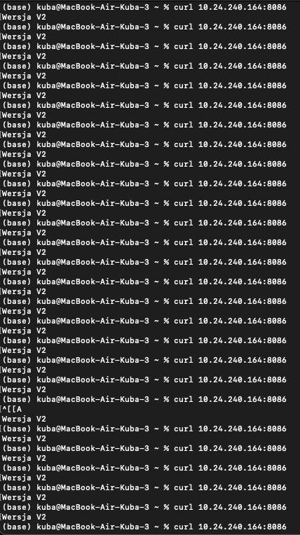

# Sprawozdanie z laboratorium 11 - Wdrażanie na zarządzalne kontenery: Kubernetes (2)

- **Imię:** Jakub
- **Nazwisko:** Stanula-Kaczka
- **Numer indeksu:** 421999
- **Grupa:** 5

---

## 1. Przygotowanie obrazów aplikacji

W ramach pierwszego etapu przygotowano trzy warianty obrazu aplikacji opartej na `nginx`:
- **`my-app:v1`** — pierwsza, stabilna wersja aplikacji,
- **`my-app:v2`** — nowsza wersja (zaktualizowana),
- **`my-app:broken`** — wersja celowo uszkodzona, której uruchomienie kończy się błędem.

Obrazy zbudowano lokalnie w środowisku Minikube, wykorzystując komendę `eval $(minikube docker-env)`, dzięki czemu trafiły one bezpośrednio do wewnętrznego rejestru Dockera klastra, z pominięciem Docker Hub. Poprawność budowy zweryfikowano poleceniem `docker images | grep my-app`, które potwierdziło obecność wszystkich trzech wariantów.


## 2. Zarządzanie wdrożeniem i skalowanie

Do zarządzania aplikacją wykorzystano plik `deployment.yml` zdefiniowany na poprzednich zajęciach, z parametrem `imagePullPolicy: Never` (obrazy dostępne lokalnie). W trakcie ćwiczeń przetestowano dynamiczne skalowanie środowiska poprzez edycję manifestu i ponowne wywołanie `kubectl apply -f deployment.yml`:

- Zwiększenie liczby replik do **8**,
- Zmniejszenie liczby replik do **1**,
- Zmniejszenie liczby replik do **0**,
- Ponowne przeskalowanie w górę do **4** replik.

Po każdej operacji stan klastra kontrolowano za pomocą `kubectl get pods`. Ostatecznie wszystkie 4 pody osiągnęły status `Running`, co potwierdziło poprawne działanie skalowania.


## 3. Aktualizacje, awarie i mechanizm Rollback

### 3.1. Wdrożenie wadliwego obrazu

Zaaplikowano wersję deploymentu wskazującą na obraz `my-app:broken`. Kubernetes natychmiast wykrył nieprawidłowość — kontenery nie były w stanie wystartować, a pody weszły w stan `Error`. Stan ten był widoczny w wynikach `kubectl get pods`, gdzie część podów raportowała `0/1 Error` z licznikiem restartów.


### 3.2. Przywracanie poprawnej wersji

W celu odzyskania sprawnego środowiska wykorzystano wbudowane mechanizmy Kubernetesa:
- `kubectl rollout history deployment/app-deployment` — pozwoliło przejrzeć historię rewizji wdrożenia,
- `kubectl rollout undo deployment/app-deployment` — przywróciło poprzednią, sprawną rewizję bez ręcznej edycji plików YAML.

Po wykonaniu `rollout undo` pody wróciły do stanu `Running`, co potwierdziło skuteczność mechanizmu rollback.


## 4. Automatyzacja weryfikacji wdrożenia

Przygotowano skrypt Bash (`check.sh`) weryfikujący, czy wdrożenie zakończy się sukcesem w zadanym oknie czasowym 60 sekund. Wykorzystano komendę:

```bash
kubectl rollout status deployment/app-deployment --timeout=60s
```

Skrypt sprawdza kod wyjścia polecenia — kod `0` oznacza powodzenie (wdrożenie zdążyło się zakończyć), kod niezerowy sygnalizuje przekroczenie limitu czasu. Po nadaniu uprawnień wykonawczych (`chmod +x check.sh`), skrypt przetestowano podczas aktualizacji obrazu do wersji `v2`. Wdrożenie zakończyło się pomyślnie w czasie poniżej 60 sekund — skrypt zwrócił komunikat o sukcesie.


## 5. Analiza strategii wdrożeń

Skonfigurowano i przetestowano dwie strategie aktualizacji obiektów Deployment:

### 5.1. Recreate

Strategia `Recreate` powoduje całkowite usunięcie wszystkich istniejących podów przed utworzeniem nowych. W trakcie testu zaobserwowano chwilową przerwę w dostępie do usługi — stare pody zostały zatrzymane (status `Terminating`), a dopiero po ich usunięciu Kubernetes przystąpił do tworzenia nowych instancji.

### 5.2. Rolling Update

Strategia `RollingUpdate` z parametrami `maxUnavailable: 1` oraz `maxSurge: 1` zapewnia stopniową podmianę podów bez przerywania dostępności aplikacji. Aktualizacja przebiegła płynnie — pody były zastępowane pojedynczo, a w każdej chwili dostępna była co najmniej jedna działająca instancja.


**Różnice między strategiami:**
- **Recreate** — prostsza, powoduje krótki przestój (downtime); odpowiednia dla aplikacji, które nie mogą działać w wielu instancjach jednocześnie.
- **RollingUpdate** — zapewnia ciągłość działania; odpowiednia dla aplikacji bezstanowych, gdzie liczy się wysoka dostępność.

Parametry `maxUnavailable` (maksymalna liczba niedostępnych podów w trakcie aktualizacji) oraz `maxSurge` (maksymalna liczba dodatkowych podów tworzonych ponad żądaną liczbę replik) pozwalają dostroić tempo i bezpieczeństwo procesu aktualizacji.

### 5.3. Canary Deployment — koncepcja

W ramach testu strategii Canary należy uruchomić dwa osobne wdrożenia (np. 3 repliki wersji `v1` i 1 replika wersji `v2`) połączone pod wspólnym adresem `Service`. Ruch kierowany jest do obu wersji, co pozwala na stopniowe przetestowanie nowej wersji na fragmencie rzeczywistego obciążenia przed pełnym wdrożeniem.

Niestety nie udało się przetestować strategii Canary, cały ruch był kierowany tylko do jednej usługi, nie udało się dojść do przyczyny takiego zachowania

