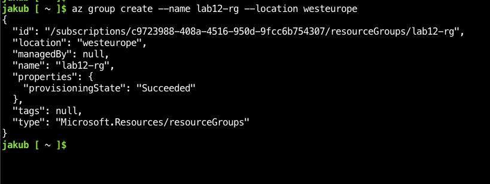
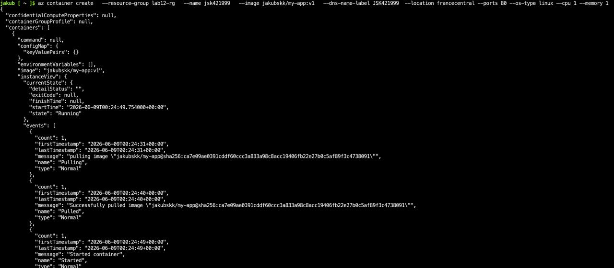
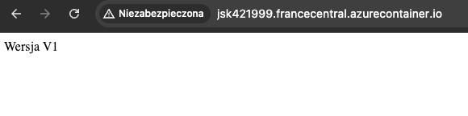
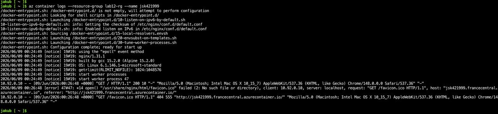
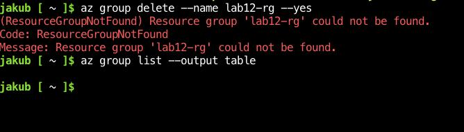

# Sprawozdanie z laboratorium 12 - Wdrażanie na zarządzalne kontenery w chmurze (Azure)

- **Imię:** Jakub
- **Nazwisko:** Stanula-Kaczka
- **Numer indeksu:** 421999
- **Grupa:** 5

---

## 1. Przygotowanie i aktualizacja kontenera

Zgodnie z wymaganiami zadania przygotowano autorski obraz aplikacji (`jakubskk/my-app:v1`), bazujący na lekkim serwerze `nginx:alpine`. Obraz został opublikowany na publicznym koncie Docker Hub, co umożliwiło jego bezpośrednie pobranie przez usługę Azure Container Instances (ACI) bez konieczności konfigurowania prywatnego rejestru Azure Container Registry (ACR).

## 2. Przygotowanie środowiska Microsoft Azure

- Zalogowano się do portalu Azure za pomocą poświadczeń studenckich AGH (Panel AGH).
- Zapoznano się z modelem rozliczeniowym usługi *Azure Container Instances* — opłaty naliczane są za vCPU i GB pamięci na sekundę działania kontenera, co ma kluczowe znaczenie przy ograniczonym budżecie kredytów studenckich.
- Uruchomiono wbudowane narzędzie **Azure Cloud Shell** (Bash), eliminując potrzebę lokalnej instalacji CLI `az`.
- Za pomocą polecenia `az group create` utworzono dedykowaną grupę zasobów `lab12-rg` w regionie `westeurope`, co ułatwia późniejsze zbiorcze zarządzanie i usunięcie wszystkich utworzonych instancji.

## 3. Wdrożenie kontenera w chmurze (Azure Container Instances)

Kontener uruchomiono bezpośrednio z publicznego rejestru Docker Hub za pomocą polecenia `az container create`:

- **Grupa zasobów:** `lab12-rg`
- **Nazwa instancji:** `jsk421999`
- **Obraz:** `jakubskk/my-app:v1`
- **Etykieta DNS:** `JSK421999`
- **Region:** `francecentral`
- **Porty:** `80`
- **Zasoby:** 1 vCPU, 1 GB RAM

Chmura automatycznie zaalokowała zasoby, pobrała obraz (`Pulling` → `Pulled`) i uruchomiła kontener (`Started container`). Zwrócony JSON potwierdził stan `ProvisioningState: Succeeded` oraz status instancji `Running`.

## 4. Weryfikacja działania i dostęp do usługi HTTP

### 4.1. Dostęp przez przeglądarkę

Wygenerowana przez Azure w pełni kwalifikowana nazwa domeny (FQDN): `jsk421999.francecentral.azurecontainer.io`. Żądanie HTTP wysłane pod ten adres zwróciło poprawną odpowiedź — stronę z napisem **„Wersja V1”**, co potwierdziło prawidłowe serwowanie treści przez kontener działający w chmurze.

### 4.2. Logi kontenera

Za pomocą polecenia `az container logs --resource-group lab12-rg --name jsk421999` pobrano standardowe logi wyjściowe. Zarejestrowały one poprawny rozruch procesów serwera Nginx (`/docker-entrypoint.sh`) oraz obsłużone zapytania HTTP (`GET /` → `200 OK`).

## 5. Zatrzymanie kontenera i dekomisja zasobów

Z uwagi na model rozliczeniowy platformy Azure i konieczność zapobiegania niepotrzebnemu zużyciu kredytów studenckich, po zakończeniu testów przystąpiono do usunięcia zasobów:

- Wywołano `az group delete --name lab12-rg --yes`, co trwale usuwa całą grupę zasobów wraz z jej zawartością.
- Grupa została już wcześniej usunięta, stąd widoczny błąd `ResourceGroupNotFound`, natomiast z uwagi na brak zrzutu ekranu został on ponownie wykonany wraz z poleceniem.
- Dla potwierdzenia wykonano `az group list --output table` — lista grup zasobów była pusta, co jednoznacznie potwierdza brak pozostałych, aktywnych zasobów na koncie.

