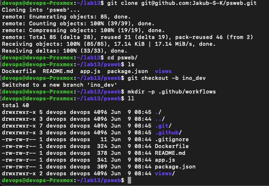
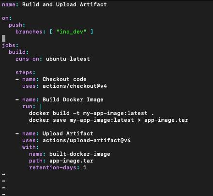
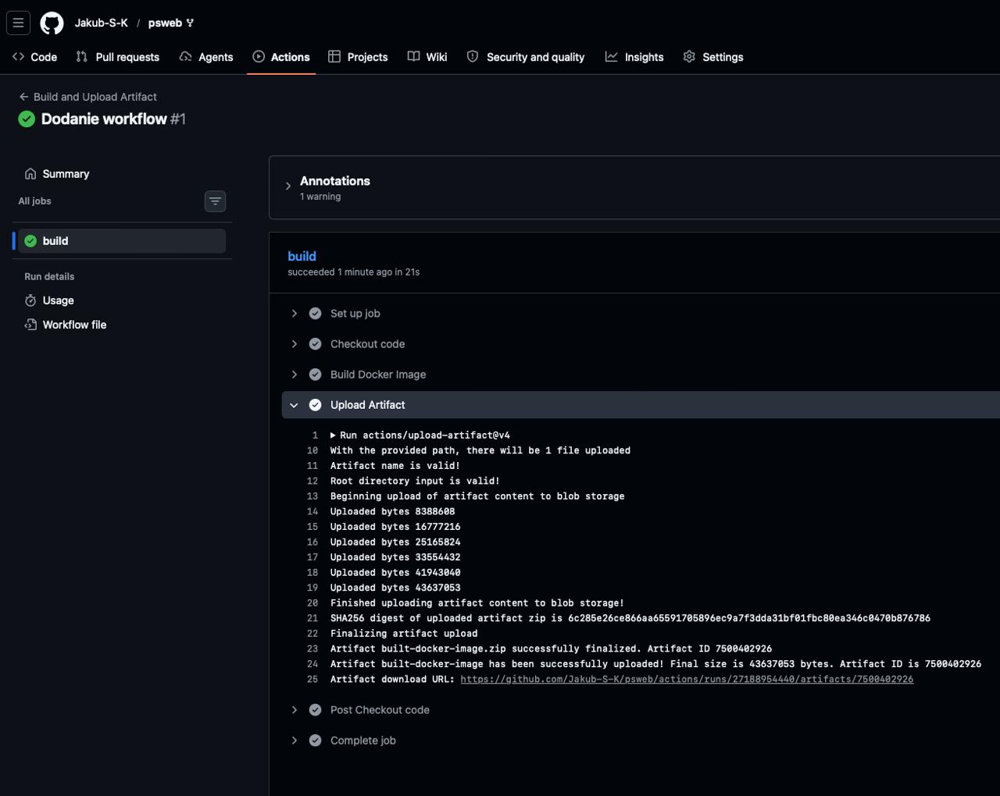

# Sprawozdanie z laboratorium 13 - Shift-left: GitHub Actions

- **Imię:** Jakub
- **Nazwisko:** Stanula-Kaczka
- **Numer indeksu:** 421999
- **Grupa:** 5

---

## 1. Przygotowanie repozytorium i gałęzi roboczej

- Zapoznano się z dokumentacją GitHub Actions oraz zasadami rozliczania usługi — darmowy plan w zupełności wystarcza do realizacji ćwiczenia.
- Dokonano sforkowania testowego projektu `nigelpoulton/psweb` (prosta aplikacja Node.js z plikiem `Dockerfile` w katalogu głównym) na własne konto GitHub (`Jakub-S-K/psweb`).
- Sforkowane repozytorium sklonowano lokalnie (`git clone git@github.com:Jakub-S-K/psweb.git`).
- Utworzono dedykowaną gałąź roboczą `ino_dev` i przełączono się na nią (`git checkout -b ino_dev`), zgodnie z wymaganiami dotyczącymi wyzwalania akcji.
- W katalogu projektu utworzono strukturę `.github/workflows/`, gdzie umieszczono plik definiujący potok CI.

## 2. Konfiguracja CI (GitHub Actions)

W pliku `.github/workflows/build.yml` zdefiniowano CI:

- **Wyzwalacz (*trigger*):** akcja uruchamia się automatycznie przy każdym zdarzeniu `push` skierowanym wyłącznie na gałąź `ino_dev`.
- **Środowisko wykonawcze (*runner*):** `ubuntu-latest`.
- **Kroki zadania `build`:**
  1. `actions/checkout@v4` — pobranie kodu źródłowego repozytorium.
  2. *Build Docker Image* — budowa obrazu na podstawie pliku `Dockerfile` (`docker build -t my-app-image:latest .`) i zapis do pliku `app-image.tar`.
  3. `actions/upload-artifact@v4` — załączenie zbudowanego artefaktu (`app-image.tar`) do podsumowania uruchomienia z retencją 1 dzień.

## 3. Weryfikacja działania i generowanie artefaktu

- Wykonanie `git push origin ino_dev` wypchnęło gałąź roboczą do zdalnego repozytorium, co natychmiast zainicjowało Actions po stronie GitHub.
- W zakładce **Actions** prześledzono przebieg zadania — wszystkie kroki (checkout, budowa obrazu, upload artefaktu) zakończyły się sukcesem (zielony status `build`).
- Artefakt `built-docker-image` (plik `app-image.tar`, ok. 43 MB) został automatycznie spakowany i udostępniony do pobrania z poziomu interfejsu GitHub

