# Sprawozdanie z laboratorium 2

- **Imię:** Jakub
- **Nazwisko:** Stanula-Kaczka
- **Numer indeksu:** 421999
- **Grupa:** 5

---

## 1. Instalacja Docker

### Instalacja Docker w systemie Linux

Zainstalowanie Dockera z repozytorium dystrybucji:

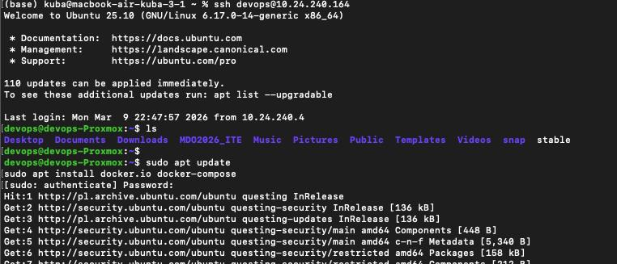

Dodanie użytkownika do grupy `docker`:

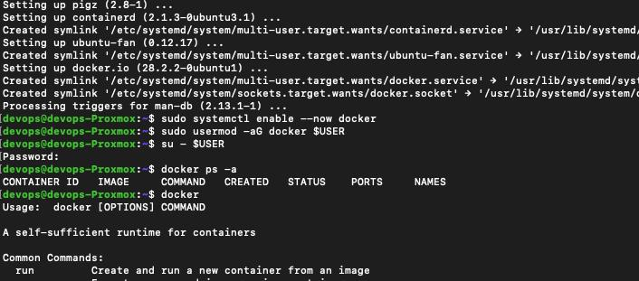

---

## 2. Docker Hub

### Logowanie do Docker Hub

Zalogowanie się do Docker Hub za pomocą polecenia `docker login`:

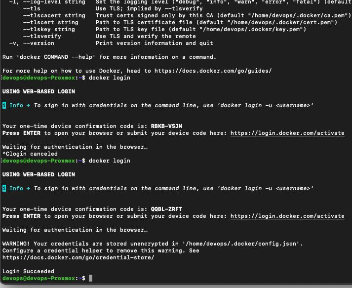

---

## 3. Obrazy Docker

### Zapoznanie z podstawowymi obrazami

Pobranie i uruchomienie obrazu `hello-world`:

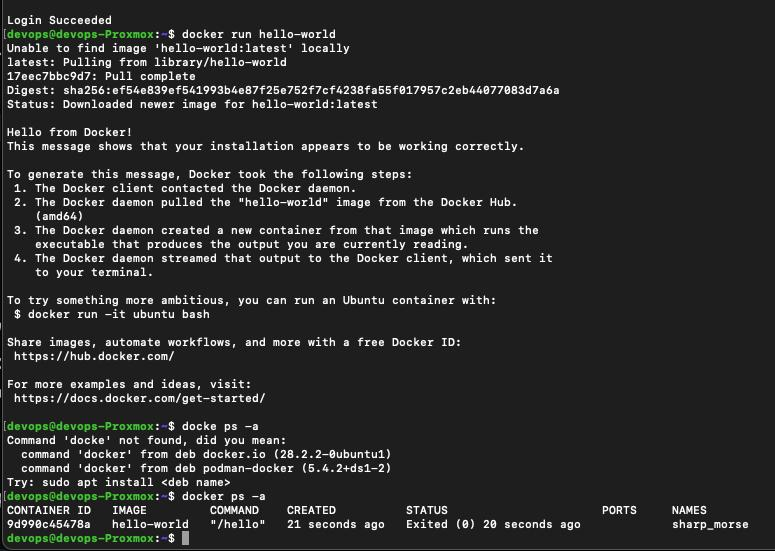

Uruchomienie pozostałych obrazów (`busybox`, `ubuntu`, `mariadb`, `aspnet`, `sdk`):

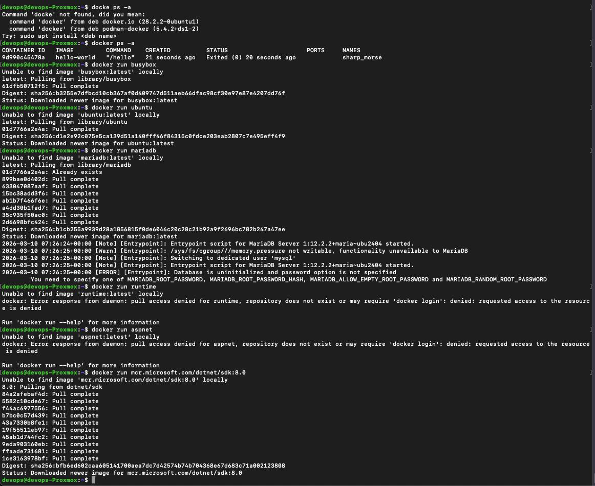

### Sprawdzenie rozmiarów obrazów

Sprawdzenie rozmiaru pobranych obrazów:

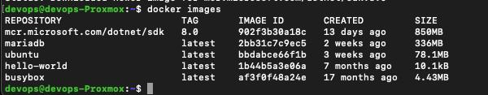

### Podłączenie interaktywne do busybox

Uruchomienie kontenera `busybox` w trybie interaktywnym i wywołanie numeru wersji:

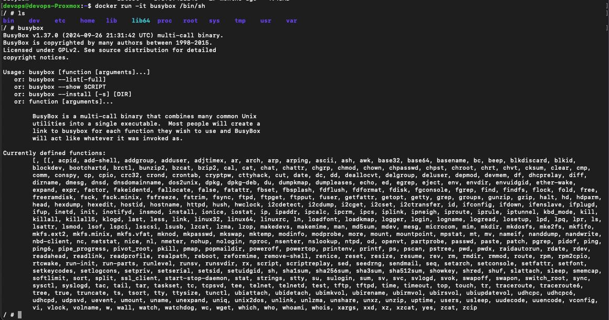

---

## 4. System w kontenerze

### PID1 w kontenerze i procesy Docker na hoście

Uruchomienie kontenera `ubuntu` w trybie interaktywnym. Prezentacja procesu PID1 w kontenerze oraz procesów dockera na hoście:

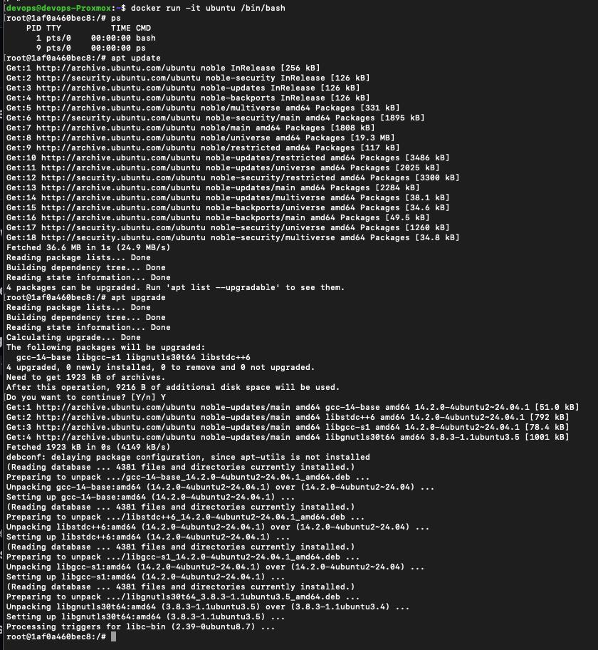

---

## 5. Dockerfile

### Utworzenie własnego Dockerfile

Utworzenie pliku `Dockerfile` bazującego na Ubuntu z zainstalowanym Git i sklonowanym repozytorium:

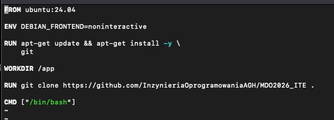

```dockerfile
FROM ubuntu:24.04

ENV DEBIAN_FRONTEND=noninteractive

RUN apt-get update && apt-get install -y \
    git

WORKDIR /app

RUN git clone https://github.com/InzynieriaOprogramowaniaAGH/MDO2026_ITE .

CMD ["/bin/bash"]
```

### Budowanie obrazu

Zbudowanie obrazu z własnego Dockerfile:

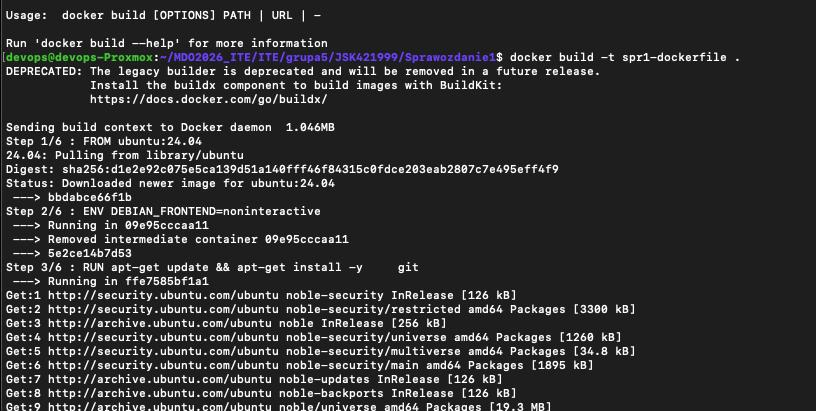

### Uruchomienie i weryfikacja

Uruchomienie kontenera w trybie interaktywnym i weryfikacja że sklonowane repozytorium jest dostępne:

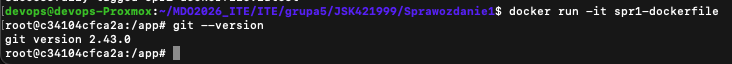

---

## 6. Zarządzanie kontenerami

### Wyświetlenie uruchomionych kontenerów

Pokazanie wszystkich kontenerów (uruchomionych i zakończonych):

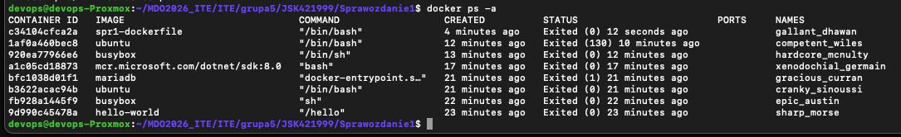

### Czyszczenie zakończonych kontenerów

Usunięcie zakończonych kontenerów:

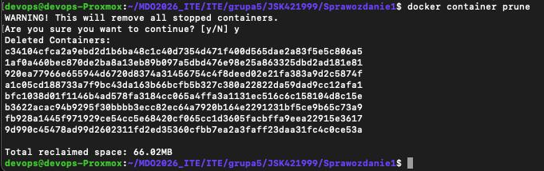

---
