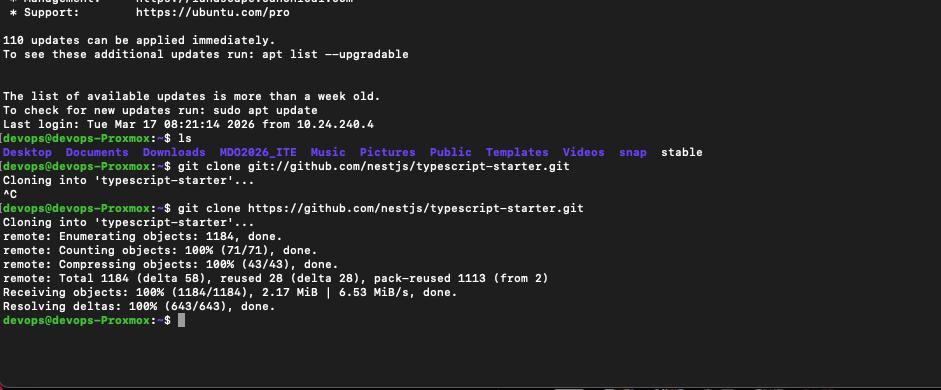
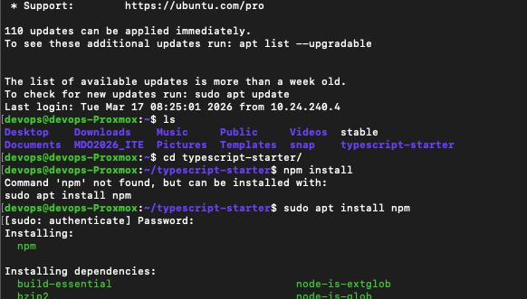
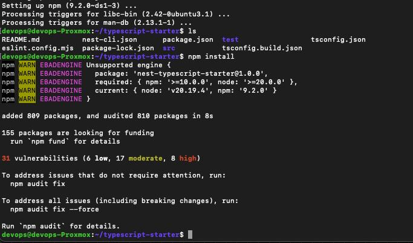
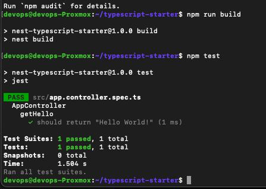
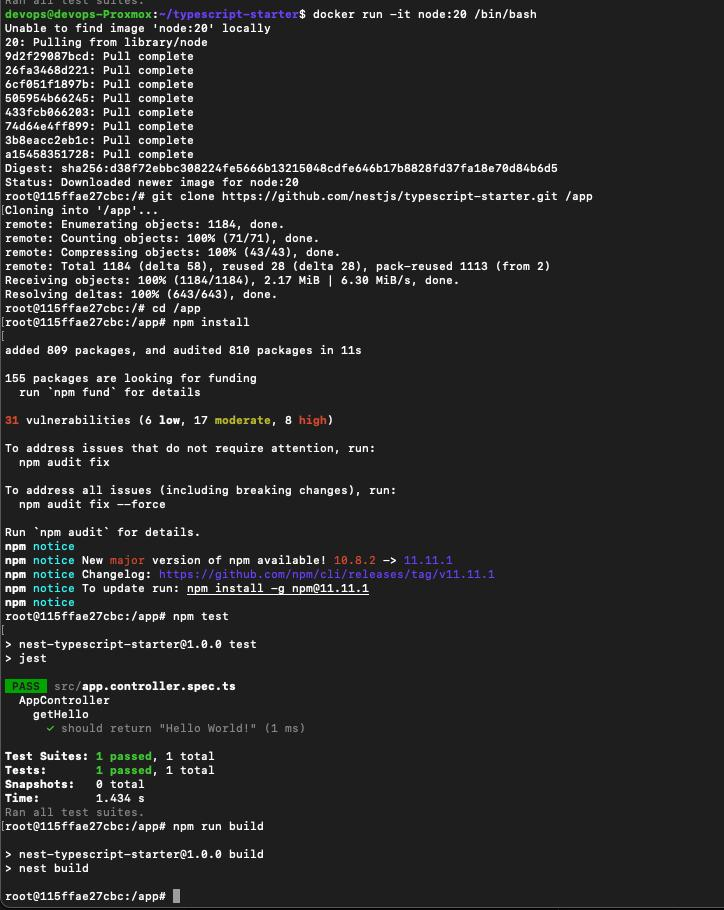
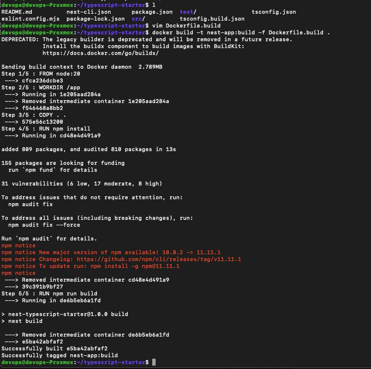
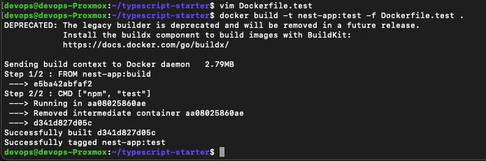
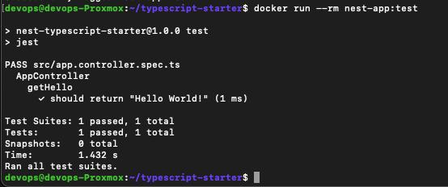

# Sprawozdanie z laboratorium 3

- **Imię:** Jakub
- **Nazwisko:** Stanula-Kaczka
- **Numer indeksu:** 421999
- **Grupa:** 5

---

## 1. Wybór oprogramowania i uruchomienie lokalne

Na potrzeby laboratorium wybrałem repozytorium aplikacji Node.js (NestJS), które zawiera testy i umożliwia budowanie przez `npm run build` oraz testowanie przez `npm test`.

### Pobranie repozytorium

Sklonowanie projektu do środowiska roboczego:

### Instalacja zależności

Instalacja `npm` i narzędzi wymaganych do budowania aplikacji:

Instalacja zależności projektu:

### Build i testy lokalnie

Uruchomienie `npm run build` oraz `npm test` poza kontenerem:

---

## 2. Izolacja i powtarzalność: build oraz testy w kontenerze (interaktywnie)

W drugim kroku ten sam proces został odtworzony wewnątrz kontenera bazowego z Node.js.

W kontenerze wykonano kolejno:
- klonowanie repozytorium,
- instalację zależności,
- budowanie aplikacji,
- uruchomienie testów.

---

## 3. Automatyzacja kroków przez Dockerfile (2 etapy)

Zgodnie z poleceniem przygotowano dwa Dockerfile:

### 3.1. Dockerfile etapu build

Pierwszy obraz realizuje wszystkie kroki do momentu zbudowania aplikacji (`npm run build`), bez uruchamiania testów:

### 3.2. Dockerfile etapu test

Drugi obraz bazuje na obrazie build i uruchamia tylko testy (`npm test`) — bez ponownego budowania:

### 3.3. Weryfikacja działania obrazu testowego

Uruchomienie kontenera z obrazu testowego i potwierdzenie poprawnego wykonania testów:

Wniosek: obraz jest tylko szablonem, a pracuje **kontener** uruchomiony z tego obrazu. To kontener wykonuje proces (`npm test`) jako PID1.

---