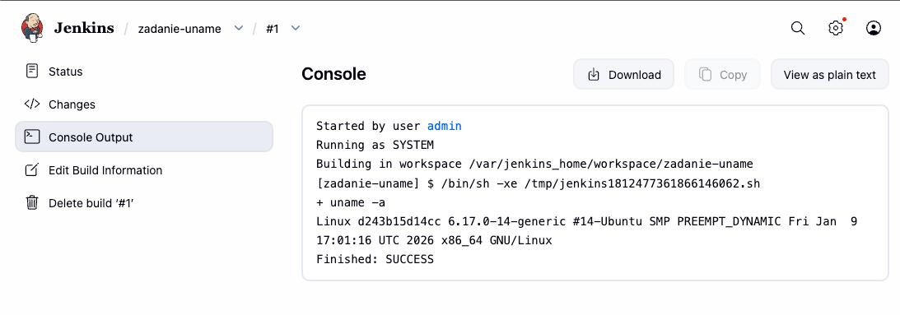
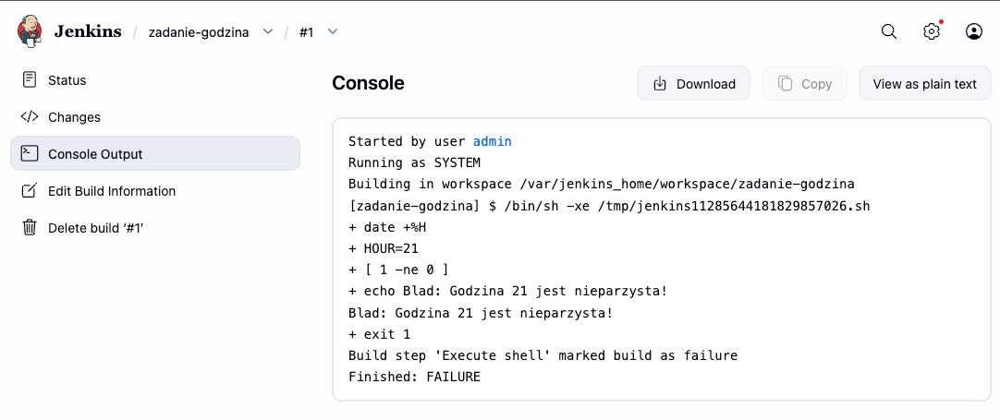
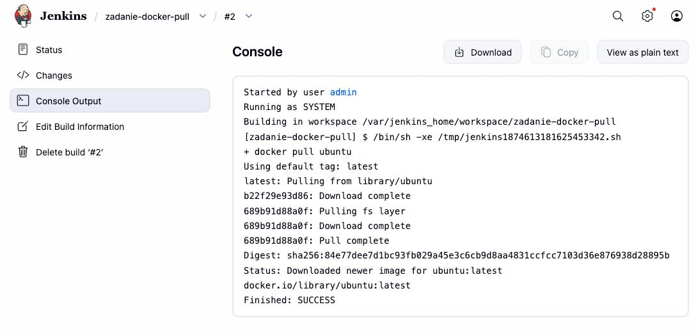
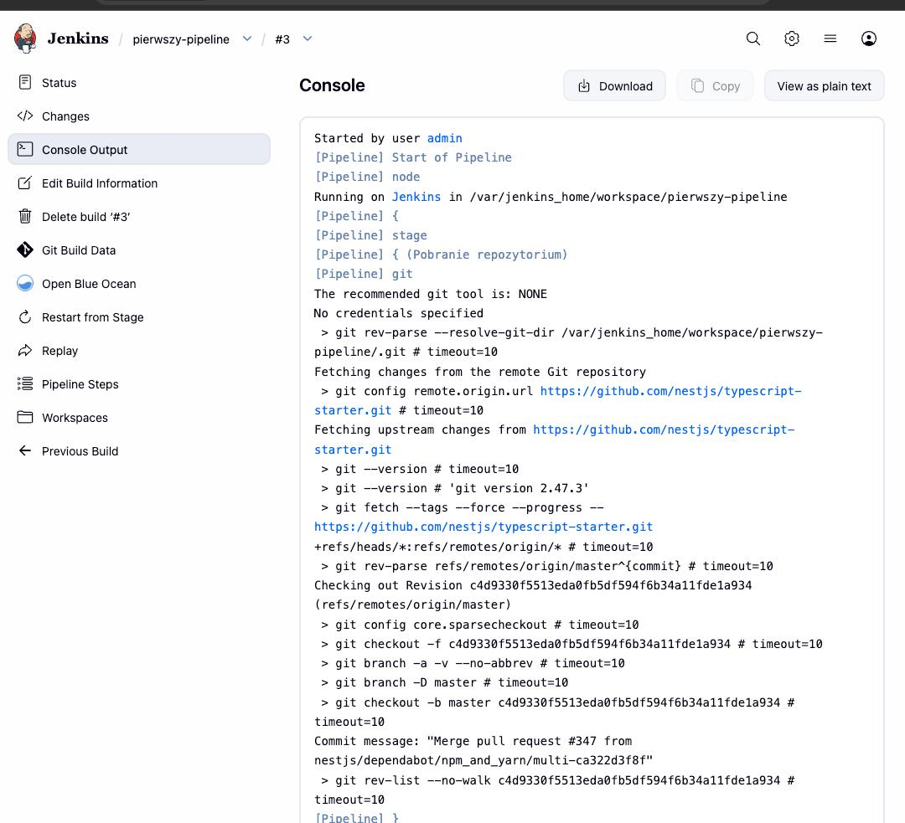
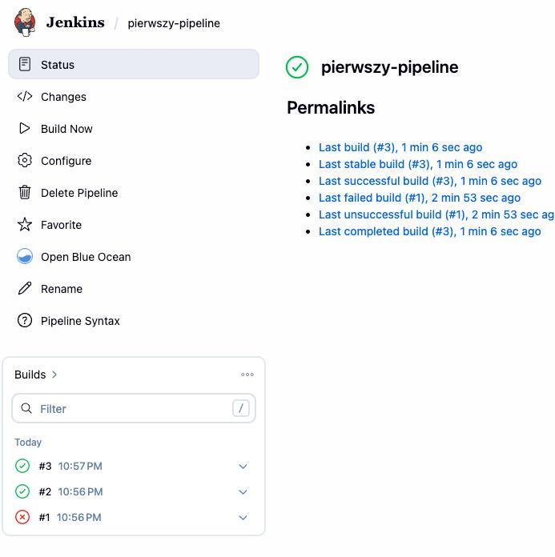
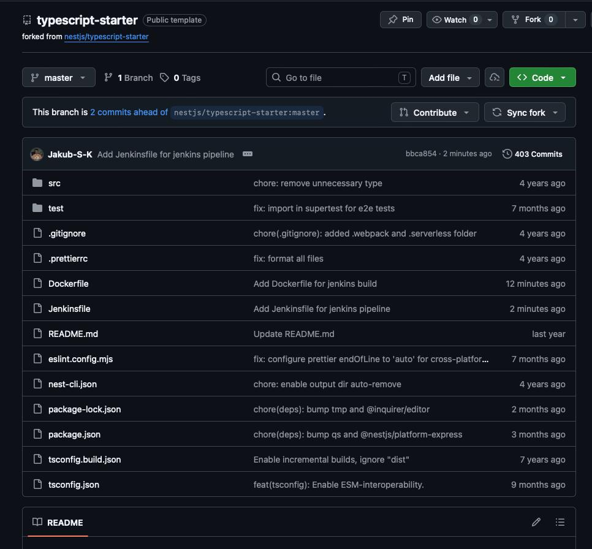
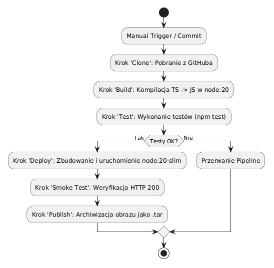
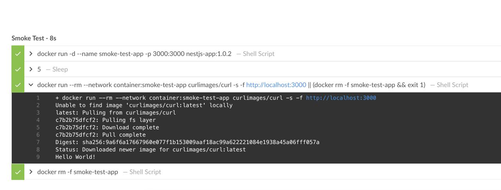
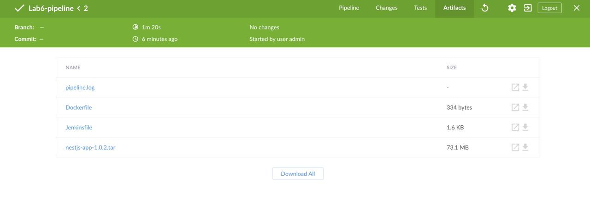

# Zbiorcze sprawozdanie z laboratoriów 5-7

- **Imię:** Jakub
- **Nazwisko:** Stanula-Kaczka
- **Numer indeksu:** 421999
- **Grupa:** 5

---

## 1. Laboratorium 5: Przygotowanie środowiska Jenkins (Docker + DIND) i Pipeline

Uruchomiono serwer Jenkins w środowisku kontenerowym typu DinD (Docker in Docker), co pozwoliło na wykonywanie operacji Dockera bezpośrednio z poziomu CI. Jenkins został oparty na obrazie Blue Ocean ze zmodyfikowanym `Dockerfile`.

Standardowy Jenkins to podstawowy serwer do CI. Rozszerzenie go o obraz Blue Ocean dostarcza ulepszone środowisko wizualne typu pipeline i dedykowane wtyczki minimalizujące nakład pracy na organizację kroków budowy.

### Zdarzenia kontrolne typu Freestyle (wstępne)
Przed właściwą konfiguracją Pipeline'u dla testu działania skryptów stworzono typowe zlecenia Freestyle:
1. Projekt realizujący systemową komendę `uname -a`.
   
2. Zadanie z warunkiem, zwracające błąd, jeśli godzina jest nieparzysta:
   
3. Pobranie zewnętrznego obrazu `docker pull ubuntu`, by upewnić się, że demon dockera jest przypięty poprawnie i zdolny do kontaktu z rejestrem dockera w sieci.
   

### Tworzenie wczesnego obiektu typu Pipeline
Od samego początku zadeklarowano wczesny wieloetapowy proces typu Pipeline  i umieszczono go w zforkowanym w tym celu repozytorium GitHub (SCM) jako `Jenkinsfile`. Pipeline podpięto w opcji *Pipeline script from SCM* i realizował kroki: pobranie repozytorium (clone), sprawdzenie Dockerfile i wybudowanie obrazu. Proces kilkukrotnie przetestowano pod kątem powtarzalności efektów.

---

## 2. Laboratorium 6: Pipeline - Ścieżka krytyczna 

W zrealizowanym pipeline CI/CD spięto ze sobą i skonfigurowano w pełni zautomatyzowane etapy: **commit, clone, build, test, deploy, publish**. Pomyślne przejścia poszczególnych kompilacji widać na logach:

### Użyta aplikacja i repozytorium
Do implementacji zadania wybrano oficjalny projekt startowy frameworka NestJS (TypeScript dla środowiska Node.js) – `nestjs/typescript-starter`. Kod jest dystrybuowany na otwartej licencji **MIT**, na co pozwalało polecenie. 
Konieczne było wykonanie forka oryginalnego repozytorium dla własnego konta na GitHubie. Wynikło to z faktu, że wymagane było umieszczenie na stałe pożądanych plików konfiguracyjnych w katalogu głównym: `Dockerfile` z własną instrukcją budowania środowisk oraz pliku źródłowego `Jenkinsfile` dostarczanego z SCM do CI.

### Architektura procesu (Diagramy UML)
W poniższym zaprojektowaniu koncepcji oparto się na dwóch diagramach, demonstrujących przewidziane założenia i środowiska CI/CD na rzecz Jenkinsa. 

**Diagram aktywności (Activity Diagram):**

**Diagram wdrożeniowy (Deployment Diagram):**

### Strategia implementacji `Dockerfile` - Izolacja etapów
Dla zrealizowania powyższych wymogów izolacji posłużono się tzw. _Multi-stage build_ umieszczonym w jednym pliku `Dockerfile`.
*   Kontenerem bazowym został `node:20` (sztywna deklaracja bez użycia zmiennej `latest`).
*   Etapy bazowe budowy (`builder`) kompilują projekt i wdrażają zależności runtime. Z tego samego środowiska wywodzi się etap pod testy (`tester`), wywołujący testy jednostkowe z biblioteki Jest.
*   Kontener przygotowany pod fazę docelową `Deploy` oparty został na minimalnym obrazie bazowym systemu: `node:20-slim`.
Wdrożenie podstawowego Node (ważącego ok. 1 GB wraz z powiązaniami developerskimi i kodem źródłowym ts) na środowisko produkcyjne byłoby niezgodne ze sztuką. Użyto wspomnianego chudszego obrazu `slim` (około 200 MB) i wykonano kopiowanie wyłącznie skompilowanego folderu `/dist` oraz produkcyjnych zależności. Optymalizuje to rozmiar i bezpieczeństwo.

---

## 3. Laboratorium 7: Jenkinsfile i Definition of Done

Zgodnie z listą kontrolną, infrastruktura i zadeklarowany przebieg automatyzacji z pliku Jenkinsfile zostały zsynchronizowane z SCM, gwarantując wersjonowanie pipeline'a wraz z kodem aplikacji.

### Specyfikacja deklaracji testowo-wdrożeniowych
1. W zadeklarowanym pliku Jenkins wymuszone zostało każdorazowe zatrzymanie i wyczyszczenie kontenerów w powłoce w kroku `post -> always` instrukcjami `docker rm -f`. Tym samym każda kolejna inicjacja startuje w czystym środowisku, a pipeline można uruchamiać wielokrotnie bez konfliktów portów.

2. **Weryfikacja w locie (Smoke Test)**: W kroku Deploy, do lekkiego obrazu slim dodano proces weryfikacji aplikacyjnej wystawionego portu. Gdy uruchomiony w tle na porcie 3000 nowo wybudowany serwer nie odpowiedziałby pozytywnie na komendy protokołu HTTP wysłane od `curl`, cały pipeline uległby przerwaniu i anulowaniu zmiany jako bład (FAILURE).

3. Publikacja artefaktu (**Publish**) polegała na poleceniu `docker save` - zapisaniu gotowego kontenera Node jako obrazu `.tar` oraz archiwizacji (`archiveArtifacts`). Obraz dockera w ten sposób zebrany to format najszerzej przenośny (posiada środowisko uruchomieniowe, system, i kod). Odcina to wymóg manualnego pobierania paczek node u docelowego odbiorcy jak ma to przy dystrybucji archiwów zip. 
Rozpoznanie historii zbudowanej paczki oparto na identyfikatorach nadanych w trakcie trwania `Jenkinsfile` jak `nestjs-app-1.0.x` powiązanym z numerem `${BUILD_NUMBER}` w panelu logów.

### "Definition of Done"
Artefakt w formie `.tar` został przygotowany ze 100% gotowością wdrożeniową:
* Opakowany komplet stanowi gotowe repozytorium do rozruchu (nie potrzebuje dostępu do zewnętrznego Docker Hub'a do weryfikacji i instalowania zależności na czystym serwerze).
* Pobrany na maszynę przez `docker load` pozwala od razu na wystartowanie poleceniem `docker run`. Mamy pewność, że powtarzalność procesu CI/CD pozwala wysyłać w obieg zintegrowany mechanizm dla klienta bez dalszych modyfikacji kodu.

