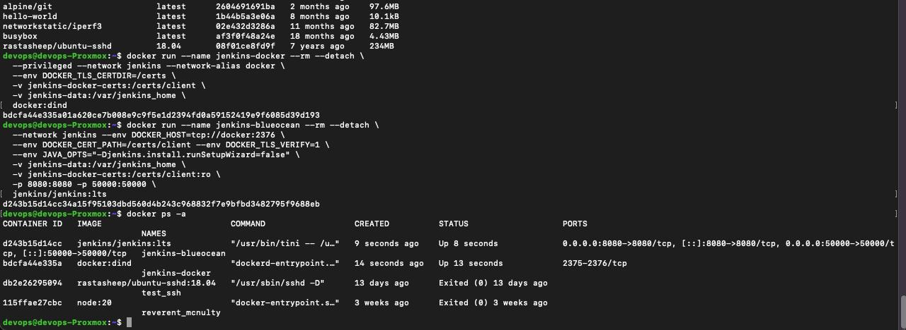
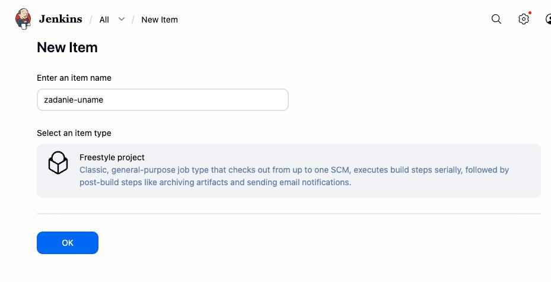
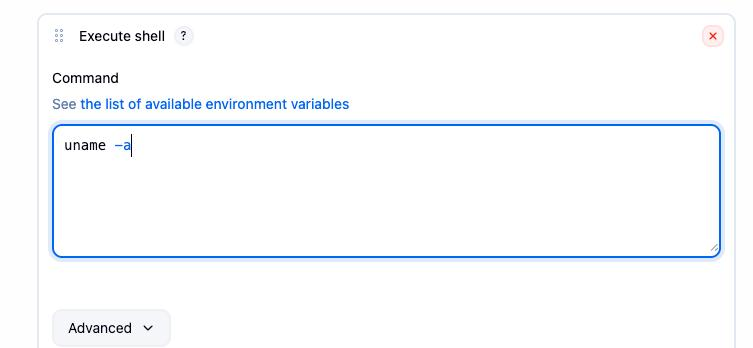
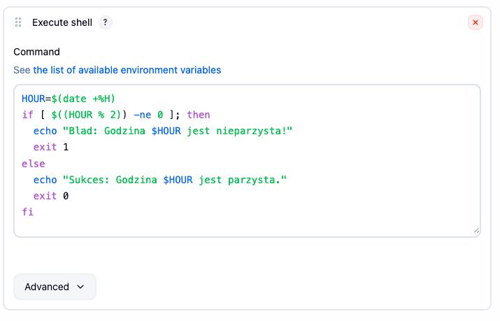
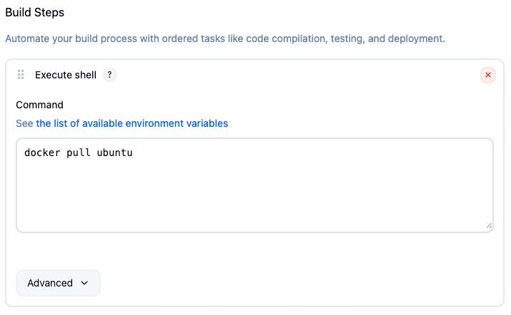
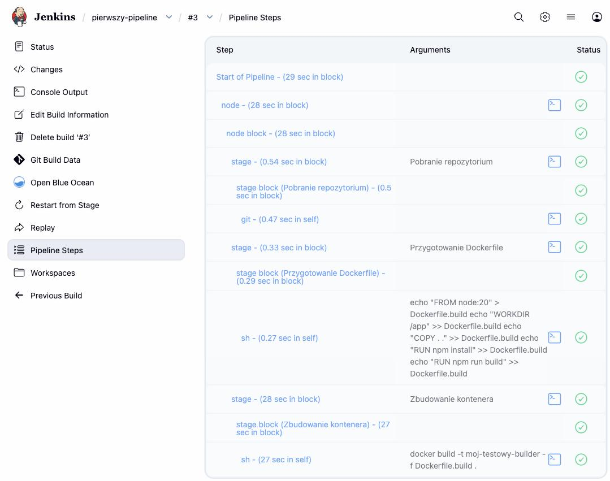

# Sprawozdanie z laboratorium 5

- **Imię:** Jakub
- **Nazwisko:** Stanula-Kaczka
- **Numer indeksu:** 421999
- **Grupa:** 5

---

## 1. Przygotowanie środowiska Jenkins (Docker + DIND)

Uruchomiono Jenkins w kontenerze Dockera zgodnie z dokumentacją producenta, z podejściem umożliwiającym wykonywanie poleceń Dockera z poziomu CI.

Różnica między obrazem standardowym a Blue Ocean:
- standardowy Jenkins to podstawowy serwer CI,
- Blue Ocean to Jenkins rozszerzony o nowy interfejs pipeline i dodatkowe wtyczki.

---

## 2. Zadanie wstępne: uruchomienie (Freestyle)

### 2.1. Projekt `uname`

Utworzono zadanie Freestyle i dodano krok `uname -a`.

### 2.2. Projekt z błędem dla nieparzystej godziny

Utworzono zadanie zwracające kod błędu, gdy bieżąca godzina jest nieparzysta.

### 2.3. Pobranie obrazu `ubuntu`

W osobnym zadaniu wykonano `docker pull ubuntu`.

---

## 3. Zadanie wstępne: obiekt typu pipeline

Utworzono obiekt typu `Pipeline` i wpisano skrypt bezpośrednio w konfiguracji zadania (bez SCM na tym etapie).
Pipeline realizuje:
- pobranie repozytorium,
- stworzenie Dockerfile,
- budowanie obrazu.

Pipeline uruchomiono ponownie w celu potwierdzenia powtarzalności działania.

---
