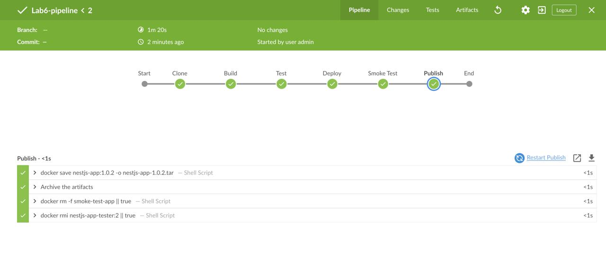
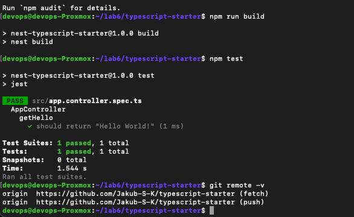
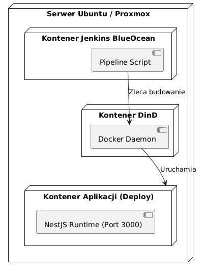

# Sprawozdanie z zajęć nr 6 - Pipeline: lista kontrolna

- **Imię:** Jakub
- **Nazwisko:** Stanula-Kaczka
- **Numer indeksu:** 421999
- **Grupa:** 5

## 1. Ścieżka krytyczna
W ramach zrealizowanego potoku (pipeline) CI/CD zaimplementowano pełną ścieżkę krytyczną. Wszystkie poniższe kroki są wykonywane w sposób w pełni zautomatyzowany:

- [x] commit (lub tzw. manual trigger @ Jenkins)
- [x] clone
- [x] build
- [x] test
- [x] deploy
- [x] publish



## 2. Pełna lista kontrolna i specyfikacja projektu

### Wybór aplikacji i licencja
- [x] **Aplikacja została wybrana:** Jako oprogramowanie do konteneryzacji i testów wybrałem oficjalny projekt startowy frameworka NestJS (napisany w TypeScript dla środowiska Node.js).
- [x] **Licencja potwierdza możliwość swobodnego obrotu kodem:** Projekt jest udostępniany na otwartej licencji MIT, co pozwala na pełną modyfikację i dystrybucję kodu w ramach tego zadania.

### Weryfikacja lokalna i repozytorium
- [x] **Wybrany program buduje się:** Zweryfikowano działanie komendy `npm run build`.
- [x] **Przechodzą dołączone do niego testy:** Zweryfikowano pomyślne przejście testów jednostkowych (`npm test`).
- [x] **Zdecydowano, czy jest potrzebny fork własnej kopii repozytorium:** Tak, wykonałem fork oryginalnego repozytorium (z `nestjs/typescript-starter`) na swoje prywatne konto GitHub.
  - **Uzasadnienie:** Posiadanie własnego repozytorium (forka) było niezbędne, aby w głównym katalogu projektu na stałe umieścić własne pliki `Dockerfile` oraz `Jenkinsfile`, z których Jenkins korzysta automatycznie poprzez mechanizm SCM.




## 3. Planowanie i Diagram UML
Zgodnie z poleceniem zaplanowałem proces za pomocą diagramów UML.

- [x] **Stworzono diagram UML zawierający planowany pomysł na proces CI/CD:**

### Diagram aktywności (Activity Diagram):
Ukazuje on kolejne etapy realizowane wewnątrz potoku.


### Diagram wdrożeniowy (Deployment Diagram):



## 4. Konteneryzacja i Izolacja Etapów (Dockerfile)
Aby spełnić wymagania dotyczące izolacji i optymalizacji, zaimplementowałem tzw. Multi-stage build w jednym pliku `Dockerfile`.

- [x] **Wybrano kontener bazowy (runtime dependencies):** Do budowania wybrałem obraz `node:20`. Użyłem zadeklarowanej wersji, aby uniknąć taga `latest`.
- [x] **Build wykonany wewnątrz kontenera:** Etap `builder` instaluje wszystkie zależności i buduje aplikacje.
- [x] **Testy wykonane wewnątrz kontenera:** Etap `tester` wykorzystuje wbudowane testy (biblioteka Jest).
- [x] **Kontener testowy oparty o kontener build:** W pliku Dockerfile zdefiniowano `FROM builder AS tester`.
- [x] **Zdefiniowano kontener typu 'deploy':** Aplikacja produkcyjna uruchamia się w nowym kontenerze.
- [x] **Uzasadniono czy kontener buildowy nadaje się do tej roli:** Kontener buildowy (`node:20`) nie nadaje się do wdrażania na produkcję. Waży on ponad 1 GB, zawiera kod źródłowy TypeScript oraz niepotrzebne narzędzia deweloperskie. Dlatego jako kontener deploy stworzyłem nowy etap bazujący na obrazie `node:20-slim`. Jest on pozbawiony zbędnych pakietów (zajmuje ok. 200 MB) i kopiuję do niego wyłącznie skompilowany folder `/dist` oraz produkcyjne zależności. To optymalizuje rozmiar i bezpieczeństwo.

## 5. Wdrożenie i Weryfikacja (Deploy)

- [x] **Wersjonowany kontener 'deploy' jest wdrażany na instancję Dockera:** W etapie Deploy Jenkins uruchamia zbudowany obraz w tle.
- [x] **Następuje weryfikacja (smoke test):** Dodano krok weryfikacyjny, który wykonuje zapytanie curl na wyeksponowany port 3000. Jeśli aplikacja nie zwróci poprawnej odpowiedzi HTTP, kontener jest usuwany, a pipeline oznacza przebieg jako błędny (FAILURE).


## 6. Publikacja Artefaktów i Wersjonowanie (Publish)

- [x] **Zdefiniowano, jaki element ma być publikowany jako artefakt:** Publikowany jest pełny obraz kontenera Dockera wyeksportowany do pliku `.tar`.
- [x] **Uzasadniono wybór:** W przypadku aplikacji NestJS/Node.js redystrybucja samego kodu (np. w pliku ZIP) wiąże się z koniecznością instalacji środowiska Node.js na serwerze docelowym. Obraz kontenera jest formatem najbardziej przenośnym (zawiera kod, zależności, system operacyjny i predefiniowane środowisko uruchomieniowe).
- [x] **Opisano proces wersjonowania artefaktu:** Artefakty są wersjonowane dynamicznie na podstawie wersji bazowej oraz unikalnego numeru przebiegu w Jenkinsie (zmienna `${BUILD_NUMBER}`). Przykład: `nestjs-app-1.0.12.tar`.
- [x] **Dostępność artefaktu i logi:** Artefakt z obrazem oraz pliki konfiguracyjne (`Dockerfile`, `Jenkinsfile`) są jawnie archiwizowane i dostępne do pobrania bezpośrednio z panelu Jenkinsa jako rezultat przejścia pipeline'u. Logi procesu są archiwizowane przez Jenkinsa pod przypisanym numerem buildu.
- [x] **Przedstawiono sposób na zidentyfikowanie pochodzenia artefaktu:** Identyfikacja pochodzenia paczki opiera się na unikalnym numerze przebiegu pipeline'u (`${BUILD_NUMBER}`). Każdy wygenerowany artefakt (np. `nestjs-app-1.0.12.tar`) jest ściśle powiązany z historią buildów w Jenkinsie. Wchodząc w szczegóły danego buildu w panelu (np. Build #12), logi systemowe jednoznacznie wskazują pobraną gałąź oraz dokładny hash commita z systemu Git, z którego została zbudowana i spakowana aplikacja.


- [x] **Zweryfikowano potencjalną rozbieżność między zaplanowanym UML a otrzymanym efektem:** Zaplanowany proces UML został w pełni odzwierciedlony w działającym potoku. Wszystkie kroki realizują się zgodnie z założeniami.

## Załączniki - Kody Źródłowe

- [x] Pliki `Dockerfile` i `Jenkinsfile`.

### 1. Plik Dockerfile (Multi-stage)

```dockerfile
# BUILD
FROM node:20 AS builder 
WORKDIR /app            
COPY package*.json ./   
RUN npm install         
COPY . .                
RUN npm run build       
                        
# TEST                  
FROM builder AS tester
RUN npm test
 
# Deploy
FROM node:20-slim AS deploy
WORKDIR /app
COPY package*.json ./
 
RUN npm install --omit=dev
 
COPY --from=builder /app/dist ./dist
EXPOSE 3000
CMD ["node", "dist/main.js"]
```

### 2. Plik Jenkinsfile

```groovy
pipeline {
    agent any
    
    environment {
        APP_VERSION = "1.0.${BUILD_NUMBER}"
        IMAGE_NAME = "nestjs-app"
    }

    stages {
        stage('Clone') {
            steps {
                git branch: 'master', url: 'https://github.com/Jakub-S-K/typescript-starter.git'
            }
        }
        
        stage('Build') {
            steps {
                sh "docker build --target builder -t ${IMAGE_NAME}-build:${BUILD_NUMBER} ."
            }
        }

        stage('Test') {
            steps {
                sh "docker build --target tester -t ${IMAGE_NAME}-tester:${BUILD_NUMBER} ."
            }
        }
        
        stage('Deploy') {
            steps {
                sh "docker build --target deploy -t ${IMAGE_NAME}:${APP_VERSION} ."
            }
        }

        stage('Smoke Test') {
            steps {
                sh "docker run -d --name smoke-test-app -p 3000:3000 ${IMAGE_NAME}:${APP_VERSION}"
                sleep 5
                sh 'docker run --rm --network container:smoke-test-app curlimages/curl -s -f http://localhost:3000 || (docker rm -f smoke-test-app && exit 1)'
                sh "docker rm -f smoke-test-app"
            }
        }
        
        stage('Publish') {
            steps {
                sh "docker save ${IMAGE_NAME}:${APP_VERSION} -o ${IMAGE_NAME}-${APP_VERSION}.tar"
                archiveArtifacts artifacts: '*.tar, Dockerfile, Jenkinsfile', allowEmptyArchive: false
            }
        }
    }
    
    post {
        always {
            sh "docker rm -f smoke-test-app || true"
            sh "docker rmi ${IMAGE_NAME}-tester:${BUILD_NUMBER} || true"
        }
    }
}
```
