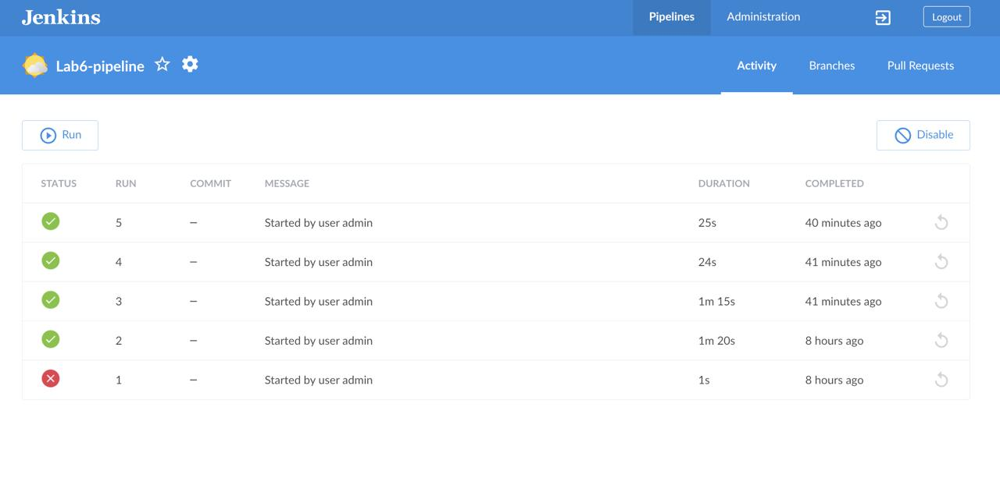

# Sprawozdanie z zajęć nr 7 - Jenkinsfile i przygotowanie Ansible

- **Imię:** Jakub
- **Nazwisko:** Stanula-Kaczka
- **Numer indeksu:** 421999
- **Grupa:** 5

---

## 1. Jenkinsfile: Lista kontrolna i "Definition of Done"

Nasz proces CI/CD został w pełni zadeklarowany jako kod (Infrastructure as Code) i jest pobierany bezpośrednio z repozytorium. Poniżej znajduje się weryfikacja zrealizowanych kroków względem wymagań.

### Weryfikacja kroków:
- [x] **Przepis dostarczany z SCM:** Pipeline nie jest wpisany na sztywno w Jenkinsie. Użyto opcji *Pipeline script from SCM* (Git), co automatycznie realizuje krok `clone`.
- [x] **Posprzątaliśmy i pracujemy na najnowszym kodzie:** W bloku `post { always { ... } }` zaimplementowano twarde usuwanie kontenerów tymczasowych (`docker rm -f`). Dzięki temu każde uruchomienie startuje w czystym środowisku, a pipeline można uruchamiać wielokrotnie bez konfliktów portów.
- [x] **Etap Build dysponuje repozytorium:** Krok `Clone` pobiera najnowszy kod wraz z plikiem `Dockerfile`.
- [x] **Etap Build tworzy obraz buildowy:** Budowany jest tzw. `builder` oparty na pełnym obrazie `node:20`, w którym instalowane są zależności deweloperskie i następuje budowanie aplikacji.
- [x] **Etap Test przeprowadza testy:** Obraz dziedziczy po `builderze` i uruchamia komendę `npm test`.
- [x] **Etap Deploy przygotowuje obraz pod wdrożenie:** Ponieważ docelowy kontener ma być odmienny (lżejszy), etap `Deploy` buduje nowy obraz bazujący na `node:20-slim`, do którego kopiowany jest tylko skompilowany kod (`/dist`), bez narzędzi deweloperskich.
- [x] **Etap Deploy przeprowadza wdrożenie:** Następuje uruchomienie kontenera docelowego w tle oraz wykonanie weryfikacji (*Smoke Test*).
- [x] **Etap Publish dodaje artefakt do historii:** Obraz docelowy jest eksportowany do pliku `.tar` poleceniem `docker save` i archiwizowany (`archiveArtifacts`) jako pobieralny rezultat przejścia pipeline'u.

### Definition of Done:
- **Czy obraz może być uruchomiony bez modyfikacji?** Tak. Zbudowany i opublikowany obraz `.tar` zawiera wszystko, co niezbędne do działania aplikacji (Node.js runtime, kod, zależności produkcyjne). Po załadowaniu go na dowolnym serwerze (`docker load`) można go natychmiast uruchomić poleceniem `docker run`.
- **Czy artefakt zadziała od razu?** Tak. Forma `.tar` jest uniwersalna dla środowisk Dockerowych, uniezależniając nas od zewnętrznych rejestrów (np. Docker Hub).

