# Sprawozdanie zbiorcze z zajęć nr 8–12

- **Imię:** Jakub
- **Nazwisko:** Stanula-Kaczka
- **Numer indeksu:** 421999
- **Grupa:** 5

---

## Wprowadzenie

Ćwiczenia obejmowały tematykę automatyzacji infrastruktury, nienadzorowanej instalacji systemów oraz orkiestracji aplikacji kontenerowych przy użyciu narzędzi Ansible, Kickstart, Kubernetes (Minikube) oraz Azure Container Instances. Poniższe sprawozdanie stanowi podsumowanie każdego z laboratoriów.

---

## Zajęcia nr 8: Ansible – zarządzanie konfiguracją

**Ansible** to bezagentowe narzędzie do automatyzacji konfiguracji systemów i zarządzania infrastrukturą. Komunikacja z maszynami docelowymi odbywa się przez SSH, bez konieczności instalacji dodatkowego oprogramowania na węzłach.

### Inventory i komunikacja

Centralnym elementem konfiguracji jest **plik inventory** (`inventory.ini`) — lista hostów podzielona na nazwane grupy logiczne. W ćwiczeniu zdefiniowano grupę `[Orchestrators]` dla maszyny zarządzającej (`localhost`) oraz `[Endpoints]` dla maszyny docelowej `ansible-target`. Dostępność hostów zweryfikowano modułem `ping`, który testuje połączenie SSH oraz działanie interpretera Pythona.

Plik inventory: [`inventory.ini`](../Sprawozdanie8/files/inventory.ini)

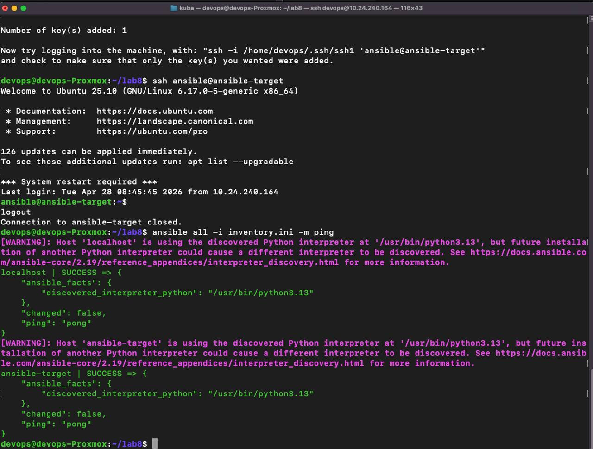

### Playbook i powtarzalność operacji

**Playbook** to plik YAML definiujący sekwencję zadań wykonywanych na wybranych hostach. Kluczową cechą Ansible jest **powtarzalność bez efektów ubocznych** — każde zadanie opisuje pożądany stan systemu, a nie konkretną operację. Jeśli system już spełnia wymagania, zadanie nie wprowadza zmian (status `ok` zamiast `changed`). Dzięki temu ten sam playbook można uruchamiać wielokrotnie bez ryzyka niepożądanych efektów ubocznych.

**Napotkany problem (sudo-rs):** Podczas próby użycia `become: yes` wystąpiły błędy uwierzytelniania sudo, spowodowane przez pakiet `sudo-rs` na maszynie docelowej. Problem rozwiązano przez edycję `visudo` i dodanie reguły `NOPASSWD: ALL` dla użytkownika `ansible`.

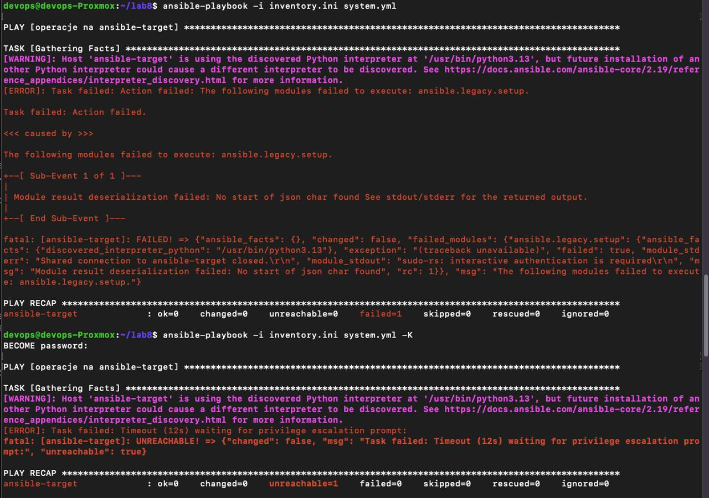

Wykonany playbook (`system.yml`) zrealizował: aktualizację pakietów systemowych, skopiowanie pliku inventory na hosty grupy `Endpoints`, restart usług `ssh` i `rng`. Przy drugim uruchomieniu zadania już spełnione oznaczono jako `ok` (kolor zielony), co potwierdziło bezpieczną powtarzalność operacji.

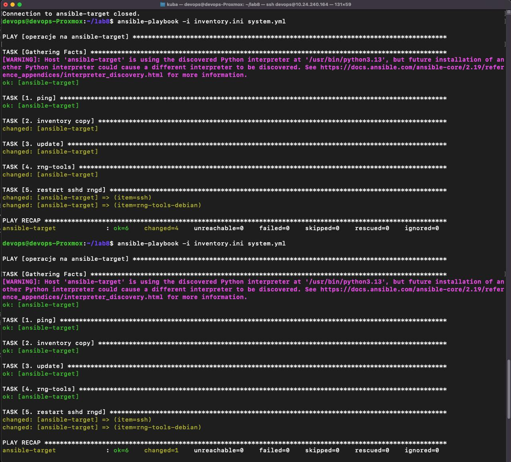

Przetestowano również zachowanie Ansible w przypadku awarii — po wyłączeniu SSH na `ansible-target`, playbook poprawnie zgłosił błąd `UNREACHABLE`.

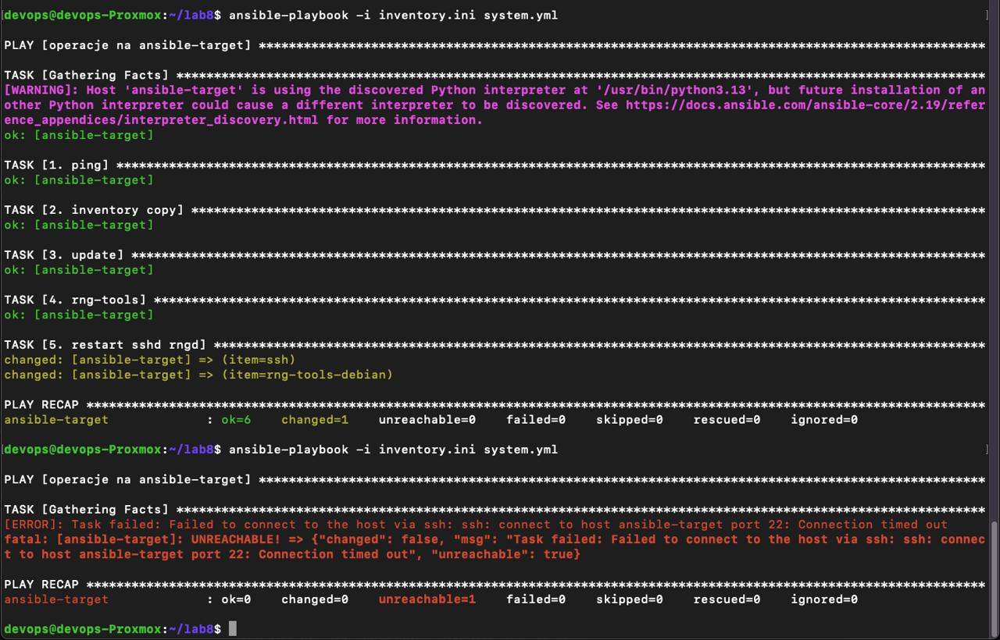

### Wdrożenie artefaktu aplikacji (NestJS)

Przygotowano playbook wdrożeniowy (`deploy.yml`) automatyzujący pełny cykl życia artefaktu aplikacji NestJS (z laboratoriów CI/CD):
1. Instalacja Dockera (`docker.io`) i uruchomienie demona.
2. Transfer archiwum `.tar` z obrazem na maszynę docelową.
3. Załadowanie obrazu (`docker load`) i uruchomienie kontenera na porcie `3000`.
4. *Smoke Test* — moduł `uri` Ansible wysłał żądanie HTTP na `localhost:3000`, weryfikując odpowiedź `200 OK`.
5. Uporządkowanie środowiska po teście.

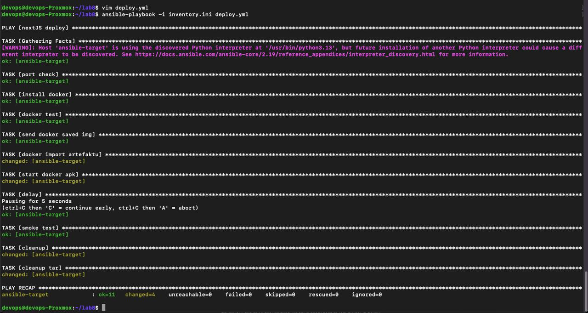

### Ansible Galaxy – role

Dla zachowania przejrzystości i ponownego użycia, strukturę playbooka przekształcono w **rolę Ansible** (`ansible-galaxy role init deploy_nestjs`). Zadania wydzielono do `tasks/main.yml`, a główny plik `site.yml` wywołuje zdefiniowaną rolę.

Plik `site.yml`: [`site.yml`](../Sprawozdanie8/files/site.yml)

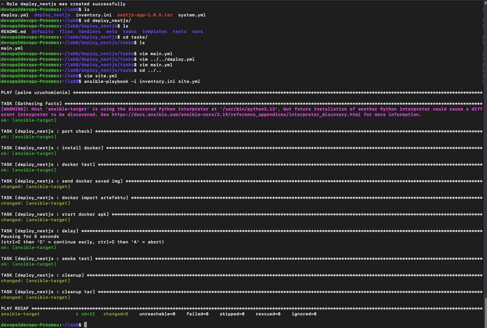

---

## Zajęcia nr 9: Kickstart – instalacja nienadzorowana Fedory

**Kickstart** to mechanizm automatycznej instalacji systemów Fedora/RHEL, wykorzystujący plik odpowiedzi (`ks.cfg`) przetwarzany przez instalator Anaconda. Plik zawiera pełną konfigurację: język, układ klawiatury, strefę czasową, sieć, partycjonowanie dysku, pakiety oraz skrypty poinstalacyjne (`%post`).

### Generowanie i dystrybucja pliku Kickstart

Na podstawie wymagań utworzono plik `ks.cfg`, który następnie udostępniono instalatorowi poprzez prosty serwer HTTP (`python3 -m http.server 8000`).

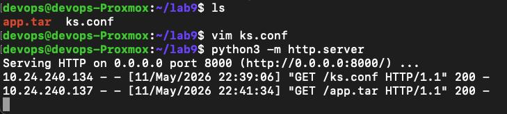

### Instalacja nienadzorowana

W menu GRUB, poza standardowymi parametrami, przekazano do jądra:
```
ip=<IP_VM>::<IP_BRAMY>:<MASKA>:fedora:ens18:none nameserver=1.1.1.1 inst.ks=http://<IP_SERWERA>:8000/ks.cfg
```
Parametr `inst.ks` wskazał lokalizację pliku odpowiedzi, a ręczna konfiguracja IP pozwoliła ominąć brak serwera DHCP w sieci.

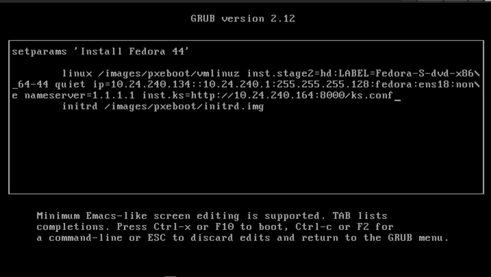

**Napotkane problemy:**
- Zawieszanie się instalatora na `nm-wait-online-initrd.service` — rozwiązane przez jawne wskazanie interfejsu `ens18` w parametrach GRUB.
- Błąd nieznanego wywołania `autostep` — parametr okazał się wycofany (*deprecated*) w nowszej wersji Anacondy; usunięto go z pliku Kickstart.

### Sekcja `%post` i systemd

W sekcji `%post` zdefiniowano skrypt, który po instalacji systemu pobiera artefakt `app.tar` z serwera, ładuje obraz Dockera i tworzy usługę `systemd` (`start-myapp.service`). Dzięki `systemctl enable` kontener uruchamia się automatycznie przy starcie systemu.

Po zakończeniu instalacji i restarcie zweryfikowano poprawność działania: `curl localhost:3000` zwrócił odpowiedź aplikacji, a `docker ps` potwierdził działający kontener.

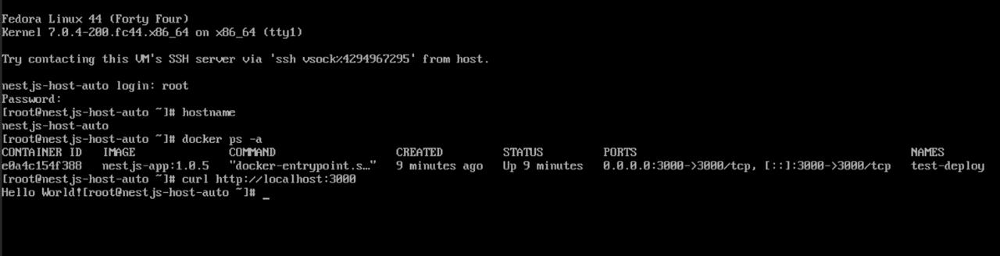

---

## Zajęcia nr 10: Kubernetes – podstawy i wdrożenie aplikacji

**Kubernetes (k8s)** to platforma do automatycznego wdrażania, skalowania i zarządzania aplikacjami kontenerowymi. W laboratorium wykorzystano **Minikube** — lokalny, jednowęzłowy klaster Kubernetes uruchomiony ze sterownikiem Docker.

```bash
minikube start --memory=2048 --cpus=2
```


### Pod – podstawowa jednostka wdrożeniowa

Na potrzeby ćwiczenia zbudowano własny obraz `my-app:v1` oparty na `nginx:alpine`. Obraz zbudowano lokalnie w kontekście Minikube (`eval $(minikube docker-env)`). Aplikację uruchomiono jako **Pod**:

```bash
kubectl run my-app-pod --image=my-app:v1 --port=80 --image-pull-policy=Never
```

Dostęp do aplikacji uzyskano przez przekierowanie portów: `kubectl port-forward pod/my-app-pod 8080:80`.


### Deployment i Service

Ręczne zarządzanie Podami zastąpiono deklaratywnym plikiem `deployment.yml`. **Deployment** zarządza replikami Podów, dbając o utrzymanie zadanej liczby instancji. Skalowanie przeprowadzono przez zmianę `replicas` na `4`:

```bash
kubectl apply -f deployment.yml
```


Wdrożenie wystawiono jako **Service** (typu `ClusterIP`), który zapewnia stały adres sieciowy i równoważenie obciążenia między replikami:

```bash
kubectl expose deployment nginx-deployment --type=ClusterIP --port=80
```


---

## Zajęcia nr 11: Kubernetes – aktualizacje i rollback

Laboratorium dotyczyło zarządzania cyklem życia wdrożeń: skalowania, aktualizacji obrazów oraz mechanizmów przywracania poprzednich wersji.

### Przygotowanie wielu wersji obrazu

Zbudowano trzy warianty obrazu `my-app`:
- **`v1`** — stabilna wersja,
- **`v2`** — zaktualizowana wersja,
- **`broken`** — wersja celowo uszkodzona (kontener kończy działanie błędem).

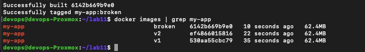

### Skalowanie

Przetestowano dynamiczną zmianę liczby replik w pliku `deployment.yml` (sekwencja: 8 → 1 → 0 → 4). Skalowanie do zera jest szczególnie istotne — Deployment nadal istnieje, ale żaden Pod nie działa, co umożliwia szybkie wznowienie bez ponownego tworzenia zasobów.

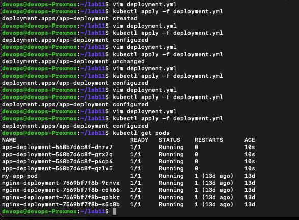

### Rollback

Po wdrożeniu obrazu `broken` pody weszły w stan `Error`/`CrashLoopBackOff`. Kubernetes wykrył cykliczne awarie i stale próbował restartować kontenery.

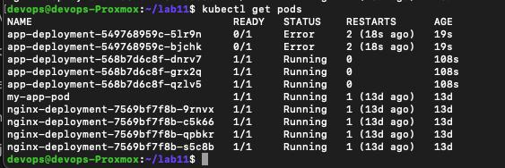

Do przywrócenia sprawnej wersji wykorzystano wbudowane mechanizmy:

```bash
kubectl rollout history deployment/app-deployment
kubectl rollout undo deployment/app-deployment
```

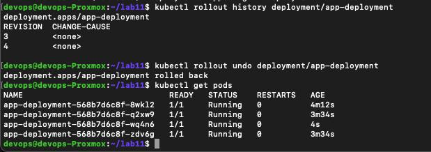

### Automatyzacja weryfikacji wdrożenia

Przygotowano skrypt `check.sh` weryfikujący, czy wdrożenie kończy się w ciągu 60 sekund:
```bash
kubectl rollout status deployment/app-deployment --timeout=60s
```

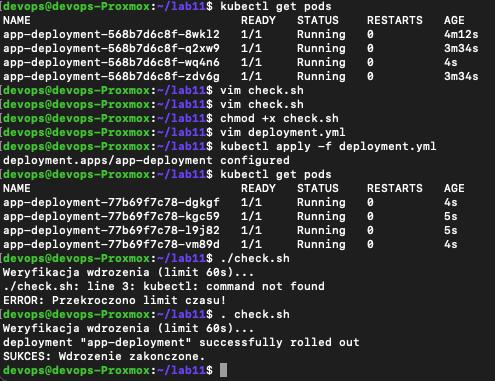

### Strategie wdrożeń

Skonfigurowano i porównano strategie aktualizacji:
- **Recreate** — usuwa wszystkie stare pody przed utworzeniem nowych (powoduje krótki przestój).
- **RollingUpdate** (`maxUnavailable: 1`, `maxSurge: 1`) — podmienia pody stopniowo, zapewniając ciągłość działania.

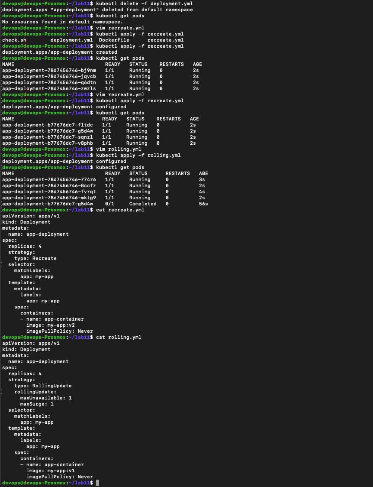

---

## Zajęcia nr 12: Azure Container Instances

**Azure Container Instances (ACI)** to usługa chmurowa w modelu serverless, umożliwiająca uruchamianie kontenerów Docker bez zarządzania maszynami wirtualnymi ani klastrem Kubernetes. Rozliczanie odbywa się za vCPU i GB pamięci na sekundę działania kontenera.

### Resource Group i Azure CLI

**Resource Group** to logiczny kontener grupujący powiązane zasoby, ułatwiający zbiorcze zarządzanie i usuwanie. Pracę wykonano w Azure Cloud Shell przy użyciu CLI `az`:

```bash
az group create --name lab12-rg --location westeurope
```


### Wdrożenie kontenera

Kontener `jakubskk/my-app:v1` (z Docker Hub) uruchomiono poleceniem `az container create`:

```bash
az container create --resource-group lab12-rg --name jsk421999 \
  --image jakubskk/my-app:v1 --dns-name-label JSK421999 \
  --location francecentral --ports 80 --cpu 1 --memory 1
```

Chmura automatycznie pobrała obraz i uruchomiła instancję (`ProvisioningState: Succeeded`).


### Weryfikacja

Aplikacja była dostępna pod adresem `http://jsk421999.francecentral.azurecontainer.io/`. Przeglądarka potwierdziła poprawne serwowanie treści („Wersja V1”). Logi kontenera (`az container logs`) wykazały prawidłowy rozruch Nginx i obsłużone zapytania HTTP `200 OK`.


### Usunięcie zasobów

Po zakończeniu testów grupa zasobów została usunięta:

```bash
az group delete --name lab12-rg --yes
az group list --output table   # potwierdzenie pustej listy
```


---

## Wnioski

1. **Automatyzacja infrastruktury** (Ansible, Kickstart) redukuje ryzyko błędów ludzkich — narzędzia te opisują docelowy stan systemu zamiast sekwencji manualnych kroków. Dzięki deklaratywnemu podejściu Ansible i Kickstarta możliwe jest utrzymanie spójnej konfiguracji wielu maszyn bez nadzorowania procesu.

2. **Kubernetes** zapewnia wysoką dostępność i skalowalność aplikacji kontenerowych. Mechanizmy Deploymentów, replikacji, rollbacku (`rollout undo`) oraz strategii aktualizacji (Recreate, RollingUpdate) umożliwiają bezpieczne wdrażanie nowych wersji bez przestojów oraz szybkie przywracanie stabilnych rewizji w przypadku awarii.

3. **Usługi chmurowe** (Azure Container Instances) pozwalają na szybkie uruchamianie kontenerów bez zarządzania infrastrukturą, jednak model rozliczeniowy (za sekundę działania) wymaga ścisłej kontroli cyklu życia zasobów i ich niezwłocznego usuwania po zakończeniu testów.

4. **Ciągłość narzędziowa** między laboratoriami (artefakt NestJS z CI/CD → wdrożenie Ansible → obraz na Docker Hub → ACI) pokazuje, jak poszczególne elementy ekosystemu DevOps łączą się w spójny łańcuch dostarczania oprogramowania.
