# SPRAWOZDANIE 5 

## Środowisko uruchomieniowe
    Środowisko uruchomieniowe
    System operacyjny: Ubuntu 24.04 LTS (Maszyna wirtualna)
    Metoda dostępu: Zdalna sesja przez SSH (użytkownik: karro)
    Silnik kontenerów: Docker 27.x
    Projekt testowy: portfinder (język Go)
    Edytor kodu: Visual Studio Code połączony zdalnie (Remote - SSH)

# 1. Utworzenie instancji Jenkins (Docker-in-Docker)
Aby umożliwić Jenkinsowi bezpieczne budowanie kontenerów, zastosowano podejście Docker-in-Docker (DIND). Konfiguracja ta wymaga uruchomienia dwóch powiązanych kontenerów w izolowanej sieci mostkowej. Zaletą tego rozwiązania w stosunku do montowania gniazda hosta jest większe bezpieczeństwo i pełna izolacja środowiska CI.

Pierwszym krokiem było uruchomienie usługi DIND. Następnie uruchomiono kontener `jenkins-blueocean`. Różnica między oficjalnym obrazem `jenkins/jenkins` a wariantem `blueocean` polega na tym, że ten drugi ma doinstalowanego klienta Docker CLI oraz zestaw wtyczek graficznych Blue Ocean, co jest niezbędne do poprawnej komunikacji z kontenerem DIND.

Oba kontenery uruchomione (`docker ps`):

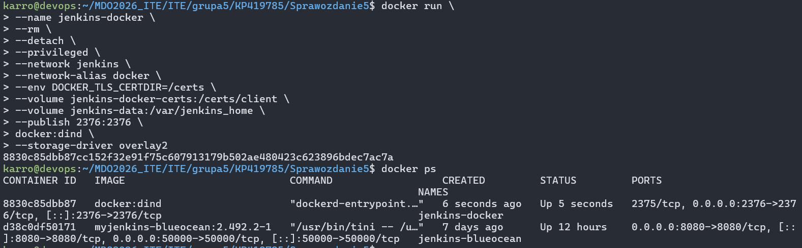

Aby uzyskać dostęp do panelu Jenkinsa z poziomu maszyny fizycznej, w programie VS Code (połączonym przez SSH) skonfigurowano przekierowanie portu `8080`.

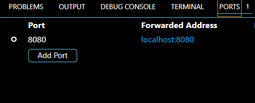

Ekran logowania Jenkinsa (dostęp pod adresem `localhost:8080`):

Początkowe hasło administratora (Initial Admin Password) odczytano wykonując komendę bezpośrednio w kontenerze:

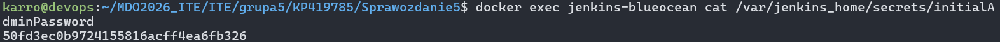

Po instalacji zalecanych wtyczek, ukaże się główny panel (Dashboard):

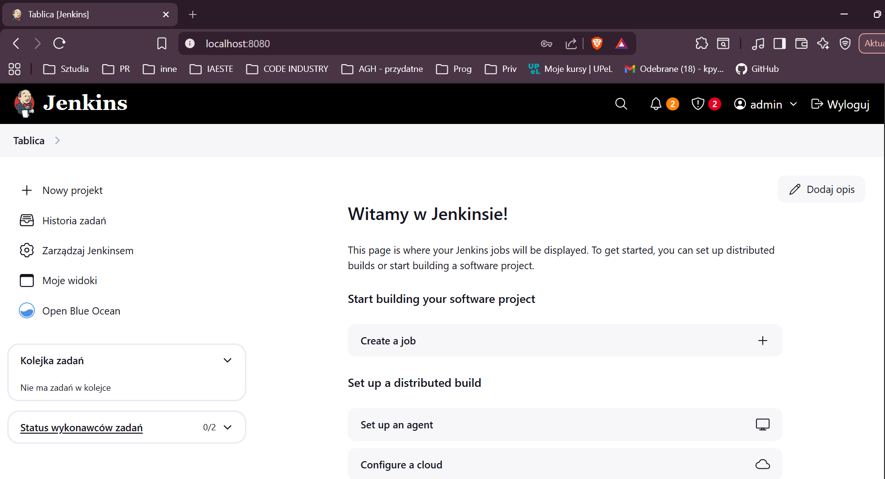

# 2. Uruchomienie (Freestyle projects)

Przed stworzeniem właściwego Pipeline'u, przetestowano działanie środowiska za pomocą prostych zadań typu Freestyle.

**Projekt 1: Wyświetlenie `uname -a`**
Zdefiniowano krok budowania wykonujący skrypt powłoki `uname -a`.

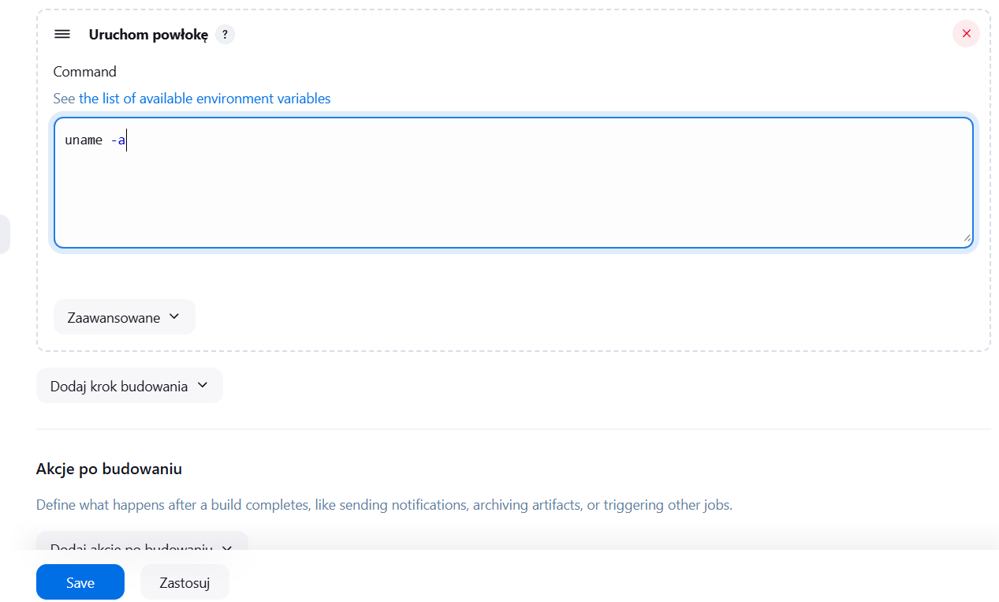

Zadanie zakończyło się sukcesem, zwracając informacje o architekturze wewnątrz kontenera:

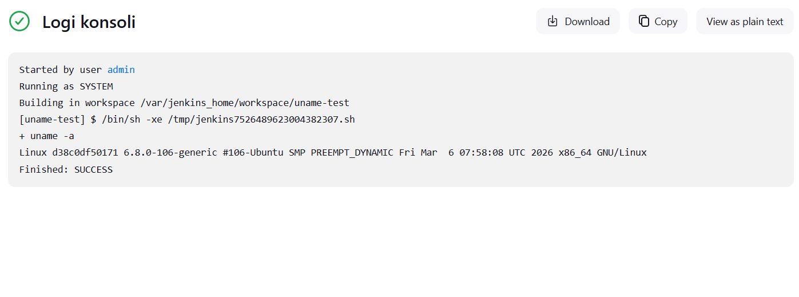

**Projekt 2: Nieparzysta godzinia**
Skonfigurowano skrypt sprawdzający aktualną godzinę. Jeśli reszta z dzielenia przez 2 nie wynosi 0, skrypt wyrzuca `exit 1`.

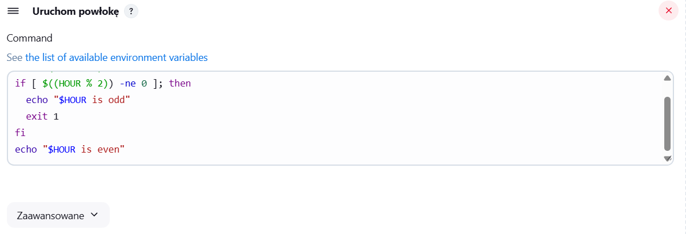

Test został wykonany o godzinie 8:00. Skrypt poprawnie zidentyfikował godzinę jako parzystą (Jenkins używa strefy czasowej UTC, a Polska jest UTC+2, stąd myśli że jest 6sta): 

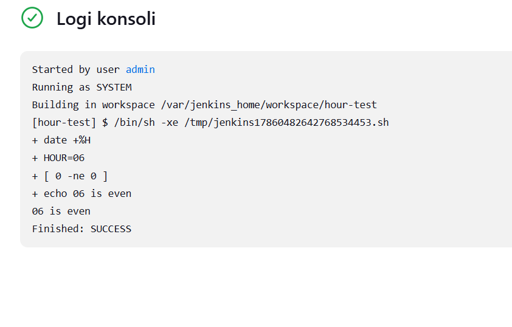

**Projekt 3: Pobranie obrazu ubuntu**
Ostatnie zadanie weryfikowało komunikację demona Dockera (DIND) z klientem zainstalowanym w Jenkinsie. Użyto polecenia `docker pull ubuntu`.

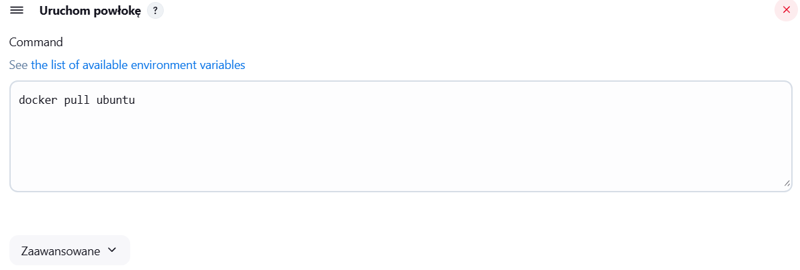

Polecenie zakończyło się sukcesem, co udowadnia poprawną łączność sieciową Jenkins -> DIND -> Docker Hub.

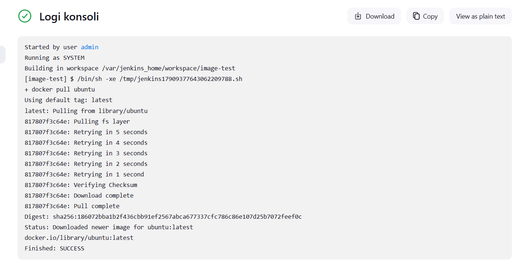

# 3. Kompletny Pipeline CI/CD

Docelowym rozwiązaniem jest kodowanie logiki wdrażania za pomocą podejścia Pipeline-as-Code. Stworzono plik `Jenkinsfile` i umieszczono go w repozytorium. Dodatkowo utworzono niezbędne konfiguracje obrazów Docker dla poszczególnych etapów.

Utworzone pliki Dockerfile zostały załączone do repozytorium za pomocą systemu git.

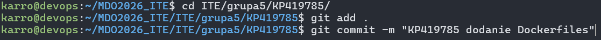
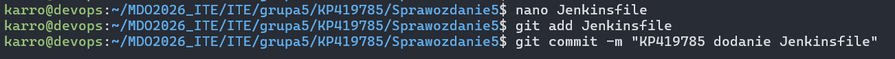

W interfejsie Jenkinsa stworzono zadanie typu Pipeline i połączono je z repozytorium.

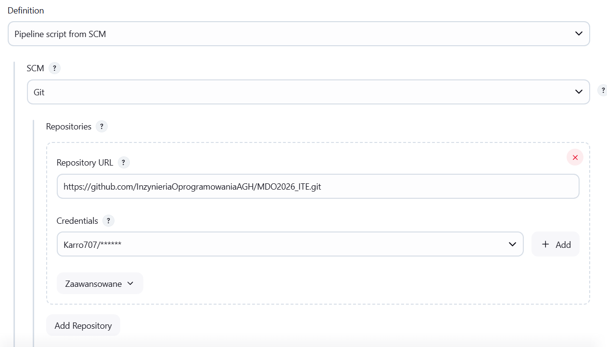
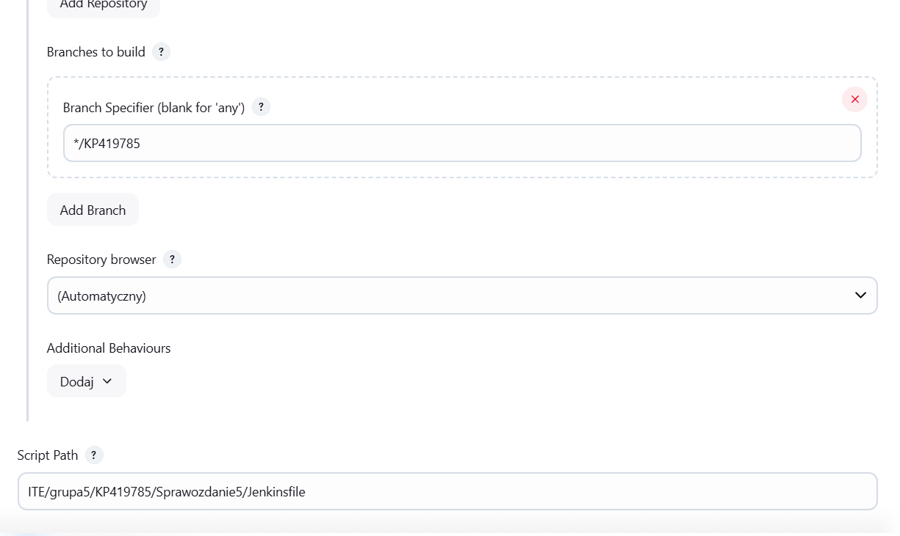

Gdy metoda nie działała, spróbowano alternatywnej opcji:

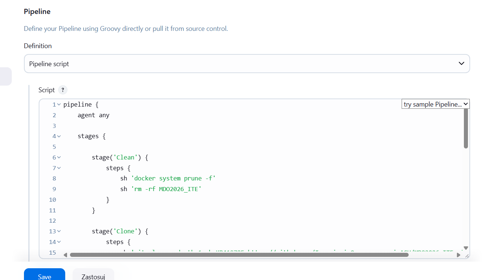

Uruchomienie procesu: 

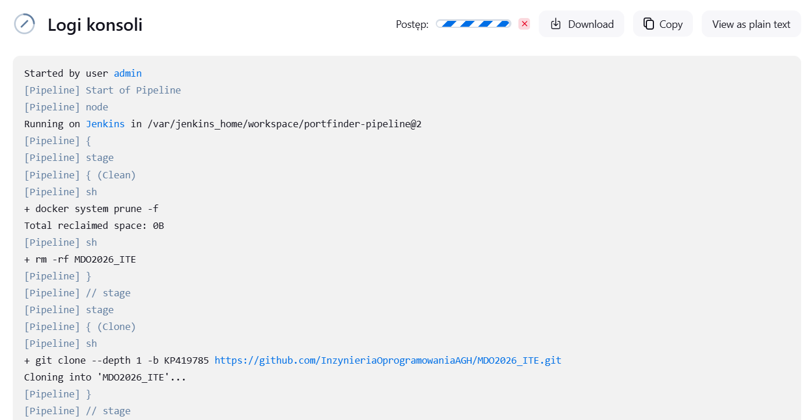

# 4. Architektura i etapy potoku (Pipeline Stages)

Potok zdefiniowany w pliku `Jenkinsfile` realizuje pełny cykl życia wdrażania aplikacji dla programu napisanego w języku Go (`portfinder`).

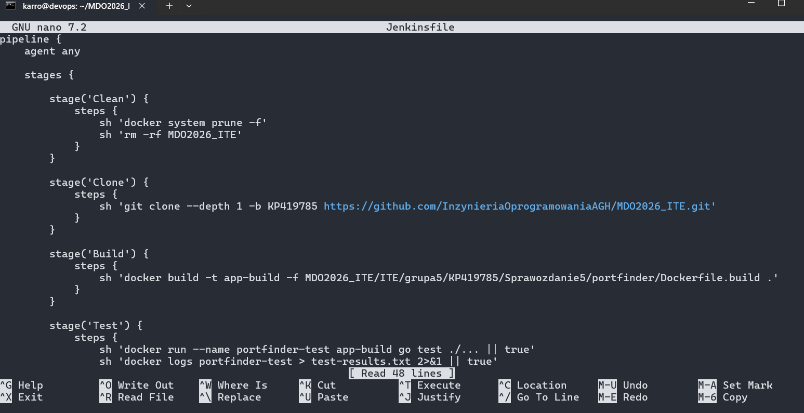

### Build 
Etap korzysta z dedykowanego pliku `Dockerfile.build`. Środowisko bazuje na obrazie `golang:1.24-alpine`, instaluje narzędzia (`make`, `git`), klonuje kod źródłowy aplikacji i wykonuje kompilację poleceniem `go build`.

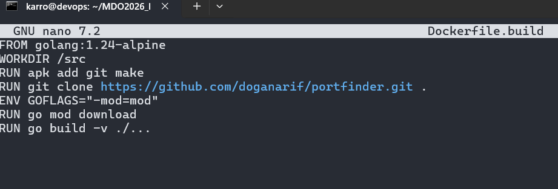

Uruchomienie procesu budowania obrazu budującego:

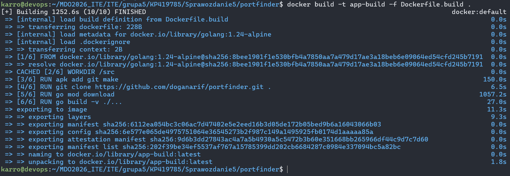

### Test
Etap korzysta z pliku `Dockerfile.test`. Ten obraz dziedziczy warstwy po obrazie wygenerowanym w etapie Build (`FROM app-build:latest`) i jako komendę główną deklaruje wykonanie `go test ./...`.

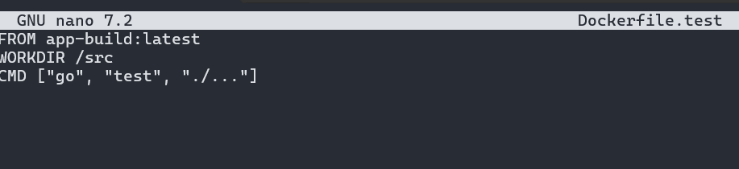

Właściwe testy budują się i uruchamiają błyskawicznie dzięki wykorzystaniu gotowego środowiska:

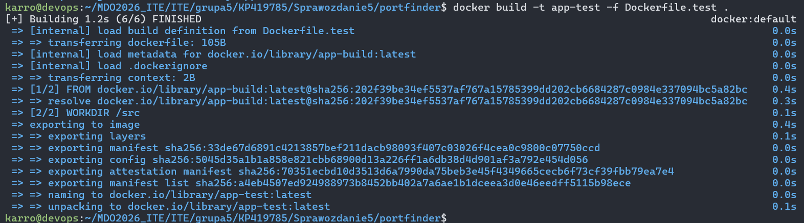

Ręczna weryfikacja logów testowych i czyszczenie wykazuje brak problemów (projekt domyślnie nie zawiera plików testowych, co potwierdza status `[no test files]`):

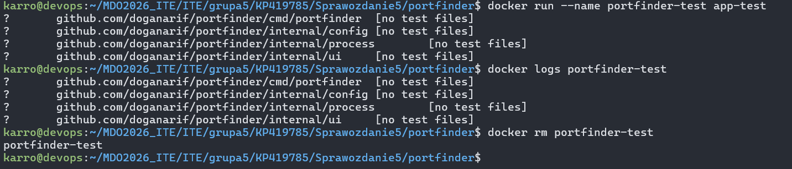

### Deploy i dyskusja architektoniczna
Zgodnie z dobrymi praktykami, do środowiska docelowego nie wdraża się kontenera służącego do budowania. Z tego powodu zastosowano koncepcję Multi-stage build wewnątrz pliku `Dockerfile.deploy`.

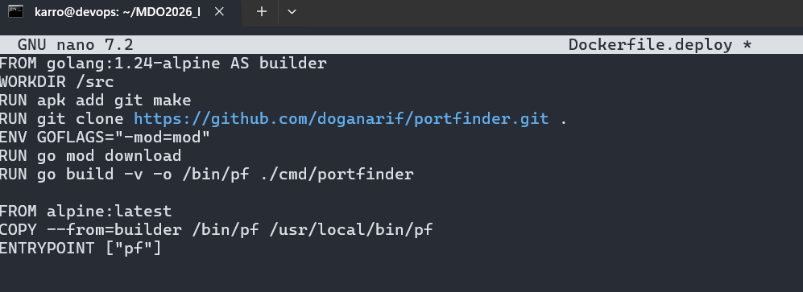

W pierwszej fazie obraz korzysta z Alpine'a w celu pobrania i kompilacji binarki (`/bin/pf`). Następnie przechodzi do nowej, pustej warstwy bazowej (czysty `alpine:latest`) i kopiuje do niej wyłącznie skompilowany plik binarny. 
Różnica między oficjalnymi pełnymi obrazami a odchudzonymi polega na pozbyciu się zbędnych zależności systemowych. W efekcie finalny obraz dla aplikacji Go potrafi zająć zalewie kilka megabajtów i jest znacznie bezpieczniejszy. Czystą kompilację i budowę zoptymalizowanego obrazu przedstawia poniższy log:

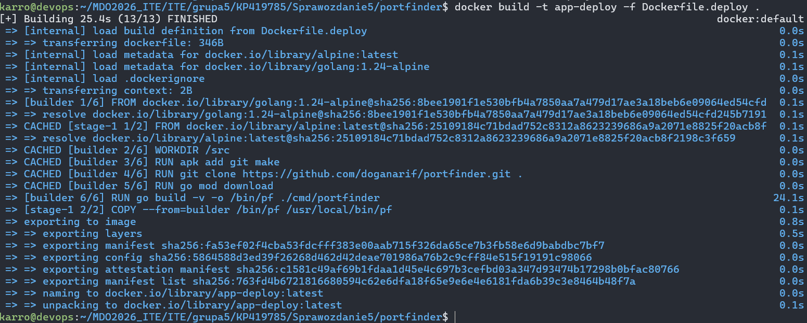

Sprawdzenie poprawności uruchomienia binarki w najlżejszym obrazie:

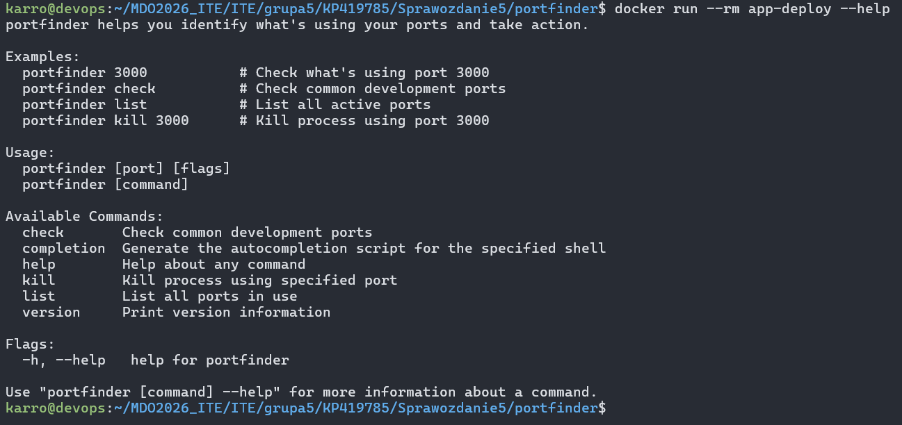
(TWORZENIE TRWAŁO ŁĄCZNIE 40 MINUT, PRACOWAŁAM CAŁY CZAS WIĘC PROSZE WZIĄŚĆ TO POD UWAGĘ PRZY OCENIE)

### Publish
W ostatnim etapie Pipeline'u, gotowy, przetestowany lekki obraz Dockera z programem jest kompresowany (`docker save app-deploy | gzip > portfinder-${BUILD_NUMBER}.tar.gz`) i przygotowywany jako artefakt `portfinder-${BUILD_NUMBER}.tar.gz`. Jenkins wykorzystuje funkcję `archiveArtifacts`, udostępniając archiwum do pobrania wprost z interfejsu WWW. W scenariuszach produkcyjnych, w tym miejscu wykorzystalibyśmy np. komendę `docker push` do rejestru (np. Docker Hub).

Główne zapytania do LLM: 
"jak połączyć te kontenery Jenkins i DIND ze sobą?"
"podstawowa składnia Jenkinsfile (Build, Test, Deploy) dla Go."
"multi stage build Docker jak zmniejszyć wage kontenera?"
Weryfikacja: Testy w panelu Jenkinsa, sprawdzanie logów z budowania, dokumentacja Dockera.

*Listing historii poleceń zawarty w pliku `history.txt` w folderze Sprawozdanie5*