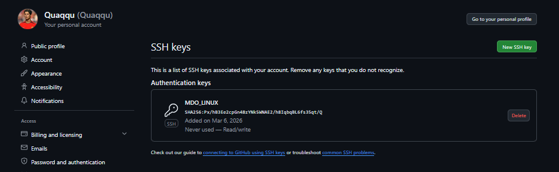
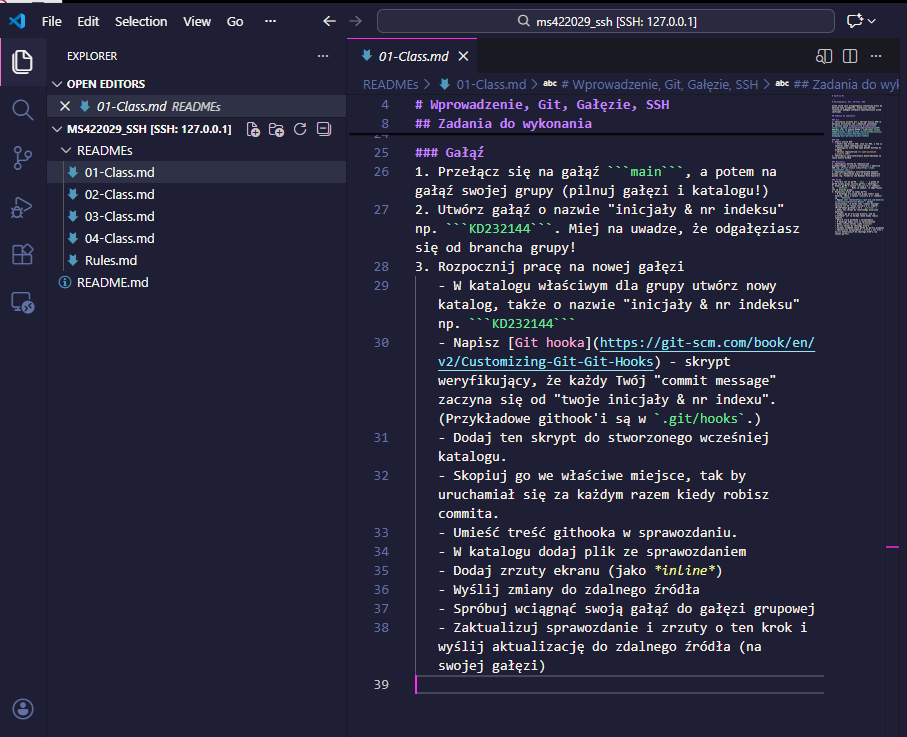

# Sprawozdanie 1 - Git, Branche, kody SSH
**Autor:** Mateusz Stępień (MS422029)

## Środowisko pracy
* **System operacyjny:** Windows 10
* **Edytor kodu:** Visual Studio Code
* **Środowisko wirtualne:** Ubuntu 24.04 LTS
* **Sposób dostępu:** Zdalne połączenie przez protokół SSH. Komendy wykonywane z poziomu zwykłego użytkownika ms422029, bez użycia konta root i bez wpisywania poleceń w konsoli KVM.

## 1. Konfiguracja połączenia SSH i pobranie repozytorium
Wygenerowałem klucz algorytmem Ed25519 poleceniem `ssh-keygen -t ed25519 -C "MDO"`. Część publiczną klucza dodałem do ustawień mojego konta na GitHubie. Następnie bez problemu sklonowałem repozytorium przy użyciu protokołu SSH.



## 2. Praca z branchami
Przełączyłem się na głownego brancha , a następnie na brancha grupa5 . Z niego utworzyłem własnego brancha  o nazwie MS422029.


## 3. Git Hook
W swoim katalogu utworzyłem plik skryptu commit-msg, który automatycznie dodaje mój numer indeksu na początek każdej wiadomości commita. Skopiowałem go do ukrytego folderu .git/hooks/ i nadałem uprawnienia do wykonywania (chmod +x). 

*Kod zastosowanego skryptu commit-msg:*
```bash
#!/bin/bash
PLIK_WIADOMOSCI=$1
OBECNA_TRESC=$(cat "$PLIK_WIADOMOSCI")
echo "MS422029: $OBECNA_TRESC" > "$PLIK_WIADOMOSCI"
