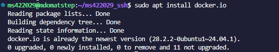
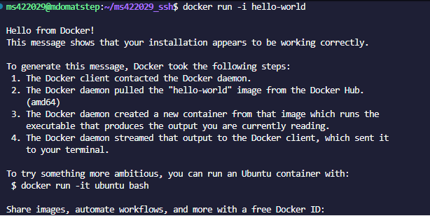
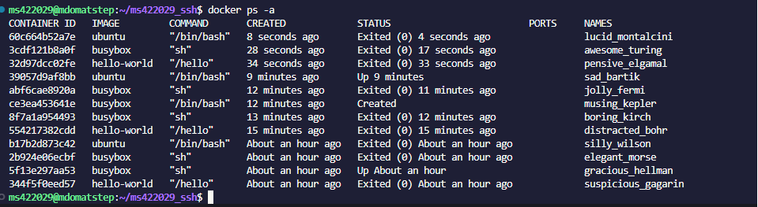
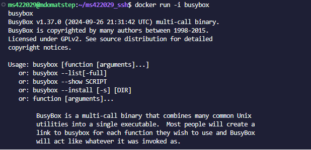
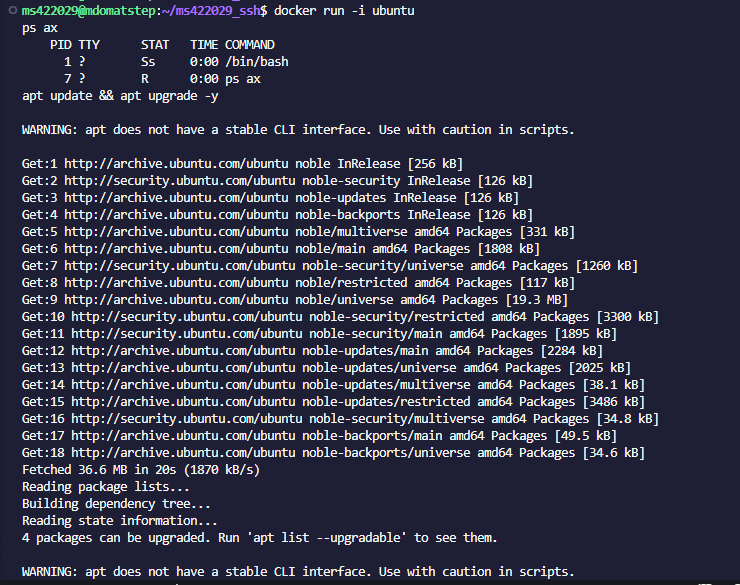
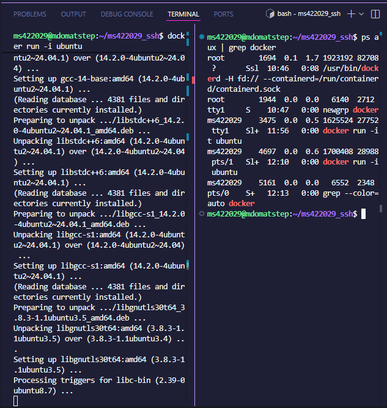
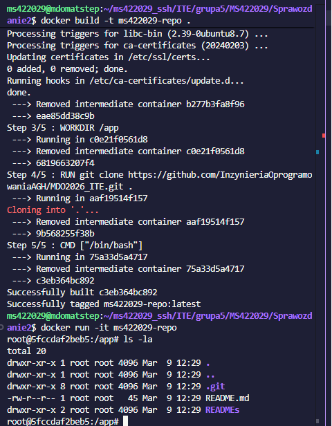
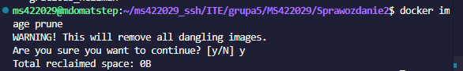

# Sprawozdanie 2 - Docker
**Autor:** Mateusz (MS422029)

## 1. Konfiguracja środowiska i instalacja
Zainstalowałem dockera poprzez użycie komendy *sudo apt install docker.io* Praca odbywa się zdalnie przez SSH w Visual Studio Code.

## 2. Rejestracja na dockerhubie

## 3. Praca z obrazami
Pobrano i uruchomiono sugerowane obrazy (hello-world, busybox, ubuntu). Zweryfikowano kody wyjścia – większość zakończyła się sukcesem (status 0)

Zestawienie kontenerów w stanie Exited (docker ps -a).

### Busybox
Uruchomiono kontener `busybox` w trybie interaktywnym i wywołano numer wersji środowiska.

## 4. procesy w Ubuntu (PID 1)
Przeprowadzono analizę procesów w kontenerze `ubuntu`.

* **Wewnątrz kontenera:** Proces `/bin/bash` posiada **PID 1**.
* **Na hoście:** Procesy kontenera są widoczne jako odrębne zadania silnika Docker.

Wychodzimy komendą exit
## 5. Własny Dockerfile
Stworzono plik `Dockerfile` bazujący na Ubuntu 24.04, stosując dobre praktyki.
* Instalacja narzędzia `git`.
* Czyszczenie cache menedżera pakietów w celu redukcji rozmiaru.
* Automatyczne klonowanie repozytorium przedmiotowego do katalogu `/app`.

## 6. Czyszczenie środowiska
Po zakończeniu prac wykonano czyszczenie lokalnego magazynu z nieużywanych kontenerów i obrazów.

