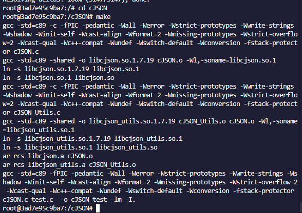
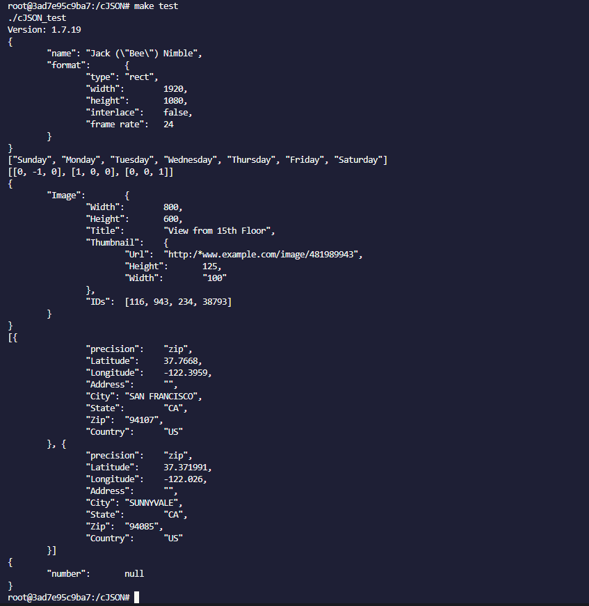
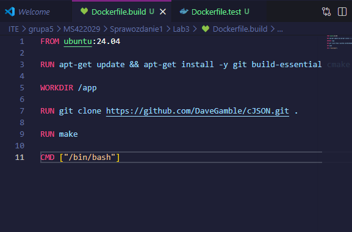
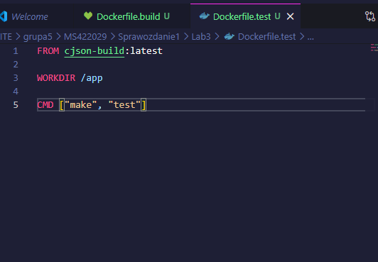
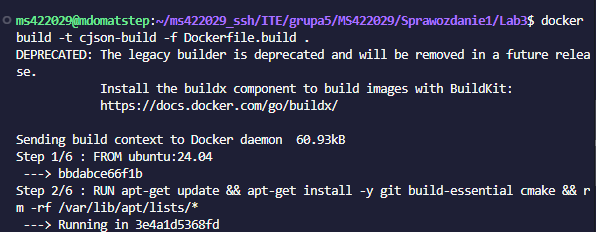
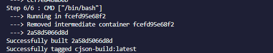
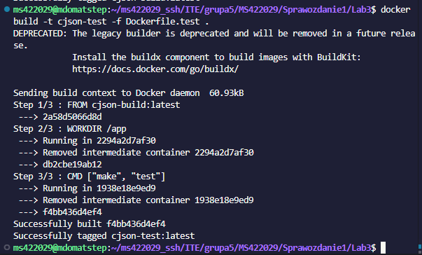
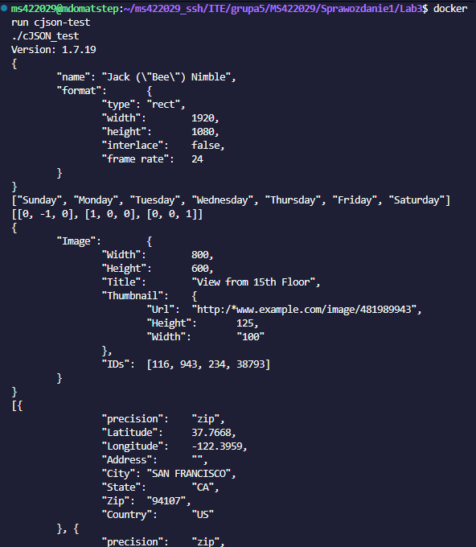

# Sprawozdanie 3 - Dockerfiles, kontener jako definicja etapu
**Autor:** Mateusz Stępień (MS422029)

## 1. Wybór oprogramowania i interaktywny build
Jako program do testów wybrałem lekką bibliotekę cJSON w języku C. Projekt ma otwartą licencję, swoje testy jednostkowe i gotowy plik `Makefile`, więc da się go łatwo zbudować przez `make` i `make test`.

Uruchomiłem interaktywnie bazowy kontener Ubuntu:
`docker run -it ubuntu:24.04 bash`

W środku zainstalowałem pakiety, pobrałem kod z gita i odpaliłem ręcznie kompilację:
apt-get update && apt-get install -y git build-essential cmake
git clone https://github.com/DaveGamble/cJSON.git
cd cJSON
make

Następnie wpisałem polecenie `make test`. Program poprawnie zinterpretował testowe struktury JSON, a testy zakończyły się sukcesem bez błędów.

## 2. Automatyzacja - pliki Dockerfile
Aby zautomatyzować proces i odseparować kompilacje od testów, napisałem dwa niezależne pliki konfiguracyjne.

**Kontener 1: Dockerfile.build**
Pobiera świeży system Ubuntu, instaluje narzędzia, klonuje repozytorium do katalogu roboczego `/app` i wykonuje kompilację (`make`).

**Kontener 2: Dockerfile.test:**
Obraz ten bazuje bezpośrednio na przygotowanym przed chwilą obrazie (`FROM cjson-build:latest`). Jego jedynym zadaniem jest wywołanie komendy `make test`.

## 3. Zbudowanie obrazów i weryfikacja
Za pomocą polecenia `docker build -t cjson-build -f Dockerfile.build .` uruchomiłem proces budowania pierwszego obrazu.

Proces zakończył się pomyślnie.

W kolejnym kroku zbudowałem drugi, testowy obraz poleceniem `docker build -t cjson-test -f Dockerfile.test .`. Budowa przebiegła błyskawicznie dzięki pobraniu gotowych warstw z poprzedniego etapu.

Na koniec uruchomiłem kontener z testami poleceniem `docker run cjson-test`. Udowodniłem tym samym, że kontener działa i prawidłowo realizuje odizolowane testy na zbudowanym programie, zwracając wyniki na wyjście standardowe.

Poprawne wdrożenie kontenera udowadnia ostatni zrzut ekranu. Po wpisaniu polecenia `docker run cjson-test`, kontener bez problemu wstaje, wykonuje powierzone mu zadanie i wyrzuca na wyjście standardowe prawidłowy wynik testów.

W kontenerze tym działa tylko jeden proces, zdefiniowany w linijce `CMD ["make", "test"]`. Skrypt ten odpala binarkę z testami cJSON i gdy dobiegną one końca, proces kończy się i zwraca kod 0. Następnie cały kontener kończy swoje działanie i po prostu się wyłącza.