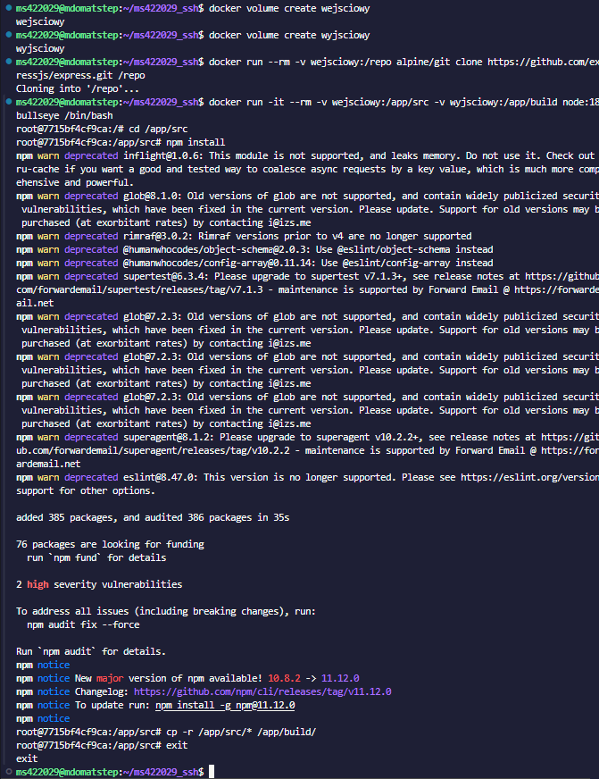
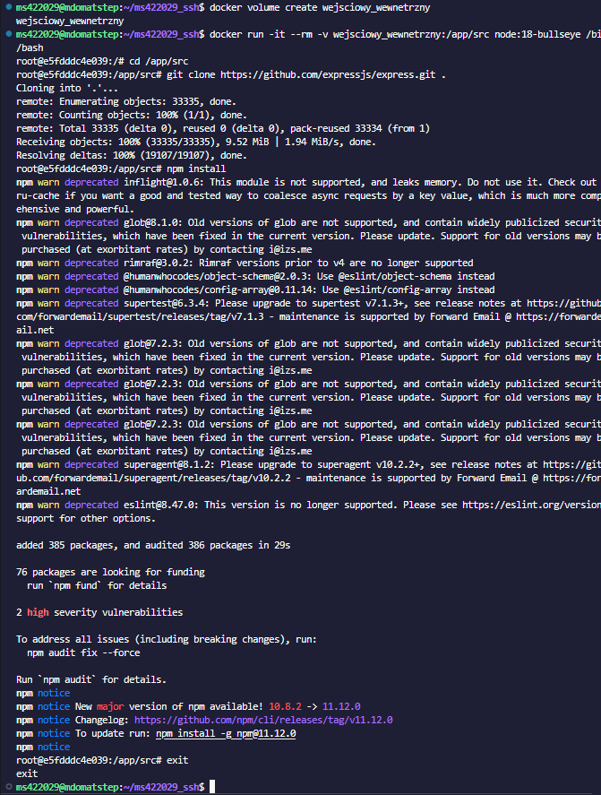
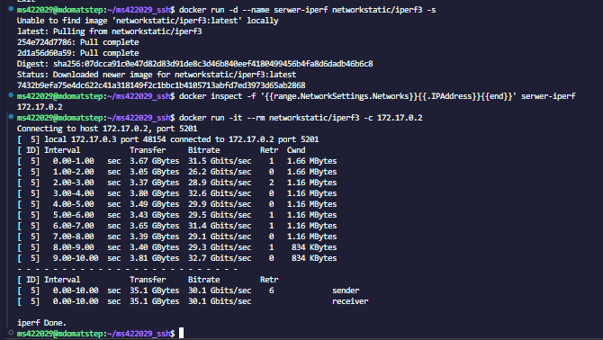
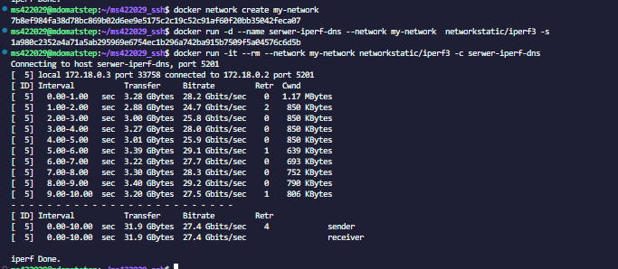
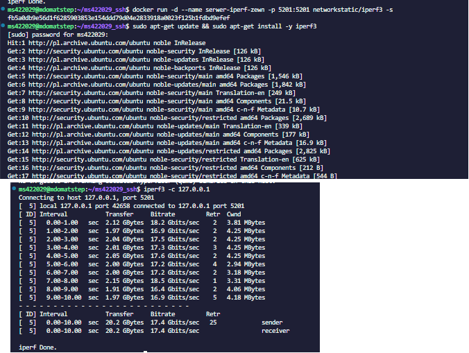
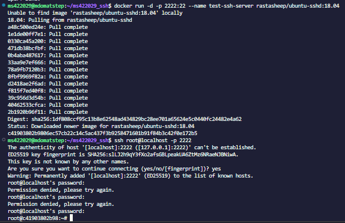
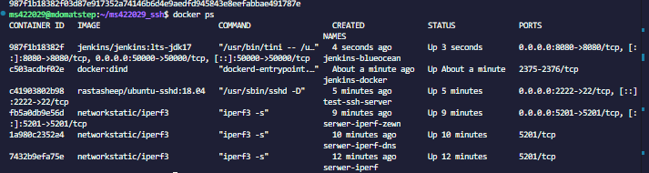
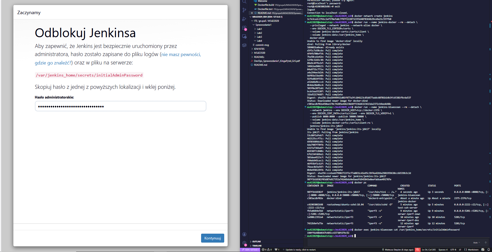
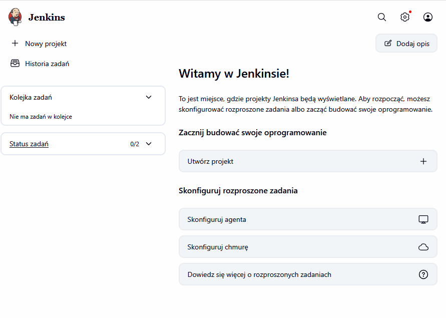

# Sprawozdanie 4 - Dodatkowa terminologia w konteneryzacji, instancja Jenkins
**Autor:** Mateusz Stępień (MS422029)

## 1. Zachowywanie stanu między kontenerami
Zadanie rozpocząłem od utworzenia dwóch wirtualnych dysków (woluminów): `wejsciowy` i `wyjsciowy`.

**Klonowanie bez użycia Gita w głównym kontenerze:**
Zgodnie z poleceniem, mój główny kontener budujący nie miał mieć dostępu do Gita. Aby pobrać kod (wybrałem projekt Express.js), użyłem tzw. **kontenera pomocniczego** z obrazem `alpine/git`. Podpiąłem do niego wolumin `wejsciowy` i sklonowałem repozytorium bezpośrednio na niego. 
*Dlaczego tak, a nie inaczej?* * Nie użyłem *bind mounta*, ponieważ chciałem, aby proces był całkowicie niezależny od plików na moim lokalnym hoście. 
 Nie kopiowałem też plików ręcznie do katalogu `/var/lib/docker`, ponieważ to omija API Dockera i jest po prostu mało elegancką praktyką. Użycie jednorazowego kontenera pomocniczego to najprofesjonalniejszy sposób.

Następnie uruchomiłem główny kontener budujący (`node:18-bullseye`), podpinając oba woluminy. Odpaliłem tam `npm install` (build), a gotowe pliki przegrałem na wolumin `wyjsciowy`.

**Klonowanie wewnątrz kontenera:**
Następnie ponowiłem operację, ale tym razem pobrałem repozytorium od razu wewnątrz kontenera budującego, który posiadał własnego klienta Git. Pliki zapisałem na nowym, testowym woluminie `wejsciowy_wewnetrzny`.

**Dyskusja - `docker build` i plik `Dockerfile`:**
Gdybym chciał w pełni zautomatyzować powyższe kroki w `Dockerfile`, świetnym sposobem na zachowanie czystości (czyli pobranie kodu bez powiększania ostatecznego obrazu) byłoby użycie instrukcji `RUN --mount=type=bind`. Pozwala to na tymczasowe wziecie plików źródłowych z hosta na czas wykonywania kompilacji. Po zakończeniu etapu builda, pliki te nie wchodzą w skład gotowego obrazu.

## 2. Eksponowanie portu i łączność między kontenerami
Do zbadania ruchu sieciowego użyłem programu `iperf3`.

**Domyślna sieć (szukanie adresu IP):**
Najpierw odpaliłem serwer w tle w domyślnej sieci Dockera (`bridge`). Aby połączyć się z nim jako klient z drugiego kontenera, musiałem wyciągnąć jego wewnętrzny adres IP. Zrobiłem to poleceniem `docker inspect`.

**Własna sieć (rozwiązywanie nazw):**
Szukanie IP jest uciążliwe przy wielu kontenerach. Utworzyłem więc własną sieć mostkową poleceniem `docker network create my-network` i tam uruchomiłem nowy serwer. Docker we własnych sieciach zapewnia wewnętrzny serwer DNS. Dzięki temu mogłem połączyć się z serwerem, podając jako cel po prostu jego nazwę (`serwer-iperf-dns`), a Docker sam przetłumaczył to na odpowiedni adres IP.

**Połączenie z zewnątrz i przepustowość:**
Sprawdziłem też łączność spoza kontenera, z poziomu hosta. Uruchomiłem kontener wystawiając jego port na zewnątrz parametrem `-p 5201:5201`. Zainstalowałem klienta na maszynie wirtualnej i połączyłem się przez lokalny adres `127.0.0.1`. 
Zarejestrowana przepustowość w testach była bardzo wysoka (rzędu kilkudziesięciu Gbits/sec), ponieważ ruch ten nie wychodzi fizycznie poza maszynę – jest obsługiwany całkowicie wirtualnie w pamięci RAM przez jądro Linuxa.

## 3. Usługi w rozumieniu systemu i kontenera
Uruchomiłem kontener z gotowym serwerem SSH (obraz `rastasheep/ubuntu-sshd`). Przemapowałem jego port 22 na port 2222 mojej maszyny i pomyślnie zalogowałem się do środka za pomocą klienta SSH.

**Zalety, wady i przypadki użycia SSH w kontenerze:**
Traktowanie kontenera jak maszyny wirtualnej z uruchomionym serwerem SSH to w nowoczesnym DevOpsie *antywzorzec*.
* *Wady:* Kontenery z zasady powinny izolować jeden główny proces. Instalowanie tam demona SSH niepotrzebnie powiększa obraz, komplikuje zarządzanie kluczami i tworzy nowe luki w zabezpieczeniach. Do interaktywnej pracy służy komenda `docker exec`.
* *Zalety i przypadki użycia:* Takie podejście ma rację bytu głównie przy konteneryzacji bardzo starych aplikacji, które od zawsze opierały się na architekturze maszyn wirtualnych i wymagają logowania po SSH do obsługi.

## 4. Przygotowanie instancji serwera Jenkins
Na sam koniec uruchomiłem serwer Jenkins, stosując architekturę Docker-in-Docker.

Stworzyłem sieć `jenkins` i uruchomiłem dwie współpracujące usługi. Pierwsza (`docker:dind`) to pomocnik robiący za silnik Dockera, dzięki któremu Jenkins będzie mógł budować obrazy. Druga (`jenkins-blueocean`) to właściwa instancja z interfejsem graficznym. Sprawdziłem, że obie usługi działają komendą `docker ps`.

Zainicjalizowałem środowisko odczytując z logów kontenera startowe hasło administratora. Przekierowałem port 8080 do mojego VS Code i wkleiłem hasło na stronie, aby odblokować system.

Po instalacji domyślnych wtyczek i założeniu konta użytkownika pomyślnie dotarłem do głównego panelu. Jenkins jest uruchomiony i gotowy do pracy nad budowaniem projektów.

