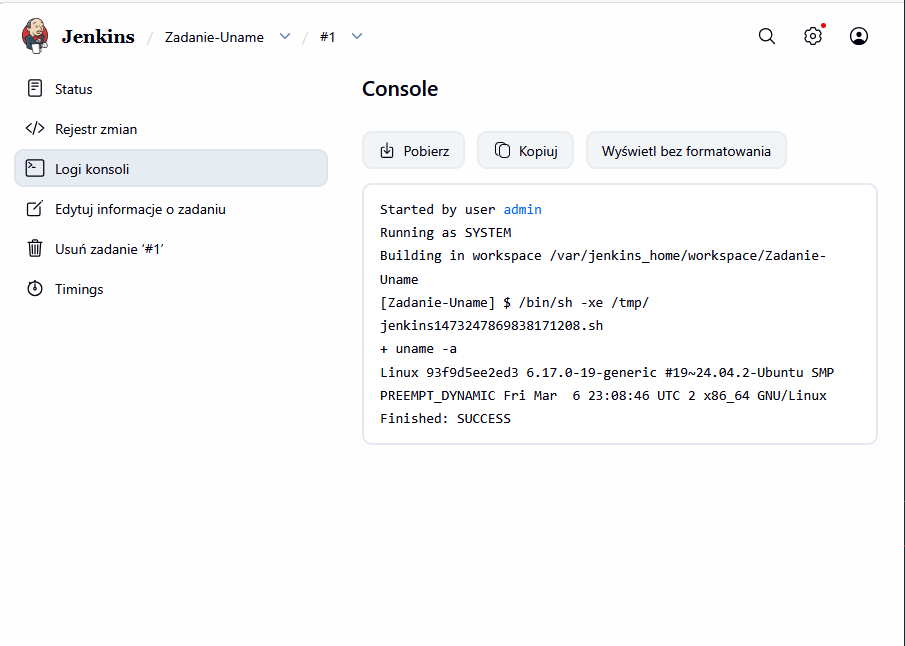
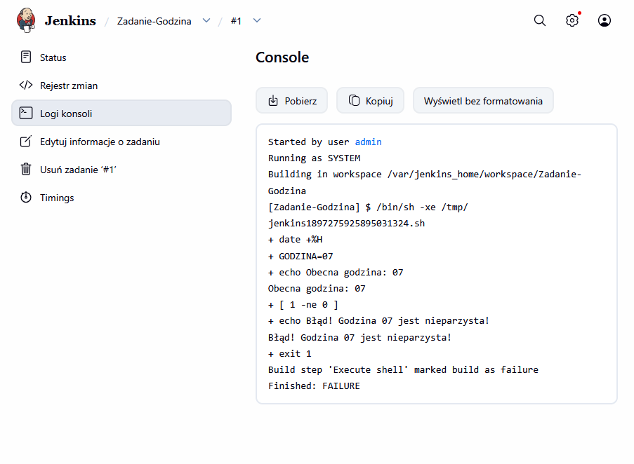
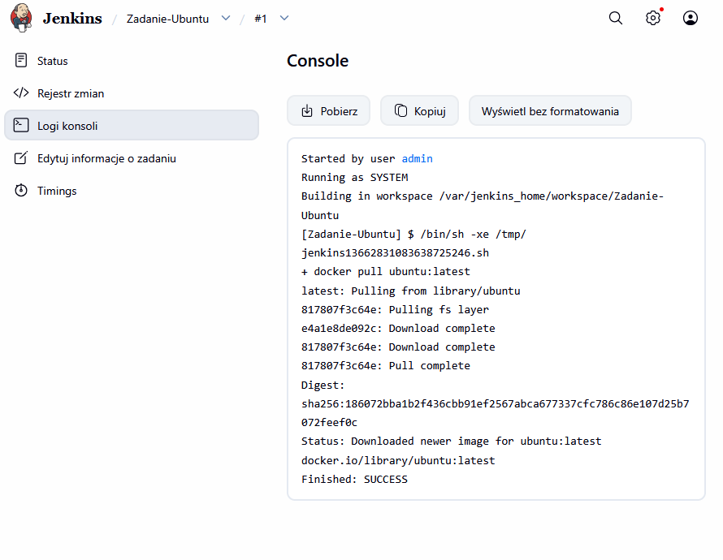
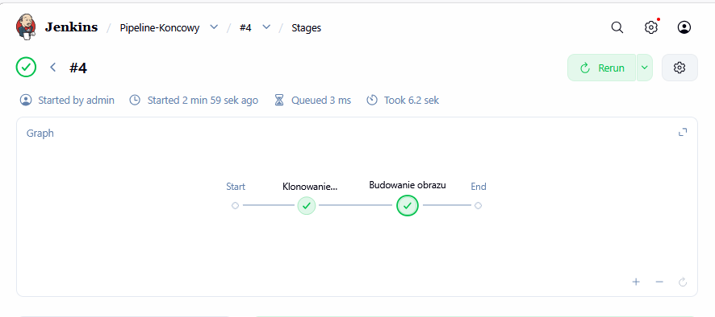

# Sprawozdanie 5 - Pipeline, Jenkins, izolacja etapów
**Autor:** Mateusz Stępień (MS422029)

## 1. Przygotowanie instancji Jenkins
Na początku zajęć zająłem się utworzeniem nowej instancji Jenkins. Z powodu problemów ze starymi woluminami, postawiłem środowisko na nowo.
* Upewniłem się, że działają kontenery budujące i testujące z poprzednich zajęć. 
* Uruchomiłem obraz Dockera, który eksponuje środowisko zagnieżdżone (Docker-in-Docker).
* Uruchomiłem interfejs Blueocean.
* Po pomyślnym starcie, zalogowałem się i skonfigurowałem Jenkinsa do dalszej pracy.
* Zgodnie z wytycznymi, zadbałem o archiwizację i zabezpieczenie logów systemowych.

## 2. Zadanie wstępne: uruchomienie
Następnie przeprowadziłem konfigurację wstępną i pierwsze uruchomienie poprzez wykonanie trzech projektów testowych.

**A. Projekt z komendą uname**
* Utworzyłem projekt, który wyświetla polecenie `uname`. 
* Wykonanie skryptu powłoki przebiegło pomyślnie, co widać na poniższym zrzucie ekranu.



**B. Projekt z godzina**
* Utworzyłem projekt, który zwraca błąd, gdy godzina jest nieparzysta. 
* Skrypt poprawnie zidentyfikował godzinę 07 jako nieparzystą, wymusił kod wyjścia `exit 1` i oznaczył status budowania jako porażkę (`FAILURE`).



**C. Pobranie obrazu Docker**
* Ostatnim krokiem było pobranie w projekcie obrazu kontenera `ubuntu`.
* Zastosowałem w tym celu komendę `docker pull`, która zakończyła się sukcesem i zapisała najnowszy obraz w środowisku.



## 3. Zadanie wstępne: obiekt typu pipeline
Po wykazaniu poprawnego działania Jenkinsa, przeszedłem do konfiguracji potoku CI.

* Utworzyłem nowy obiekt typu `pipeline`.
* Wpisałem treść pipeline'u bezpośrednio do obiektu, celowo unikając na tym etapie pobierania definicji z systemu SCM.
* W pierwszym kroku potoku sklonowałem repozytorium przedmiotowe.
* Następnie wykonałem checkout do swojego pliku Dockerfile na osobistej gałęzi.
* W kolejnym etapie zbudowałem ten plik Dockerfile.

Widok zdefiniowanych i pomyślnie zakończonych etapów:


Aby sprawdzić działanie pamięci podręcznej, uruchomiłem stworzony pipeline drugi raz. Zgodnie z przewidywaniami, Docker rozpoznał niezmienione instrukcje i wykorzystał zapisane wcześniej warstwy obrazu. Potwierdzają to logi wygenerowane przez silnik:

```text
#5 [3/6] RUN curl -fsSLo /usr/share/keyrings/docker-archive-keyring.asc [https://download.docker.com/linux/debian/gpg](https://download.docker.com/linux/debian/gpg)
#5 CACHED

#6 [4/6] RUN echo "deb [arch=$(dpkg --print-architecture) signed-by=/usr/share/keyrings/docker-archive-keyring.asc] [https://download.docker.com/linux/debian](https://download.docker.com/linux/debian) $(lsb_release -cs) stable" > /etc/apt/sources.list.d/docker.list
#6 CACHED

#7 [5/6] RUN apt-get update && apt-get install -y docker-ce-cli
#7 CACHED

#8 [2/6] RUN apt-get update && apt-get install -y lsb-release
#8 CACHED

#9 [6/6] RUN jenkins-plugin-cli --plugins "blueocean docker-workflow"
#9 CACHED
```

Komunikaty CACHED świadczą o poprawnym przebiegu etapów