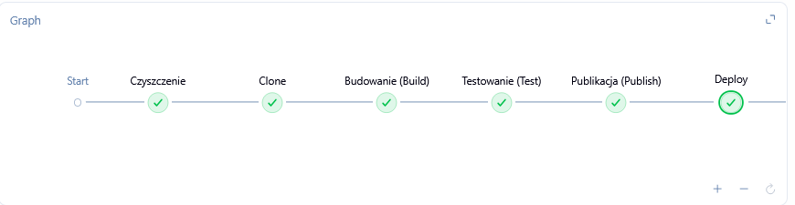
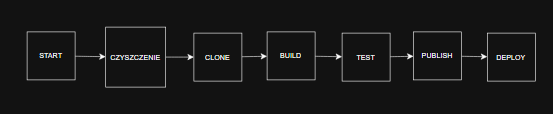
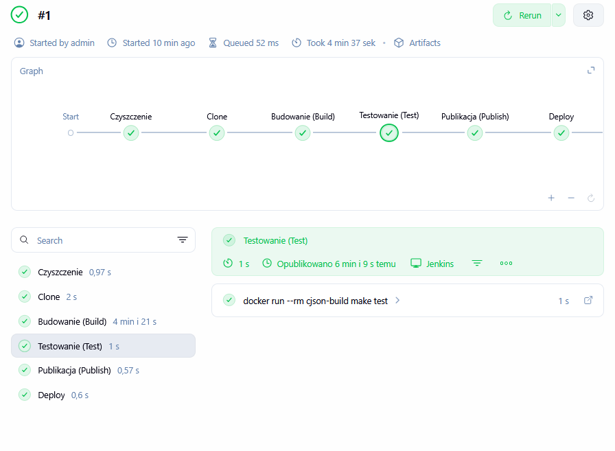
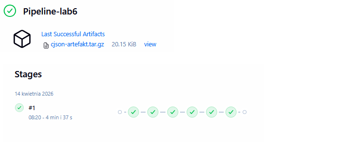
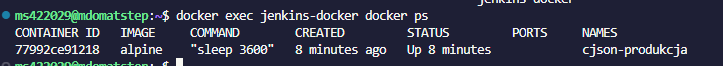

# Sprawozdanie 6 - Pipeline CI/CD, lista kontrolna
**Autor:** Mateusz Stępień (MS422029)

## 1. Ścieżka krytyczna
Podstawowy zbiór czynności w ramach potoku CI/CD (Manual Trigger -> Clone -> Build -> Test -> Publish -> Deploy) został w pełni zaimplementowany. Całość procesu została poprawnie wykonana przez silnik Jenkins, co udowadnia poniższy zrzut z widoku etapów (Stage View):



## 2. Pełna lista kontrolna - Aplikacja i Kod
* **Wybór aplikacji i budowanie:** Do stworzenia pełnego potoku wybrałem projekt `cJSON`. Program poprawnie kompiluje się przy użyciu narzędzia `make`.
* **Fork i SCM:** Kod źródłowy jest pobierany bezpośrednio z oryginalnego repozytorium GitHub (DaveGamble/cJSON). Zdecydowałem, że tworzenie własnego *forka* na tym etapie nie jest konieczne, ponieważ nie wprowadzam zmian w kodzie C, a proces CI/CD w całości kontroluję z poziomu Jenkinsa.

## 3. Architektura i Diagram UML
Zgodnie z wymogami opracowałem diagram aktywności UML, który obrazuje przepływ pracy w zaplanowanym potoku.



**Rozbieżność między UML a efektem:** Zaplanowany diagram w 100% pokrywa się z otrzymanym efektem w Jenkinsie. Dodano jedynie techniczny krok "Czyszczenie" na początku potoku, aby zagwarantować idempotentność (powtarzalność) środowiska.

## 4. Izolacja: Kontenery Build i Test
* **Kontener bazowy (Build):** Do etapu kompilacji stworzyłem dedykowany obraz oparty na `ubuntu:24.04`. Doinstalowałem tam jedynie niezbędne zależności: `build-essential` oraz `cmake`. Skrypt potoku w locie generuje plik konfiguracyjny i wykonuje proces *Build* wewnątrz tego kontenera.

**Kod pliku Dockerfile.build (generowany z poziomu Jenkinsa):**
```dockerfile
FROM ubuntu:24.04
RUN apt-get update && apt-get install -y build-essential cmake
COPY . /app
WORKDIR /app
RUN make
```

* **Testy wewnątrz kontenera:** Dołączone do repozytorium testy jednostkowe zostały uruchomione w sposób izolowany. Jako środowisko uruchomieniowe dla testów celowo wykorzystano ten sam kontener, który posłużył do zbudowania aplikacji (`cjson-build`), co gwarantuje spójność bibliotek pomiędzy kompilacją a weryfikacją. Testy zakończyły się pełnym sukcesem.
* **Logi z procesu:** Logi z testów są automatycznie odkładane przez Jenkinsa i przypisywane do konkretnego numeru operacji (#1).



## 5. Publikacja artefaktu (Publish)
* **Wybór elementu publikowanego:** Elementem publikacyjnym jest archiwum `cjson-artefakt.tar.gz`. Zdecydowałem się na ten format, ponieważ biblioteki języka C (pliki nagłówkowe `.h`, kody `.c` oraz zoptymalizowane skrypty `Makefile`) dystrybuuje się najczęściej jako proste, spakowane archiwa, a nie pełne kontenery.
* **Wersjonowanie i pochodzenie:** W rzeczywistym środowisku produkcyjnym pochodzenie artefaktu identyfikuje się za pomocą hasha commitu (np. z gita) lub zmiennej systemowej Jenkinsa (np. tagując plik jako `cjson-v1.0-${env.BUILD_NUMBER}.tar.gz`). 
* **Dostępność artefaktu:** Gotowy do redystrybucji plik został odłożony w Jenkinsie i jest dostępny do pobrania bezpośrednio na stronie podsumowania zadania.



## 6. Wdrożenie i Smoke Test (Deploy)
* **Kontener Deploy a Kontener Build:** Kontener użyty do etapu budowania (Ubuntu + kompilatory) absolutnie nie nadaje się do wdrożenia (Deploy). Jest zbyt "ciężki" i zawiera narzędzia developerskie, które stwarzają ogromne zagrożenie dla bezpieczeństwa w środowisku produkcyjnym.
* **Wdrożenie kontenera produkcyjnego:** W celu symulacji wdrożenia użyto lekkiego kontenera bazującego na obrazie `alpine`. 
* **Smoke test:** Aby zweryfikować, czy aplikacja została wdrożona prawidłowo do silnika Docker, wykonałem polecenie `docker ps` wewnątrz środowiska wykonawczego (DinD).



## 7. Skrypt potoku (Jenkinsfile)
Zgodnie z wymaganiami, poniżej przedstawiam w pełni skopiowalną postać użytego obiektu *Jenkinsfile*. Jest on również załączony do sprawozdania jako oddzielny plik.

```groovy
pipeline {
    agent any
    stages {
        stage('Czyszczenie') {
            steps {
                sh 'docker rm -f cjson-produkcja || true'
                sh 'rm -rf cJSON || true'
            }
        }
        stage('Clone') {
            steps {
                sh 'git clone [https://github.com/DaveGamble/cJSON.git](https://github.com/DaveGamble/cJSON.git)'
            }
        }
        stage('Budowanie (Build)') {
            steps {
                dir('cJSON') {
                    sh '''
                    echo "FROM ubuntu:24.04" > Dockerfile.build
                    echo "RUN apt-get update && apt-get install -y build-essential cmake" >> Dockerfile.build
                    echo "COPY . /app" >> Dockerfile.build
                    echo "WORKDIR /app" >> Dockerfile.build
                    echo "RUN make" >> Dockerfile.build
                    '''
                    sh 'docker build -t cjson-build -f Dockerfile.build .'
                }
            }
        }
        stage('Testowanie (Test)') {
            steps {
                dir('cJSON') {
                    sh 'docker run --rm cjson-build make test'
                }
            }
        }
        stage('Publikacja (Publish)') {
            steps {
                dir('cJSON') {
                    sh 'tar -czvf cjson-artefakt.tar.gz cJSON.h cJSON.c Makefile'
                    archiveArtifacts artifacts: 'cjson-artefakt.tar.gz', onlyIfSuccessful: true
                }
            }
        }
        stage('Deploy') {
            steps {
                sh 'docker run -d --name cjson-produkcja alpine sleep 3600'
            }
        }
    }
}
```