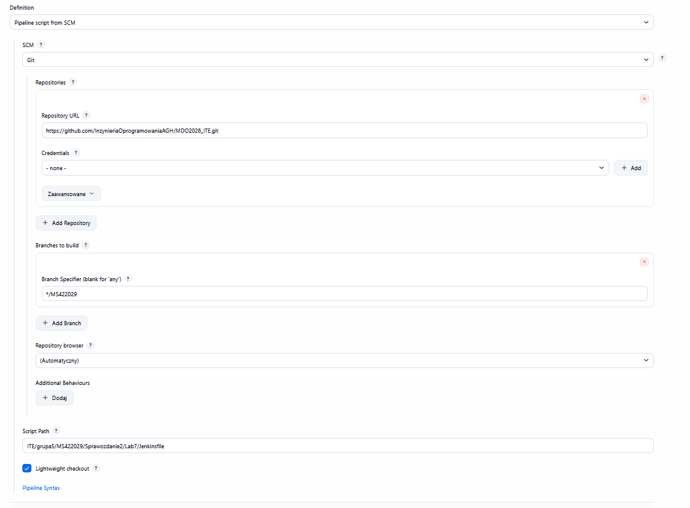
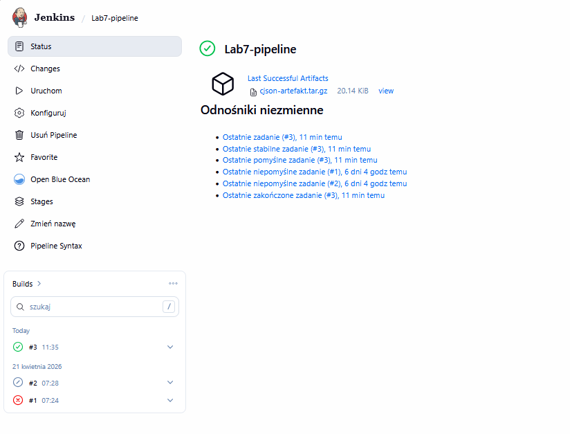

# Sprawozdanie z Laboratorium 7: Ciągła Integracja i Wdrażanie (CI/CD) - Jenkins Pipeline

**Autor:** Mateusz Stępień, 422029  
**Temat:** Automatyzacja procesu budowania, testowania i wdrażania biblioteki `cJSON` przy pomocy potoku (Pipeline) w Jenkinsie zintegrowanego z GitHubem oraz Dockerem.

---

## 1. Wstęp
Na tych laboratoriach zajęliśmy się przeniesieniem definicji potoku CI/CD bezpośrednio do kodu źródłowego (jako plik `Jenkinsfile`) na repozytorium GitHub. Dzięki takiemu podejściu typu "Infrastructure as Code", konfiguracja środowiska budowania jest wersjonowana razem z kodem, co ułatwia pracę i uodparnia nas na ewentualne awarie samego serwera Jenkins.

## 2. Problemy napotkane podczas wdrożenia i ich rozwiązania
Zanim udało się poprawnie uruchomić cały pipeline, natrafiłem na kilka poważnych problemów ze środowiskiem Dockerowym i siecią, które wymagały ręcznej interwencji:

1. **Błąd połączenia z API Dockera (`server misbehaving / lookup docker`):**
   Z powodu wcześniejszego czyszczenia dysku i kontenerów, Jenkins (`blueocean`) stracił połączenie z kontenerem udostępniającym silnik Dockera (`dind`). Musiałem od nowa skonfigurować sieć i postawić kontener `jenkins-docker`.
2. **Zawieszanie się etapu pobierania repozytorium (`git fetch`):**
   Jenkins potrafił wisieć kilkadziesiąt minut na etapie zaciągania repozytorium z GitHuba. Jak sprawdziłem komendą `curl` z wnętrza kontenera, dostęp do internetu był poprawny. Okazało się, że Git "dławił się" przy pobieraniu pełnej, ciężkiej historii repozytorium całej grupy. Żeby to obejść, wdrożyłem w konfiguracji projektu w Jenkinsie opcję **Shallow clone** z głębokością (`depth`) ustawioną na 1. Dzięki temu pobierana była tylko najnowsza wersja kodu, a problem z zawieszaniem całkowicie zniknął.

## 3. Realizacja listy kontrolnej 
Ostatecznie udało się stworzyć w pełni działający Pipeline. Poniżej zestawienie zrealizowanych punktów:

- [x] **Przepis dostarczany z SCM:** Zamiast wklejać kod potoku prosto w Jenkinsa, skonfigurowałem opcję *Pipeline script from SCM*, podając link do GitHuba i ścieżkę do mojego pliku `Jenkinsfile` na branchu `MS422029` w folderze `Lab7`.
- [x] **Sprzątanie na starcie:** Dodałem etap `Czyszczenie i SCM` wykorzystujący polecenie `cleanWs()`. Dzięki temu przed każdym buildem czyszczony jest workspace i mamy pewność, że budujemy najświeższy kod, a nie jakieś resztki z cache'u.
- [x] **Dostęp do repozytorium i Dockerfile:** Potok robi klona biblioteki `cJSON` i generuje plik `Dockerfile.bldr` bazujący na Ubuntu 24.04, żeby mieć gdzie zainstalować potrzebne pakiety (`build-essential`, `cmake`).
- [x] **Tworzenie obrazu buildowego:** Odpalam `docker build`, co stawia odizolowane środowisko do kompilacji, korzystając z kontenera DIND.
- [x] **Przygotowanie artefaktu i Testy:** Wewnątrz obrazu budującego puszczam polecenie `make`, a potem Jenkins sam odpalania kompilację testową (`make test`). Logi z konsoli potwierdziły, że program poprawnie parsuje przykładowe pliki JSON.
- [x] **Wdrożenie (Deploy):** Po zbudowaniu programu, wyodrębniam tylko potrzebne pliki (`cJSON.h`, `cJSON.c`, `Makefile`) i pakuję je do archiwum `tar`. Dodatkowo, żeby zasymulować środowisko produkcyjne, potok odpala lekki kontener oparty na Alpine Linux.
- [x] **Publish:** Archiwum `.tar.gz` wrzucam do historii buildu używając polecenia `archiveArtifacts`. Plik normalnie pojawia się na stronie zadania w Jenkinsie.
- [x] **Powtarzalność:** Żeby udowodnić, że potok działa więcej niż raz, puściłem go ponownie. Zadanie nr 3 przeszło bezbłędnie i dużo szybciej, bo Docker użył pamięci podręcznej dla obrazu Ubuntu, chociaż kod i tak kompilował na nowo.

## 4. "Definition of Done"
Udało się osiągnąć założony cel – na końcu działania pipeline'u otrzymujemy gotowy do wdrożenia artefakt (`cjson-artefakt.tar.gz`). Można go pobrać z poziomu Jenkinsa i od razu użyć na innym środowisku, bez konieczności instalowania całej paczki kompilatorów z Ubuntu, bo wszystko skompilowało się wcześniej wewnątrz odizolowanego kontenera.

## 5. Załączniki
Jako dowód poprawnej konfiguracji i działania systemu, poniżej zamieszczam zrzuty ekranu:

**1. Konfiguracja zaciągania potoku (Pipeline script from SCM):**

**2. Ekran projektu po udanym zadaniu:**
Widoczny udany build nr 3, zielony wykres etapów i plik `.tar.gz` gotowy do pobrania.

