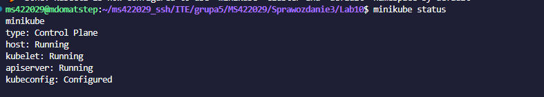
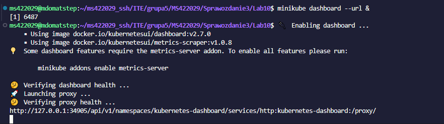
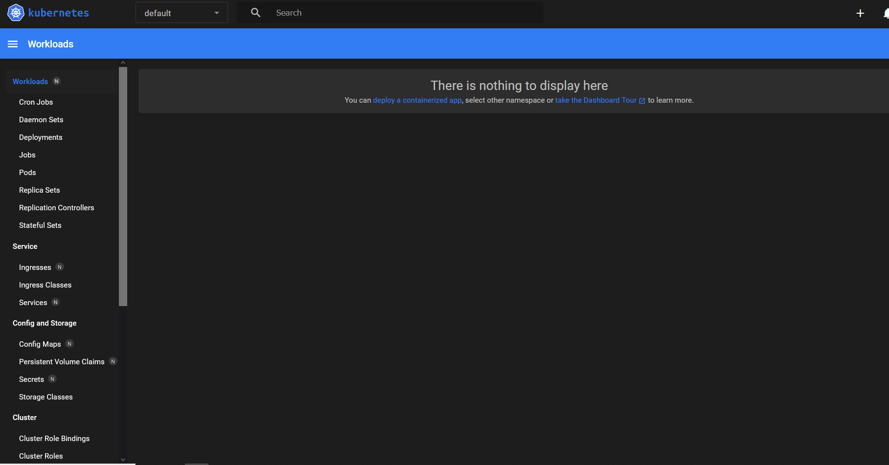
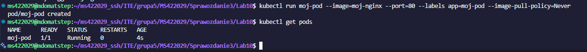
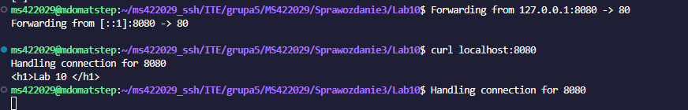
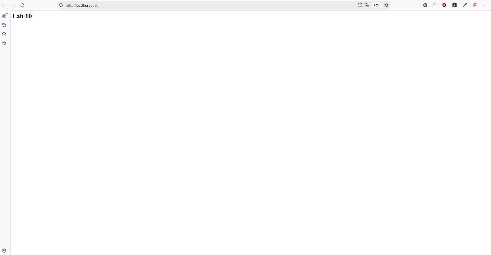
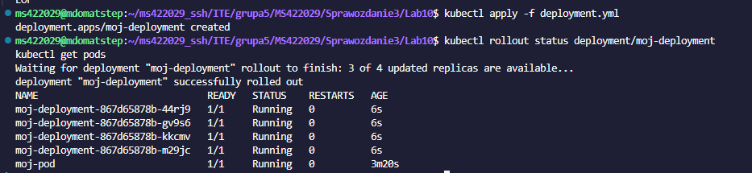
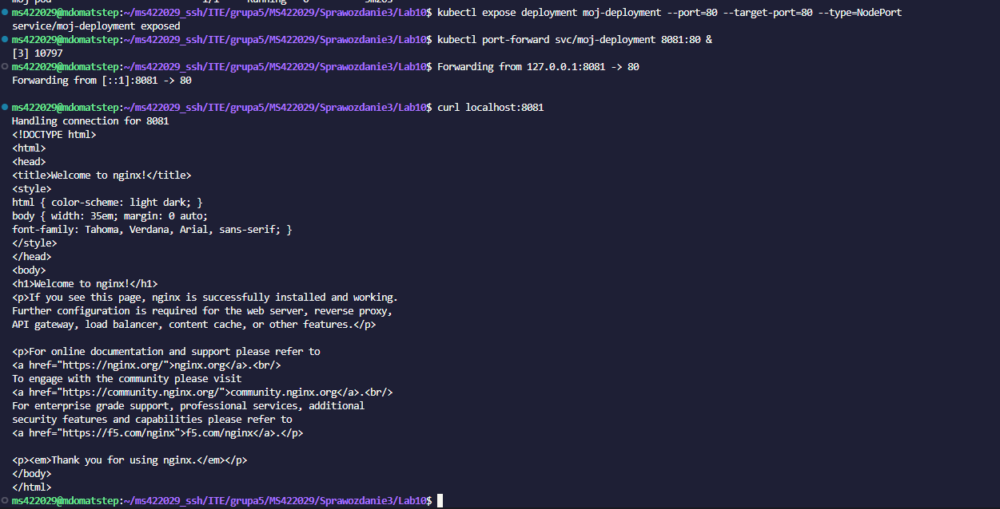

# Sprawozdanie z Laboratorium: Wdrażanie na zarządzalne kontenery – Kubernetes (1)

**Imię i nazwisko:** Mateusz Stępień
**Temat:** Zajęcia 10 - Wdrażanie na zarządzalne kontenery: Kubernetes (1)

## 1. Cel zadania
Celem laboratorium było zapoznanie się z podstawami orkiestracji kontenerów przy użyciu środowiska Kubernetes (k8s). Zadanie obejmowało instalację lokalnego klastra, przygotowanie własnego obrazu kontenera, manualne wdrożenie go jako pojedynczego Poda, a następnie zautomatyzowanie tego procesu przy pomocy deklaratywnego pliku YAML (Deployment) ze skalowaniem do wielu replik.

## 2. Instalacja i konfiguracja klastra Kubernetes (Minikube)
Jako implementację klastra k8s wybrano narzędzie `minikube`. Środowisko zostało zainstalowane na maszynie wirtualnej z systemem Ubuntu. 

W celu zmitygowania problemów wynikających z ograniczeń sprzętowych maszyny roboczej, klaster uruchomiono z nałożonymi ścisłymi limitami zasobów:
`minikube start --driver=docker --cpus=2 --memory=2048`

Użycie sterownika `docker` zapewnia wysoki poziom bezpieczeństwa, ponieważ węzeł klastra (worker) jest izolowany wewnątrz kontenera. Weryfikację poprawnego działania klastra oraz narzędzia `kubectl` przedstawia poniższy zrzut ekranu.

## 3. Uruchomienie interfejsu graficznego (Dashboard)
W celu uzyskania wizualnego podglądu stanu klastra, uruchomiono wbudowany Kubernetes Dashboard. Z uwagi na pracę w środowisku serwerowym (bez powłoki graficznej), panel uruchomiono w trybie nasłuchiwania proxy (`minikube dashboard --url`). 

## 4. Przygotowanie kontenera i ręczne uruchomienie Poda
Zgodnie z wariantem optimum ("obraz-gotowiec z dorzuconą własną konfiguracją"), proces deployu oparto na oficjalnym obrazie `nginx`, do którego wstrzyknięto niestandardowy plik `index.html`. Obraz zbudowano bezpośrednio w środowisku Dockera wewnątrz Minikube, aby był natychmiast widoczny dla klastra.

Następnie uruchomiono kontener, który został automatycznie zamknięty w obiekcie typu *Pod*.
Polecenie: `kubectl run moj-pod --image=moj-nginx --port=80 --labels app=moj-pod --image-pull-policy=Never`

Poprawność działania Poda zweryfikowano poleceniem `kubectl get pods` (status: Running).

Aby uzyskać dostęp do aplikacji z zewnątrz, wyprowadzono port za pomocą polecenia `kubectl port-forward`. Komunikację z eksponowaną funkcjonalnością potwierdzono zapytaniem HTTP (curl) oraz z poziomu przeglądarki internetowej.

## 5. Wdrożenie deklaratywne (Deployment) i Serwisy
Wdrożenie manualne zostało przekute w profesjonalne wdrożenie zdefiniowane w pliku `deployment.yml`. Konfigurację wzbogacono o mechanizm wysokiej dostępności, definiując aż 4 repliki aplikacji. 

Plik wdrożono poleceniem `kubectl apply -f deployment.yml`. Badanie stanu komendą `kubectl rollout status` oraz wylistowanie Podów udowodniło, że kontroler poprawnie utworzył i uruchomił 4 niezależne instancje serwera Nginx.

Na koniec, wdrożenie zostało wyeksponowane jako jednolity punkt dostępowy za pomocą zasobu *Service* (typu NodePort). Umożliwiło to komunikację z całą pulą replik pod jednym adresem sieciowym. Poprawność konfiguracji Serwisu udowodniono, przekierowując port 8081 do Serwisu i pobierając stronę powitalną serwera.

## Podsumowanie
Laboratorium potwierdziło skuteczność platformy Kubernetes w zarządzaniu kontenerami. Przećwiczono pełny cykl życia aplikacji w klastrze: od budowy obrazu, przez uruchomienie pojedynczego Poda, aż po wdrażanie wysokodostępnych, wieloreplikowych architektur sterowanych plikami YAML oraz udostępnianie ich przez Serwisy.