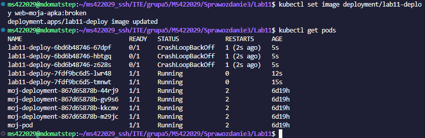
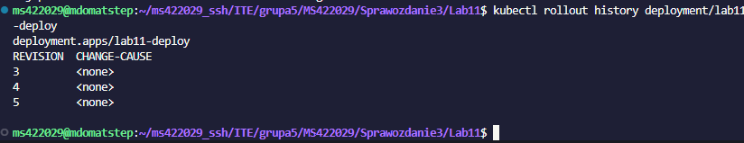
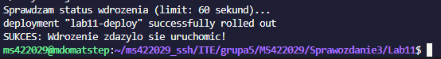
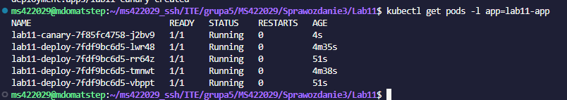
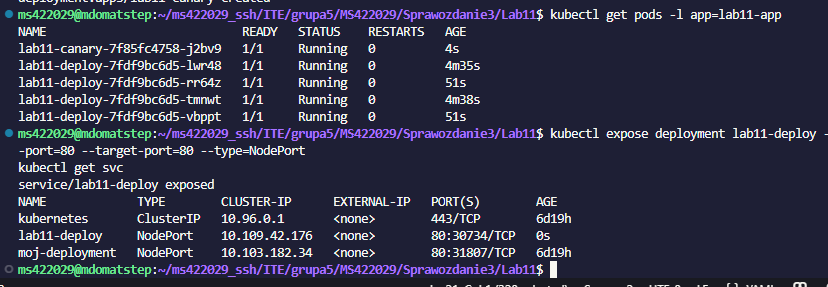

# Sprawozdanie z Laboratorium 11: Wdrażanie na zarządzalne kontenery – Kubernetes (2)

**Autor:** Mateusz Stępień  
**Temat:** Zaawansowane operacje na wdrożeniach (Deployments), strategie aktualizacji i kontrola stanu w Kubernetes.

---

## 1. Przygotowanie nowych obrazów
Na początku laboratorium przygotowano lokalnie trzy różne wersje obrazu opartego na serwerze Nginx:
- **v1:** Wersja stabilna z podstawowym plikiem `index.html`.
- **v2:** Wersja zaktualizowana (ze zmienionym nagłówkiem na stronie).
- **broken:** Wersja celowo uszkodzona (podmieniono w niej komendę startową na nieistniejącą, żeby wymusić błąd przy starcie kontenera).

Aby zaoszczędzić czas i miejsce na maszynie, obrazy zbudowano bezpośrednio w środowisku Dockera wewnątrz Minikube (`eval $(minikube docker-env)`), co pozwoliło pominąć konieczność wypychania ich na zewnętrzny Docker Hub.

## 2. Zmiany w deploymencie i skalowanie
Utworzono bazowe wdrożenie (Deployment) i przetestowano na nim ręczne skalowanie liczby replik. Za pomocą komendy `kubectl scale` płynnie zmieniano liczbę działających kontenerów (zwiększanie do 8, ubijanie do 1, całkowite wygaszenie do 0 i powrót do 4). Kubernetes automatycznie dostosowywał stan klastra do żądanej liczby.

Następnie przetestowano aktualizację obrazu. Po wrzuceniu wersji "wadliwej" (`broken`), Kubernetes próbował podnieść nowe kontenery, co skończyło się błędem.

*Zrzut ekranu pokazuje mechanizm obronny Kubernetesa – nowe pody z wadliwym obrazem wpadły w pętlę błędów (CrashLoopBackOff), ale część starych podów nadal działa, dzięki czemu aplikacja jako całość nie padła.*

## 3. Kontrola wdrożenia (Historia i Skrypt)
Kolejnym krokiem była identyfikacja problemów. Za pomocą wbudowanych mechanizmów klastra sprawdzono historię rewizji danego wdrożenia. 

*Historia zmian (rollout history) pozwala szybko zidentyfikować, na jakiej wersji aktualnie pracujemy i w razie awarii natychmiast wycofać się do działającego stanu poleceniem `kubectl rollout undo`.*

Zgodnie z poleceniem, napisano również prosty skrypt w Bashu, który pilnuje czasu wstawania wdrożenia. Użyto w nim flagi `--timeout=60s`.

*Skrypt poprawnie zweryfikował, że poprawione wdrożenie zdążyło się w pełni podnieść (sukces) przed upływem 60 sekund.*

## 4. Strategie wdrożenia i Serwisy
W ramach zajęć sprawdzono i porównano w praktyce różne podejścia do aktualizacji oprogramowania na produkcji:
1. **Recreate:** Najprostsze podejście – najpierw ubijamy wszystko co stare, potem stawiamy nowe. Minus to chwilowa przerwa w działaniu (downtime).
2. **Rolling Update:** Domyślna i najbezpieczniejsza strategia. Kontenery są podmieniane partiami (zdefiniowano parametry `maxUnavailable` oraz `maxSurge`), co zapewnia ciągłość działania.
3. **Canary Deployment:** Skonfigurowano tzw. wdrożenie kanarkowe. Obok głównego wdrożenia (`v1`) wypuszczono pojedynczy Pod z wersją `v2`, nadając mu taką samą etykietę selektora (`app=lab11-app`).

*Na zrzucie widać efekt Canary Deploymentu – jeden nowy "kanarek" (lab11-canary) działa równolegle z czterema stabilnymi podami z głównego wdrożenia, przyjmując na siebie część ruchu.*

Na sam koniec wdrożenie zostało spięte w jedną całość za pomocą zasobu **Service** (typ `NodePort`), co pozwoliło na wystawienie połączonych replik pod jednym, wspólnym adresem sieciowym.

---
**Wnioski:** Laboratorium udowodniło, że Kubernetes świetnie radzi sobie z zarządzaniem cyklem życia aplikacji. Największe wrażenie robi wbudowana odporność na błędy (wstrzymanie rolloutu przy wadliwym obrazie) oraz łatwość rozdzielania ruchu za pomocą etykiet, co pozwala na bezbolesne testowanie nowych funkcji na części użytkowników.