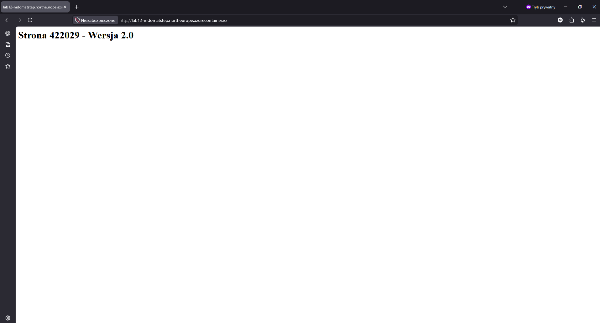
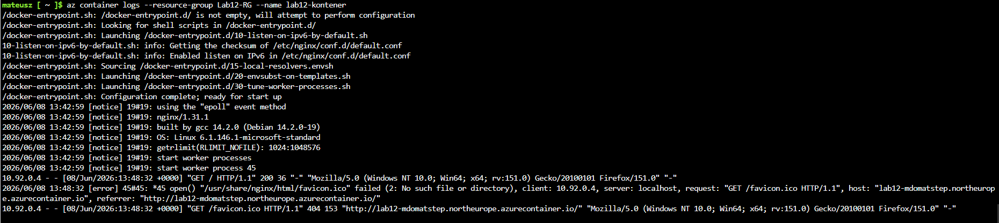
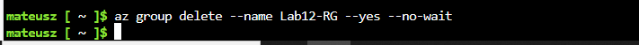

# Sprawozdanie z Laboratorium 12: Wdrażanie na zarządzalne kontenery w chmurze (Azure)

**Autor:** Mateusz Stępień  
**Temat:** Wdrożenie kontenera z własną aplikacją do usługi Azure Container Instances (ACI).

## 1. Przygotowanie obrazu i Docker Hub
Pierwszym krokiem było zaktualizowanie lokalnego obrazu kontenera z serwerem Nginx. Zmodyfikowano plik `index.html`, aby wyświetlał wymaganą treść z numerem indeksu . Następnie obraz został zbudowany z nowym tagiem i wypchnięty do publicznego repozytorium na platformie Docker Hub:
`docker build -t quaqqu/moja-apka:v2 .`
`docker push quaqqu/moja-apka:v2`

## 2. Inicjalizacja środowiska w Azure
Po zalogowaniu do portalu Azure za pomocą konta studenckiego (AGH), uruchomiono wbudowany terminal Azure Cloud Shell (Bash). Utworzono nową grupę zasobów (`Resource Group`) w lokalizacji `northeurope`, która posłużyła jako logiczny kontener na wszystkie elementy tworzone w ramach tego zadania:
`az group create --name Lab12-RG --location northeurope`

## 3. Wdrożenie kontenera (Azure Container Instances)
Zgodnie z zaleceniami w instrukcji, zrezygnowano z tworzenia płatnego rejestru Azure (ACR), wykorzystując gotowy obraz bezpośrednio z Docker Huba. Kontener został wdrożony, a chmura przypisała mu unikalny, publiczny adres DNS. Skonfigurowano również podstawowe limity zasobów (1 CPU, 1 GB RAM) oraz przekazano poświadczenia logowania do rejestru, co umożliwiło poprawne pobranie obrazu:

`az container create --resource-group Lab12-RG --name lab12-kontener --image quaqqu/moja-apka:v2 --dns-name-label lab12-mdomatstep --ports 80 --os-type Linux --cpu 1 --memory 1 ...`

## 4. Weryfikacja działania usługi i logi
Po udanym wdrożeniu kontenera (status Succeeded/Running), zweryfikowano jego działanie, wchodząc na przypisany mu adres FQDN (`http://lab12-mdomatstep.northeurope.azurecontainer.io`) w przeglądarce. Serwer poprawnie zwrócił zaktualizowaną stronę z numerem indeksu.

Aby potwierdzić, że kontener prawidłowo odbiera ruch sieciowy, pobrano logi z jego wnętrza za pomocą polecenia `az container logs`:

*Na zrzucie widać logi startowe serwera Nginx oraz pomyślnie zarejestrowane żądania HTTP GET wygenerowane podczas odwiedzania strony przez przeglądarkę.*

## 5. Czyszczenie zasobów
Z uwagi na model rozliczeniowy platformy Azure i konieczność oszczędzania limitowanych kredytów studenckich, po zakończeniu weryfikacji bezwzględnie usunięto całą grupę zasobów wraz z działającym kontenerem. Wykorzystano do tego polecenie:

*Parametry `--yes --no-wait` pozwoliły na natychmiastowe usunięcie zasobów w tle, co zapobiega dalszemu naliczaniu kosztów.*