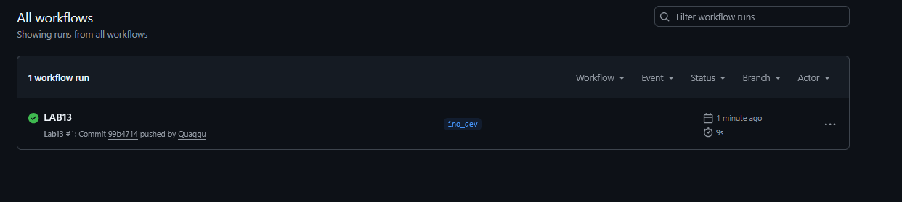

# Sprawozdanie z Laboratorium 13: GitHub Actions

**Autor:** Mateusz Stępień  
**Temat:** Automatyzacja procesów budowania oprogramowania i zarządzanie artefaktami.

## 1. Github Actions
Do realizacji zadań z instrukcji darmowy plan jest w zupełności wystarczający. W przypadku repozytoriów publicznych dostęp do maszyn wirtualnych uruchamiających skrypty jest darmowy.

## 2. Przygotowanie repozytorium
Aby nie pracować na głównym kodzie obcego projektu, utworzyłem własną kopię testowego repozytorium Spoon-Knife. Całość prac prowadziłem na nowo utworzonej gałęzi ino_dev. Zgodnie z zaleceniami zrezygnowałem z tworzenia żądań wciągnięcia zmian do oryginalnego projektu, aby nie przesyłać testowych plików do głównych twórców.

## 3. Konfiguracja akcji i weryfikacja
Przed dodaniem własnego skryptu usunąłem z projektu dotychczasowe pliki konfiguracyjne. Po przygotowaniu i wypchnięciu mojego pliku YAML na serwer, GitHub poprawnie wykrył nową wersję na gałęzi ino_dev i automatycznie uruchomił zadanie na maszynie z systemem Ubuntu. 

Proces polegał na wyizolowaniu plików roboczych i zasymulowaniu etapu budowania aplikacji. Zakończył się on pomyślnie, wygenerowaniem gotowego artefaktu w formie archiwum. Panel kontrolny potwierdził poprawne zakończenie działania, a paczka z plikami była gotowa do pobrania.

Poniżej zamieszczam zrzut ekranu potwierdzający bezbłędne wykonanie akcji:


## 4.Plik YAML
```
name: Lab13

on:
  push:
    branches:
      - ino_dev

jobs:
  build-and-store:
    runs-on: ubuntu-latest

    steps:
      - name: Pobranie kodu
        uses: actions/checkout@v4

      - name: Zbuduj aplikacje
        run: |
          echo "Rozpoczynam przygotowanie plikow..."
          mkdir build_output
          cp index.html build_output/

      - name: Upload artefaktu
        uses: actions/upload-artifact@v4
        with:
          name: gotowy-artefakt
          path: build_output/
          retention-days: 5
```