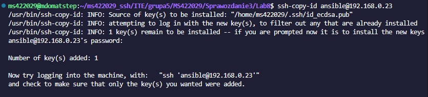
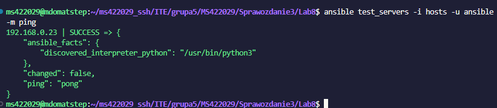
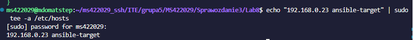
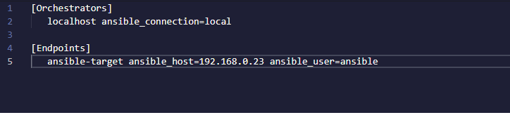
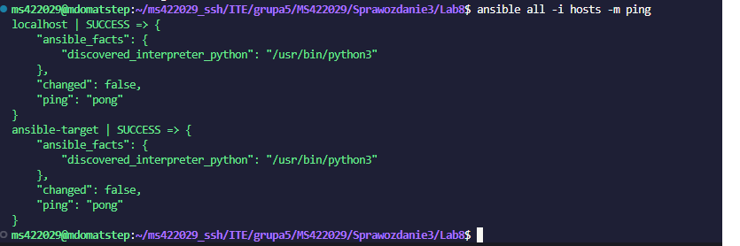
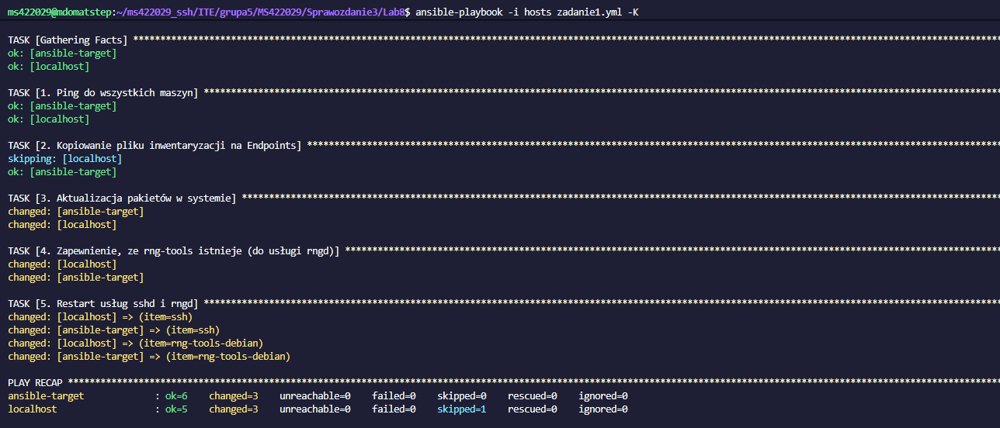
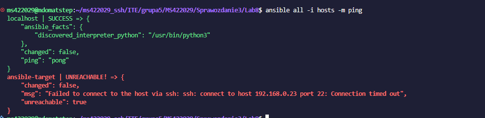
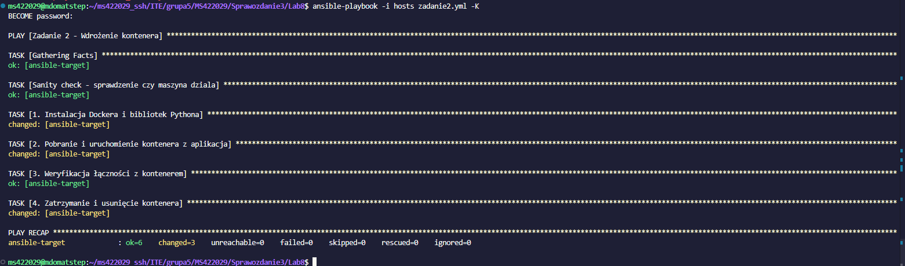
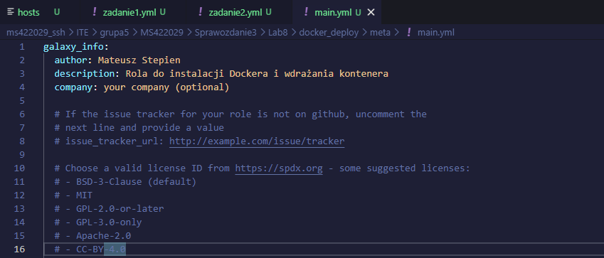

# Sprawozdanie z Laboratorium: Automatyzacja i zdalne wykonywanie poleceń za pomocą Ansible

**Imię i nazwisko:** Mateusz Stępień
**Temat:** Zajęcia 08 - Automatyzacja i zdalne wykonywanie poleceń za pomocą Ansible

### 1. Przygotowanie środowiska i instalacja zarządcy Ansible

Pierwszym etapem laboratorium było skonfigurowanie odpowiedniego środowiska testowego. Utworzono nową maszynę wirtualną z systemem operacyjnym Ubuntu o minimalnym zbiorze zainstalowanego oprogramowania, która pełniła rolę węzła zarządzanego. Zadbałem o obecność programu `tar` oraz serwera OpenSSH (`sshd`). Maszynie nadano hostname `ansible-target` i utworzono dedykowanego użytkownika o nazwie `ansible`.

Na głównej maszynie (`mdomatstep`), pełniącej rolę węzła sterującego, zainstalowałem oprogramowanie Ansible przy użyciu systemowego menedżera pakietów apt (`ansible-core`).

Aby Ansible mógł sprawnie zarządzać nową maszyną bez konieczności interaktywnego podawania hasła przy każdym zadaniu, wygenerowałem parę kluczy SSH. Następnie skopiowałem klucz publiczny na maszynę docelową dla użytkownika `ansible` za pomocą polecenia `ssh-copy-id`.

Poprawność przeprowadzonej konfiguracji uwierzytelniania zweryfikowałem inicjalnym testem połączenia, wysyłając żądanie ping.

### 2. Inwentaryzacja i konfiguracja DNS

Zamiast operować na surowych adresach IP, skonfigurowałem lokalne rozwiązywanie nazw. Na głównej maszynie dodałem odpowiedni wpis w pliku `/etc/hosts`, tak aby móc wywoływać drugą maszynę wirtualną za pomocą przewidywalnej nazwy.

Kolejnym krokiem było stworzenie pliku inwentaryzacji dla Ansible. Plik ten podzieliłem na dwie sekcje zgodnie z instrukcją: `Orchestrators`, w której znalazła się maszyna główna, oraz `Endpoints`, do której przypisałem węzeł `ansible-target` z odpowiednimi parametrami połączeniowymi.

Po przygotowaniu pliku inwentaryzacji wysłałem asynchronicznie żądanie ping do wszystkich maszyn zdefiniowanych w grupach. Test zakończył się sukcesem, co potwierdziło pełną poprawność konfiguracji połączeń.

### 3. Zdalne wywoływanie procedur administracyjnych

Aby zautomatyzować powtarzalne procesy, utworzyłem playbook. Zdefiniowałem w nim zestaw zadań, w których Ansible miał:
1. Zbadać łączność za pomocą żądania ping.
2. Skopiować plik inwentaryzacji na maszyny należące do grupy `Endpoints`.
3. Dokonać pełnej aktualizacji pakietów w systemie.
4. Upewnić się, że zainstalowane są niezbędne pakiety narzędziowe (np. `rng-tools-debian`).
5. Wykonać restart kluczowych usług, takich jak `sshd` oraz `rngd`.

Zastosowanie parametru `become: yes` pozwoliło na poprawne podniesienie uprawnień podczas operacji na pakietach.

W ramach procedur testowych sprawdziłem również reakcję zarządcy na nagłą awarię węzła. W ustawieniach maszyny wirtualnej odpiąłem wirtualną kartę sieciową i wywołałem polecenie ping. Zgodnie z założeniami, system rozpoznał awarię i zwrócił błąd połączenia.

### 4. Zarządzanie artefaktem – instalacja i wdrożenie Dockera

Ostatnim etapem działań z wykorzystaniem playbooków było wdrożenie testowej aplikacji w kontenerze. Utworzyłem kolejny plik, który po szybkim sprawdzeniu dostępności węzła, pobierał z repozytorium pakiety niezbędne do obsługi kontenerów i automatycznie instalował system Docker.

Następnie playbook pobierał obraz aplikacji, uruchamiał kontener z odpowiednim przekierowaniem portów i samodzielnie weryfikował poprawne działanie aplikacji poprzez żądanie HTTP na wystawiony port. Po upewnieniu się, że usługa działa, następowało sprzątanie środowiska polegające na zatrzymaniu i usunięciu kontenera.

### 5. Strukturyzacja ról

W celu zachowania standardów utrzymania kodu i możliwości jego wielokrotnego użycia w przyszłości, zadania związane z wdrażaniem kontenerów ubrałem w specjalną strukturę katalogów – rolę Ansible.

Za pomocą polecenia `ansible-galaxy role init docker_deploy` wygenerowałem pełen szkielet roli. Następnie wyedytowałem plik konfiguracyjny `meta/main.yml`, w którym zdefiniowałem siebie jako autora oraz opisałem przeznaczenie roli. Gotowa struktura została w ten sposób przygotowana do umieszczenia w systemie kontroli wersji.

