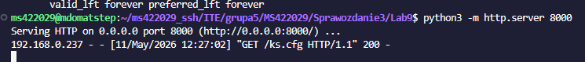
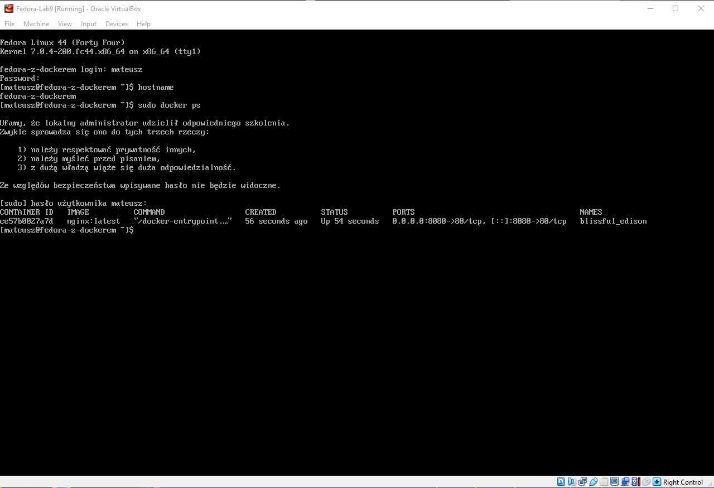

# Sprawozdanie z Laboratorium: Pliki odpowiedzi dla wdrożeń nienadzorowanych

**Imię i nazwisko:** Mateusz Stępień
**Temat:** Zajęcia 09 - Pliki odpowiedzi dla wdrożeń nienadzorowanych

## 1. Cel zadania
Celem laboratorium było zautomatyzowanie procesu instalacji systemu operacyjnego na nowej maszynie wirtualnej poprzez przygotowanie i wykorzystanie pliku odpowiedzi . Zainstalowany system miał być od razu gotowy do pracy, hostując wybraną aplikację w kontenerze Docker bez jakiejkolwiek ręcznej ingerencji po stronie administratora.

## 2. Przygotowanie pliku odpowiedzi
Wykorzystano i zmodyfikowano plik odpowiedzi `ks.cfg`, dostosowując go do architektury systemu **Fedora 44 Server**. Zgodnie z wymogami instrukcji, plik został poddany następującym modyfikacjom:

* **Repozytoria:** Ponieważ wykorzystano obraz instalatora sieciowego, w pliku zdefiniowano źródła pobierania pakietów wskazujące na oficjalne mirrory Fedory 44:
  * `url --mirrorlist=http://mirrors.fedoraproject.org/mirrorlist?repo=fedora-44&arch=x86_64`
  * `repo --name=update --mirrorlist=http://mirrors.fedoraproject.org/mirrorlist?repo=updates-released-f44&arch=x86_64`
* **Partycjonowanie:** Zapewniono całkowite czyszczenie dysku bez monitów za pomocą dyrektywy `clearpart --all --initlabel` oraz automatyczne utworzenie partycji logicznych LVM (`autopart --type=lvm`).
* **Nazwa hosta:** Zmieniono domyślną nazwę maszyny (`localhost`) za pomocą dyrektywy: `network --hostname=fedora-z-dockerem`.
* **Pakiety:** W sekcji `%packages` dodano instalację silnika kontenerów Docker (`moby-engine`) niezbędnego do hostowania docelowej aplikacji.
* **Automatyzacja:** Dodano dyrektywę `reboot`, aby maszyna po udanej instalacji samodzielnie uruchomiła się ponownie.

## 3. Dystrybucja pliku i wywołanie instalacji nienadzorowanej
Przygotowany plik `ks.cfg` został udostępniony w sieci lokalnej przy użyciu serwera HTTP wbudowanego w język Python (`python3 -m http.server 8000`) na głównej maszynie, pełniącej rolę węzła sterującego.

Następnie uruchomiono nową maszynę wirtualną z podpiętym obrazem ISO. W menu startowym programu rozruchowego (GRUB) zmodyfikowano parametry rozruchu jądra systemu, dopisując dyrektywę wskazującą instalatorowi lokalizację pliku odpowiedzi w sieci:
`inst.ks=http://<IP_SERWERA>:8000/ks.cfg`

Działanie to realizuje wymóg z **zakresu rozszerzonego** (wskazanie nośnikowi, aby użył pliku z sieci). Poprawność tego kroku potwierdza log serwera HTTP, na którym zarejestrowano prawidłowe pobranie pliku konfiguracyjnego przez instalator Fedory.



## 4. Konfiguracja post-instalacyjna (Sekcja %post)
Kluczowym elementem wdrożenia było odpowiednie przygotowanie sekcji `%post`. Zgodnie z instrukcją uwzględniono fakt, że z poziomu środowiska instalatora (chroot) nie da się wdać w interakcję z demonem Dockera (np. poprzez `docker run`).

Aby środowisko uruchomiło aplikację od razu po pierwszym starcie, zastosowano następujący łańcuch poleceń:
1. Skonfigurowano demona Dockera do uruchamiania przy starcie systemu (`systemctl enable docker`).
2. Wygenerowano własny plik usługi systemd (`/etc/systemd/system/uruchom-apke.service`). Zdefiniowano w nim, że po poprawnym uruchomieniu demona Dockera, system ma automatycznie pobrać i uruchomić kontener `nginx:latest` z przekierowaniem portu 8080.
3. Włączono wygenerowaną usługę startową (`systemctl enable uruchom-apke.service`).

**Zakres rozszerzony:** Aby działania konfiguracyjne z sekcji `%post` były na bieżąco wyświetlane na ekranie (a nie ukryte w tle), zastosowano przekierowanie wejścia/wyjścia na trzecią wirtualną konsolę (`tty3`):
```bash
exec < /dev/tty3 > /dev/tty3
chvt 3
```

## 5. Weryfikacja działania wdrożenia
Instalacja odbyła się w 100% nienadzorowanie i zakończyła się planowanym restartem. Po zalogowaniu do systemu na utworzone konto weryfikacyjne (`mateusz`), poprawność wdrożenia zweryfikowano wprowadzając polecenia administracyjne.

Zgodnie z poniższym zrzutem ekranu wykazano, że:
* Nazwa hosta została prawidłowo zmieniona (`fedora-z-dockerem`).
* Systemd uruchomił Dockera poprawnie.
* Skonfigurowany w pliku odpowiedzi kontener uruchomił się samoistnie wraz ze startem systemu operacyjnego (na zdjęciu widać status *Up*).



## Podsumowanie
Wykorzystanie pliku Kickstart (ks.cfg) dowiodło wysokiej skuteczności w automatyzacji procesu instalacji hosta (Provisioning). Dzięki połączeniu dyrektyw partycjonowania, konfiguracji sieci i instalacji pakietów z zaawansowaną sekcją `%post` (wykorzystującą usługi systemd), udało się stworzyć środowisko *zero-touch* – od pustego dysku do działającego serwera hostującego aplikację WWW bez żadnej interwencji użytkownika po podaniu wskaźnika rozruchowego.