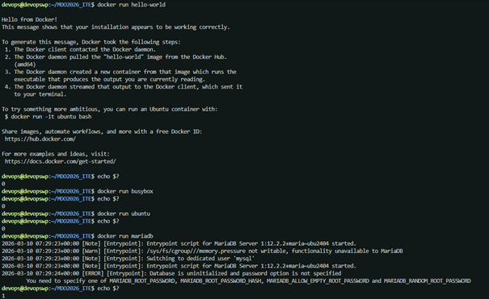
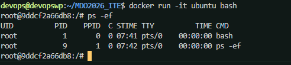
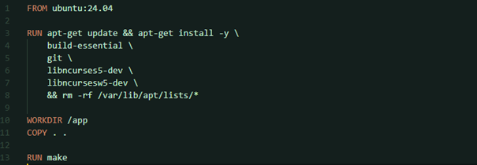

# Sprawozdanie Zbiorcze 1

**Student:** Wilhelm Pasterz

**Indeks:** 416619

**Kierunek:** ITE

**Grupa: 5** 

## 1. System kontroli wersji Git i bezpieczna komunikacja
W celu zapewnienia bezpiecznej wymiany danych z repozytorium zdalnym skonfigurowano klucz SSH. Wykorzystano algorytm **Ed25519**, generując parę kluczy poleceniem `ssh-keygen -t ed25519 -C "MDO"`. Klucz publiczny został zintegrowany z kontem GitHub, co umożliwiło autoryzowane operacje na kodzie.

Kluczowe aspekty pracy z Gitem:
1. **Zarządzanie strukturą gałęzi:** Zrealizowano przejście z gałęzi głównej poprzez branch `grupa5`, tworząc docelową gałąź roboczą o nazwie `MS422029`.
2. **Automatyzacja procesów (Git Hooks):** Wdrożono skrypt `commit-msg` wewnątrz katalogu `.git/hooks/`. Po nadaniu uprawnień do wykonywania (`chmod +x`), skrypt automatycznie standaryzuje komunikaty commitów, dodając numer indeksu autora na ich początku.

## 2. Docker / Git
Po instalacji pakietu `docker.io` przeprowadzono następujące kroki:

1. **Zapoznanie się z obrazami:** Instalacja i uruchomienie obrazów takich jak np. hello-world/ubuntu/busybox

2. **Stworzenie własnego Dockerfile:** Napisanie własnego Dockerfile opartego na na ubuntu, który miał klonować repozytorium i instalować git

3. **Zarządzanie kontenerami:** t.j. pokazanie listy procesów

4. **Czyszczenie lokalnych kontenerów i obrazów:** przy pomocy `docker container prune` bądź `docker image prune -a`

Podejście DevOps gwarantuje separację zależności od systemu gospodarza, co zapobiega konfliktom w oprogramowaniu. Dzięki plikom Dockerfile proces przygotowania infrastruktury staje się w pełni zautomatyzowany i deterministyczny.

## 3. Dockerfile

Laboratorium 3 opierało się na zadaniach związanych z budowaniem oprogramowania w środowisku CI, dzięki czemu cały proces pozostaje przenośny.

Po wyborze oprogramowania miały miejsce następujące kroki:

1. **Make oraz uruchomienie testów:**

2. **Utworzenie dockerfile'i:** czyli `.build` oraz `.test` na podstawie oryginalnego do uruchamiania testów

3. **Uruchomienie dockerfile'i:**

Zastosowanie konteneryzacji gwarantuje pełną separację środowiska uruchomieniowego oraz procesów testowych. Wykorzystanie plików Dockerfile pozwala na precyzyjną optymalizację obrazów poprzez usuwanie zbędnych zależności po etapie budowania, natomiast Docker Compose znacząco usprawnia orkiestrację i zarządzanie wieloma usługami jednocześnie.

## 4. Woluminy

Laboratorium 4 zawierało zadania związane z dodatkową terminologią w konteneryzacji i uruchomieniem Jenkins w środowisku skonteneryzowanym.

Kluczowym elementem pracy z Dockerem jest zachowanie wygenerowanych danych oraz komunikacja między kontenerami.
* **Woluminy i kontenery pomocnicze:** Aby zbudować aplikację Express.js bez instalowania programu Git w docelowym obrazie, utworzono wirtualne dyski (woluminy): `wejsciowy` i `wyjsciowy`. Tymczasowy kontener pomocniczy pobrał kod na wolumin `wejsciowy`. Następnie główny kontener budujący (`node:18-bullseye`) podpiął te woluminy, wykonał kompilację (`npm install`) i zapisał wynik na wolumenie `wyjsciowy`. 
* **Wewnętrzny DNS Dockera:** W domyślnej sieci `bridge` kontenery komunikują się po adresach IP, które trzeba odczytywać komendą `docker inspect`. Aby to uprościć, utworzono własną sieć poleceniem `docker network create my-network`. We własnych sieciach Docker zapewnia serwer DNS, co pozwala na łączenie się z usługami poprzez ich nazwy (np. `serwer-iperf-dns`).
* **Eksponowanie portów:** Aby umożliwić dostęp z zewnątrz, wystawiono port kontenera parametrem `-p 5201:5201`. Ruch odbywający się w ramach maszyny hosta charakteryzuje się bardzo wysoką przepustowością, gdyż jest obsługiwany wirtualnie w pamięci RAM przez jądro systemu Linux.

Woluminy umożliwiają trwałe zachowanie stanu między uruchomieniami kontenerów. Sieci mostkowe ułatwiają komunikację między kontenerami. Jenkins w kontenerze izolje środowisko CI/CD.