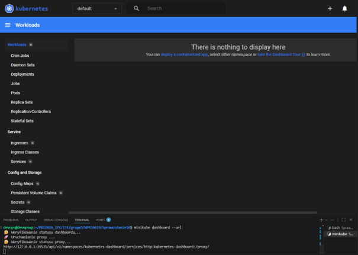
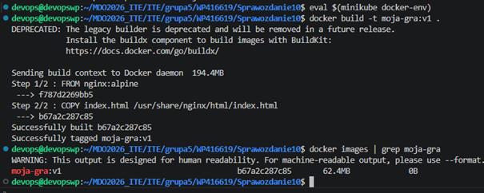
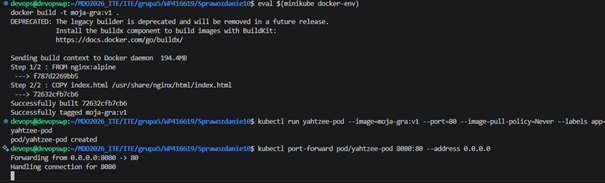
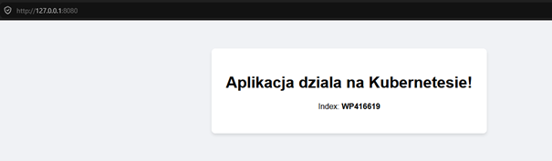
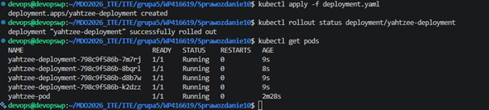
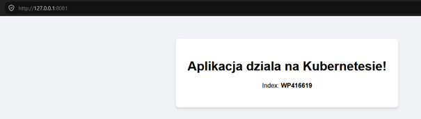

# Sprawozdanie 8 - Wdrażanie na zarządzalne kontenery: Kubernetes 
**Student:** Wilhelm Pasterz

**Indeks:** 416619

**Kierunek:** ITE

**Grupa: 5** 

**Data: 19.05.2026**

---

## 1. Cel laboratorium
Celem parsing-u zadań było zapoznanie się z podstawami architektury platformy Kubernetes (K8s) w środowisku lokalnym za pomocą narzędzia `minikube`. Zakres prac obejmował manualne uruchomienie aplikacji (pod), weryfikację jej zachowania i logów, a następnie automatyzację i skalowanie procesu przy użyciu deklaratywnych plików konfiguracyjnych YAML (`Deployment` i `Service`).

---

## 2. Przygotowanie klastra i analiza środowiska

Prace rozpoczęto od alokacji zasobów sprzętowych dla klastra `minikube` w celu zapewnienia optymalnej wydajności procesów orkiestracji, ograniczając pamięć RAM do 3000 MB oraz liczbę rdzeni CPU do 3. Następnie zainicjalizowano wbudowany panel administracyjny Kubernetes Dashboard, pozwalający na graficzną interpretację stanu obiektów.



---

## 3. Analiza i budowa kontenera aplikacji

Aplikacja została oparta na serwerze webowym Nginx, wewnątrz którego zaimplementowano spersonalizowaną stronę główną zawierającą numer indeksu (`WP416619`).

Aby klaster `minikube` posiadał bezpośredni dostęp do nowo budowanych struktur bez konieczności wypychania ich do zewnętrznego rejestru (Docker Hub), przełączono kontekst środowiskowy lokalnego demona Docker na instancję wewnątrzmaszynową. Obraz zbudowano z jawnym tagiem wersji `v1`.

```bash
# Konfiguracja zmiennych środowiskowych demona Docker klastra minikube
eval $(minikube docker-env)

# Budowanie obrazu aplikacji
docker build -t moja-gra:v1 .
```




## 4. Uruchamianie oprogramowania (Wdrożenie manualne)

W pierwszym etapie aplikacja została wdrożona w sposób imperatywny (manualny). Utworzono pojedynczą instancję podstawowej jednostki obliczeniowej (Pod), przypisując jej selektor etykiety "app=yahtzee-pod" i blokując próby pobierania obrazu z zewnętrznych repozytoriów za pomocą polityki "Never".

Komenda uruchamiająca Poda:
kubectl run yahtzee-pod --image=moja-gra:v1 --port=80 --image-pull-policy=Never --labels app=yahtzee-pod



W celu weryfikacji poprawności warstwy sieciowej bez tworzenia trwałych struktur, wykonano mapowanie portów z interfejsu kontenera bezpośrednio na maszynę lokalną (port 8080).

Komenda przekierowująca port:
kubectl port-forward pod/yahtzee-pod 8080:80 --address 0.0.0.0



---

## 5. Skalowanie aplikacji za pomocą obiektu Deployment

Ręczne zarządzanie pojedynczymi Podami nie zapewnia wysokiej dostępności ani odporności na awarie. Zgodnie z wymaganiami projektowymi, wdrożenie manualne przekształcono w deklaratywny plik manifestu "deployment.yaml". Liczbę poszukiwanych replik (żądanych kopii kontenera) zdefiniowano na poziomie 4.

Wdrożenie zaimplementowano do klastra, kontrolując stan operacji za pomocą mechanizmu rollout status.

Komendy aplikujące konfigurację:

`kubectl apply -f deployment.yaml`

`kubectl rollout status deployment/yahtzee-deployment`



---

## 6. Wyeksponowanie wdrożenia jako stabilny Serwis sieciowy

Ostatnim etapem prac było powiązanie rozproszonych replik jednym, stałym punktem wejścia o charakterze Load Balancera. Wdrożenie zostało wyeksponowane na zewnątrz przy użyciu serwisu typu NodePort.

Komenda tworząca serwis:
kubectl expose deployment yahtzee-deployment --type=NodePort --port=80 --name=yahtzee-service

Ruch sieciowy skierowano na port lokalny 8081 w celu izolacji od wcześniejszych testów manualnych.

Komenda port-forward dla serwisu:
kubectl port-forward service/yahtzee-service 8081:80

Następnie zweryfikowano działanie w przeglądarce internetowej:



---

## 7. Wnioski i napotkane problemy

1. Zarządzanie kontekstem rejestru: Najczęstszym problemem przy pracy z lokalnym klastrem minikube jest błąd ErrImageNeverPull. Wynika on z braku synchronizacji środowiska Docker hosta ze środowiskiem klastra. Poprawne użycie komendy "eval $(minikube docker-env)" przed budowaniem obrazu skutecznie eliminuje ten problem.
2. Deklaratywność vs Imperatywność: Wykorzystanie plików YAML (Deployment) automatyzuje proces self-healingu aplikacji — w przypadku awarii lub usunięcia jednego z Podów, Kubernetes natychmiast powołuje do życia nową instancję, aby utrzymać zadeklarowaną liczbę 4 replik.
3. Izolacja portów: Prawidłowe i czyste zarządzanie tunelami port-forward zapobiega konfliktom na interfejsach sieciowych systemu operacyjnego i pozwala na bezproblemowe testowanie struktur wieloklastrowych.