# Sprawozdanie 11 - Zaawansowane Zarządzanie i Strategie Wdrożeń w Kubernetes
**Student:** Wilhelm Pasterz

**Indeks:** 416619

**Kierunek:** ITE

**Grupa: 5**  


---

## 1. Przygotowanie nowego obrazu

Zgodnie z wytycznymi laboratorium, przygotowano własny kontener zawierający aplikację (gra Yahtzee oparta na środowisku .NET 9.0). Proces rejestracji i wersjonowania oprogramowania zrealizowano lokalnie przy użyciu mechanizmu przenoszenia obrazów do klastra za pomocą polecenia `minikube image load`. 

W celu przetestowania pełnego cyklu zarządzania konfiguracją, przygotowano trzy wersje obrazu:
* `moja-gra:v1` – Bazowa, sprawna wersja aplikacji, zbudowana ręcznie na maszynie hosta.
* `moja-gra:v2` – Nowa wersja oprogramowania, zawierająca zmodyfikowaną warstwę prezentacji (zmieniony nagłówek informujący o wersji v2).
* `moja-gra:bad` – Wersja celowo uszkodzona, w której zmodyfikowano instrukcję uruchomieniową `CMD` w pliku `Dockerfile` (wskazanie na nieistniejący skrypt startowy), co powoduje natychmiastowe zakończenie działania kontenera z błędem zaraz po jego wykreowaniu.

---

## 2. Zmiany w deploymencie

Proces testowy przeprowadzono w sposób w pełni deklaratywny, aktualizując plik manifestu `deployment.yaml` i aplikując zmiany poleceniem `kubectl apply -f deployment.yaml --record`.

### Dynamiczne skalowanie replik infrastruktury:
W pierwszej fazie sprawdzono mechanizmy zarządzania skalą obiektów przy użyciu stałego obrazu bazowego `v1`:
1. **Zwiększenie replik do 8:** Zaobserwowano natychmiastowe powołanie nowych podów i rozłożenie obciążenia.
2. **Zmniejszenie liczby replik do 1:** Klaster zredukował zasoby, wprowadzając nadmiarowe pody w stan `Terminating`.
3. **Zmniejszenie liczby replik do 0:** Weryfikacja całkowitego wygaszenia środowiska (brak aktywnych podów w klastrze).
4. **Ponowne przeskalowanie w górę do 4 replik:** Przywrócenie domyślnej, stabilnej skali roboczej.

*Dokumentacja stanów pośrednich podów podczas procedury skalowania:*
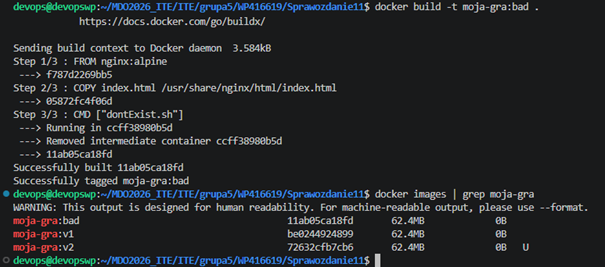

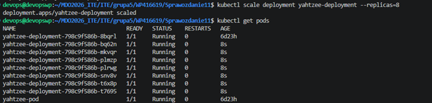

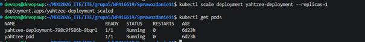

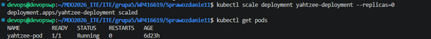

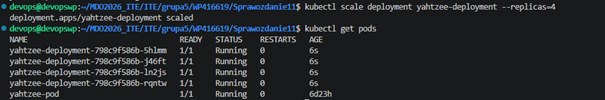


### Rotacja wersji obrazów w locie:
W drugiej fazie, zachowując 4 repliki robocze, przeprowadzono aktualizacje poprzez modyfikacje pól `image` w pliku manifestu:
* **Zastosowanie nowej wersji obrazu (`v2`):** Kontroler wdrożeń dokonał udanej, stopniowej wymiany kontenerów.
* **Zastosowanie "wadliwego" obrazu (`bad`):** Klaster podjął próbę wdrożenia, jednak pody natychmiast weszły w stan błędu `CrashLoopBackOff` z powodu uszkodzonej instrukcji startowej kontenera.

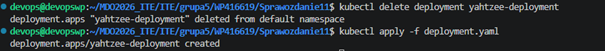

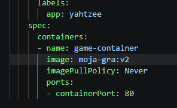

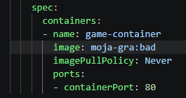


### Przywracanie poprzednich wersji wdrożeń:
W celu awaryjnego ratowania stabilności systemu wykorzystano polecenia historii:
```bash
kubectl rollout history deployment/yahtzee-production
kubectl rollout undo deployment/yahtzee-production --to-revision=2
```

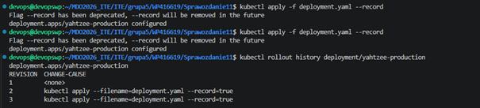


---

## 3. Kontrola wdrożenia

### Identyfikacja i korelacja błędów w historii
Wykorzystując polecenie szczegółowej inspekcji historii rolloutu dla uszkodzonej zmiany (Revision 3):
```bash
kubectl rollout history deployment/yahtzee-production --revision=3
```
Klaster precyzyjnie zidentyfikował błąd zapisu metadanych obrazu, co skorelowano z błędną konfiguracją instrukcji `CMD` wprowadzoną podczas budowania kontenera:


### Automatyzacja weryfikacji wdrożenia (Skrypt)
Napisano autorski skrypt weryfikujący `check_deploy.sh`, który monitoruje status wdrożenia i pilnuje, aby proces zakończył się sukcesem w zadanym czasie poniżej 60 sekund (wykorzystując wbudowany mechanizm `--timeout` narzędzia `kubectl`).

Po wycofaniu zmian do stabilnej wersji `v2` (Revision 2), skrypt pomyślnie potwierdził przywrócenie sprawności operacyjnej środowiska:
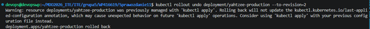

---

## 4. Strategie wdrożenia

W ramach laboratorium zaimplementowano, przetestowano i porównano trzy niezależne podejścia do dystrybucji kodu, wykorzystując wdrożenia oparte na **etykietach (labels)** oraz stałym **serwisie sieciowym** (`service.yaml`) działającym jako Load Balancer.

### A. Strategia Recreate
* **Konfiguracja w manifestu:** Sekcja `strategy.type: Recreate`.
* **Zaobserwowane zachowanie:** Klaster w pierwszej kolejności jednocześnie zabija wszystkie pody starej wersji (`Terminating`). Nowe kontenery zaczynają powstawać dopiero po całkowitym zamknięciu poprzednich. Powoduje to mierzalny przestój w działaniu aplikacji (downtime).

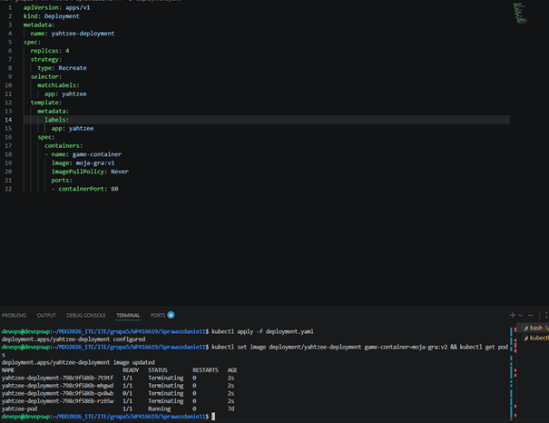


### B. Strategia Rolling Update
* **Konfiguracja w manifestu:**

* **Zaobserwowane zachowanie:** Podmiana zasobów odbywa się falami. Parametr `maxUnavailable: 2` pozwolił na jednoczesne wyłączenie maksymalnie dwóch podów, podczas gdy `maxSurge: 25%` pozwolił na powołanie jednego dodatkowego kontenera ponad stan bazowy. Zapewnia to ciągłość działania aplikacji bez przestojów.

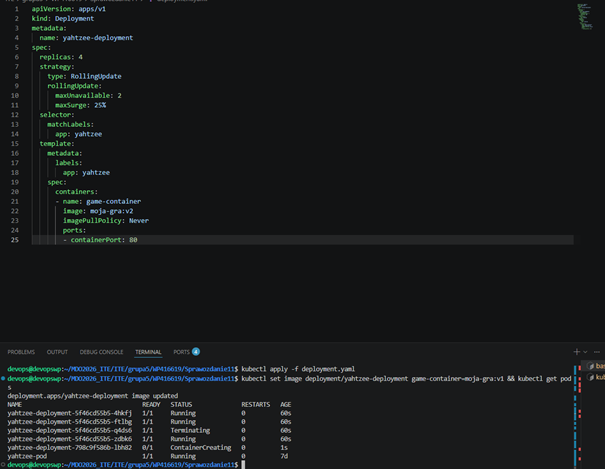


### C. Canary Deployment workload
* **Konfiguracja:** Utworzono dwa oddzielne obiekty typu Deployment (`yahtzee-production` oraz `yahtzee-canary`).
* **Zastosowanie etykiet i serwisów:** Oba wdrożenia otrzymały unikalne znaczniki środowiskowe (`tier: production` i `tier: canary`), ale współdzieliły główną etykietę logiczną `app: yahtzee`. Serwis sieciowy przekierowywał ruch na podstawie selektora `app: yahtzee`.
* **Zaobserwowane zachowanie:** Ponieważ pod wspólnym selektorem serwisu znalazły się wszystkie pody z tą etykietą, ruch sieciowy rozkłada się automatycznie pomiędzy punkty końcowe (endpoints). Pozwala to na bezpieczne skierowanie testowej części zapytań do wersji Canary przed pełną aktualizacją całego klastra.

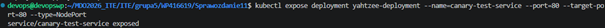

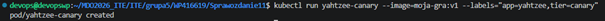

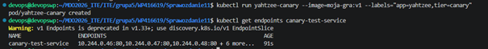


---

## 5. Podsumowanie i wnioski z obserwacji różnic

1. **Recreate** eliminuje ryzyko niespójności wersji, ale jest niedopuszczalny w systemach produkcyjnych wymagających wysokiej dostępności ze względu na generowany przestój (downtime).
2. **Rolling Update** to bezpieczny standard dla systemów bezprzerwowych (zero-downtime), jednak wymaga wstecznej kompatybilności kodu.
3. **Canary Deployment** daje najwyższy poziom kontroli nad ryzykiem wdrożeniowym. Wykorzystanie elastycznych etykiet i natywnych serwisów Kubernetes umożliwia separację ruchu sieciowego i ochronę większości użytkowników przed skutkami potencjalnej awarii nowej wersji oprogramowania.