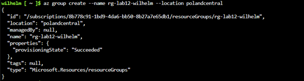
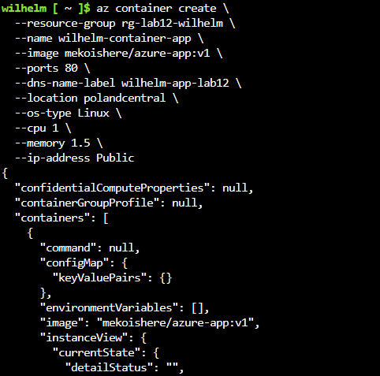
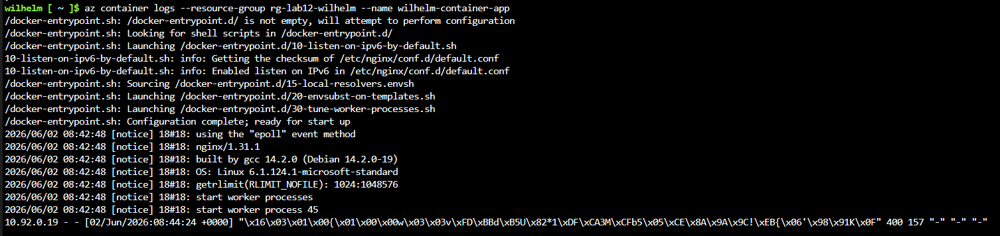
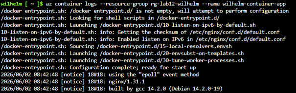

# Sprawozdanie 12 – Wdrażanie na zarządzalne kontenery w chmurze (Azure)

**Student:** Wilhelm Pasterz  
**Indeks:** 416619  
**Kierunek:** ITE  
**Grupa:** 5

## 1. Cel zadania

Uruchomienie własnej aplikacji kontenerowej (Nginx) w bezserwerowej usłudze Azure Container Instances (ACI) przy użyciu publicznego rejestru Docker Hub oraz weryfikacja mechanizmów sieciowych i cennika chmury.

---

## 2. Przygotowanie kontenera (Docker Hub)

Lokalnie utworzono plik `index.html` z własnym podpisem oraz `Dockerfile`:

### Dockerfile

```dockerfile
FROM nginx:latest
COPY index.html /usr/share/nginx/html/index.html
```

Obraz zbudowano i wypchnięto do rejestru komendą:

```bash
docker push mekoishere/azure-app:v1
```

---

## 3. Przebieg wdrożenia w Azure Cloud Shell

### Krok 1: Rejestracja i tworzenie Resource Group

Po aktywacji subskrypcji studenckiej przez Panel AGH, utworzono grupę zasobów w dozwolonym przez polityki akademickie regionie Poland Central:

```bash
az group create --name rg-lab12-wilhelm --location polandcentral
```



### Krok 2: Rejestracja dostawcy i błąd zasobów

Pierwsza próba uruchomienia wykazała brak rejestracji modułu `Microsoft.ContainerInstance` oraz wymóg jawnego określenia sprzętu w tym regionie.

```bash
az provider register --namespace Microsoft.ContainerInstance
```



### Krok 3: Poprawne uruchomienie kontenera

Dodano wymagane parametry `--cpu 1`, `--memory 1.5`, `--os-type Linux` i pomyślnie wdrożono usługę:

```bash
az container create \
  --resource-group rg-lab12-wilhelm \
  --name wilhelm-container-app \
  --image mekoishere/azure-app:v1 \
  --ports 80 \
  --dns-name-label wilhelm-app-lab12 \
  --location polandcentral \
  --os-type Linux \
  --cpu 1 \
  --memory 1.5 \
  --ip-address Public
```

---

## 4. Weryfikacja działania i analiza ruchu

### Logi kontenera i boty sieciowe

Uruchomiono polecenie:

```bash
az container logs --resource-group rg-lab12-wilhelm --name wilhelm-container-app
```

Serwer Nginx wstał poprawnie na porcie 80.



W logach zaobserwowano masowe błędy `404 Not Found` (zapytania o `/.env`, `/.git/HEAD`, `/wp-config.php`). To wynik natychmiastowego skanowania podatności przez automatyczne boty sieciowe, które wykryły nowe, publiczne IP chmury.

Odnotowano też błąd `400 Bad Request` wywołany próbą wymuszenia szyfrowania HTTPS przez przeglądarkę na porcie HTTP.

### Dostęp do usługi

Strona główna poprawnie serwuje treść pod publicznym adresem FQDN:

```text
http://wilhelm-app-lab12.polandcentral.azurecontainer.io
```

Po ponownym wywołaniu otrzymujemy 200




---

## 5. Czyszczenie zasobów

### Sprzątanie

Bezpiecznie usunięto całą grupę zasobów w tle:


---

## 6. Wnioski

Usługa Azure Container Instances umożliwia błyskawiczne wdrażanie aplikacji bezpośrednio z Docker Huba bez narzutu administracyjnego. Kluczowym elementem pracy w chmurze komercyjnej jest znajomość ograniczeń regionalnych subskrypcji oraz natychmiastowe usuwanie zasobów po zakończeniu testów w celu ochrony budżetu.