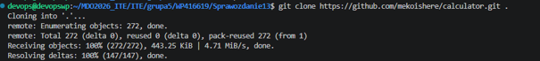
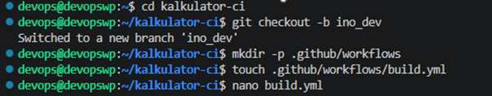
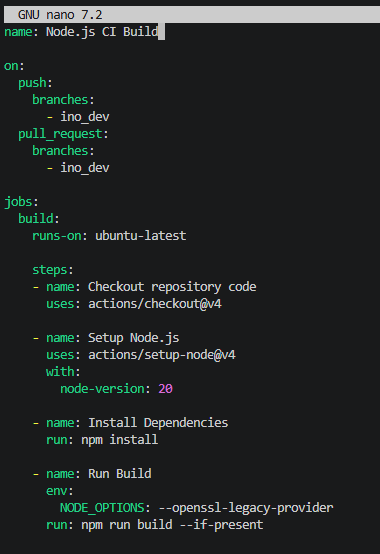
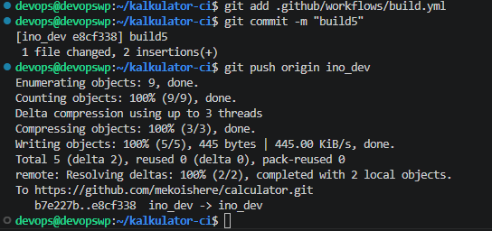
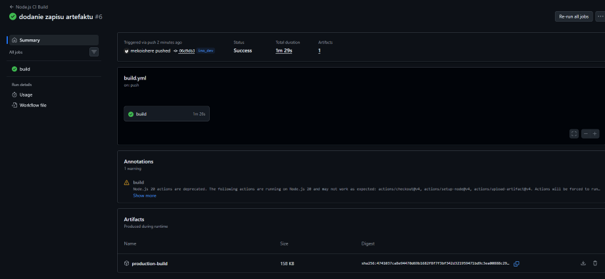

# Sprawozdanie 13: Automatyzacja potoków CI/CD przy użyciu GitHub Actions

**Student:** Wilhelm Pasterz

**Indeks:** 416619

**Kierunek:** ITE

**Grupa: 5**  

---

## 1. Cel zadania

Celem ćwiczenia było zapoznanie się z platformą GitHub Actions, mechanizmami automatyzacji procesów integracji (CI/CD) oraz zasadami rozliczeniowymi darmowych planów wykonawczych (runners). Zadanie obejmowało stworzenie dedykowanego forka wybranego projektu, utworzenie gałęzi deweloperskiej ino_dev oraz skonstruowanie potoku automatycznie budującego aplikację i generującego artefakt wyjściowy po każdym pushu.

## 2. Środowisko i realizacja kroku po kroku

Do realizacji zadania wybrano publiczne repozytorium z kalkulatorem opartym o środowisko Node.js / React.

### Krok 1: Forkowanie repozytorium i izolacja zmian

Zgodnie z zaleceniem, projekt został sforkowany na prywatne konto użytkownika, aby nie zanieczyszczać głównego repozytorium kodu. Następnie utworzono dedykowaną gałąź roboczą za pomocą polecenia git checkout -b ino_dev.
Link do sforkowanego repozytorium: [https://github.com/mekoishere/calculator](https://github.com/mekoishere/calculator)

### Krok 2: Konfiguracja pliku Workflow (CI Build)

W katalogu .github/workflows/ przygotowano plik konfiguracyjny build.yml reagujący wyłącznie na zdarzenia push oraz pull_request skierowane do gałęzi ino_dev.

## 3. Weryfikacja działania i wygenerowane artefakty

## 4. Wnioski

Wykorzystanie podejścia Shift-left poprzez automatyczne uruchamianie testów i procesów budowania (CI) na niezależnych maszynach wirtualnych pozwala na błyskawiczne wykrywanie błędów konfiguracyjnych i programistycznych. Izolacja potoków w dedykowanych gałęziach (takich jak ino_dev) gwarantuje stabilność głównego kodu aplikacji (master/main) i zapobiega przypadkowemu wdrożeniu niedziałających wersji oprogramowania.