# Sprawozdanie 2 - Git, Docker

**Student:** Wilhelm Pasterz

**Indeks:** 416619

**Kierunek:** ITE

**Grupa: 5** 

## 1. Pobieranie dockera
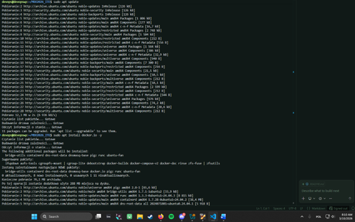

## 2. Logowanie w dockerze
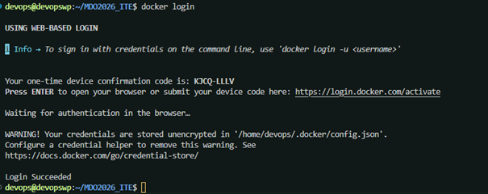

## 3. Pobieranie obrazów
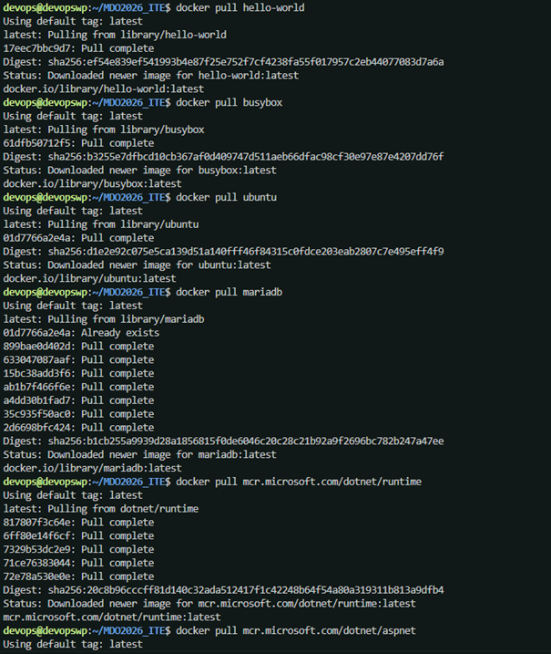

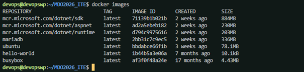

## 4. Uruchamianie obrazów

## 5. Uruchomienie busyboxa i sprawdzenie jego wersji
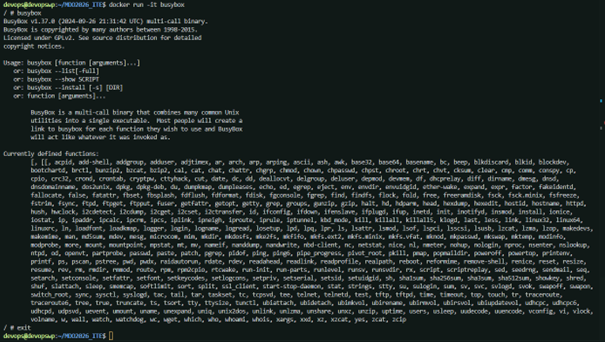

## 6. Włączenie porównanie PID1 wewnątrz i na zewnątrz kontenera ubuntu

Wewnątrz kontenera:

Na zewnątrz kontenera:

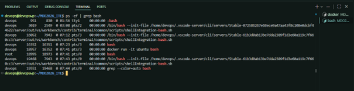

## 7. Aktualizacja pakietów
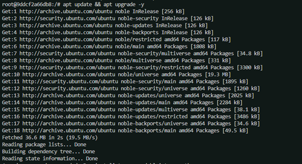

## 8. Utworzenie Dockerfile'a oraz zbudowanie własnego obrazu
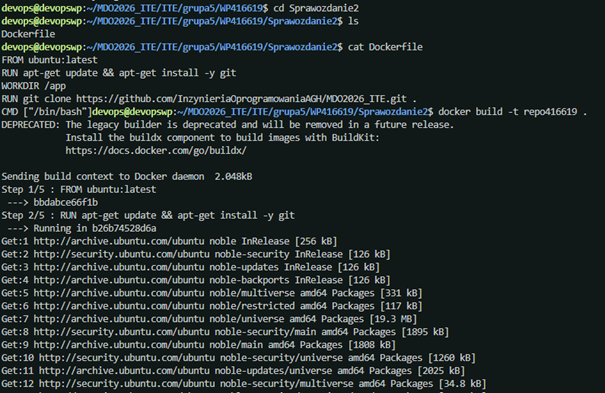

## 9. Uruchomienie obrazu
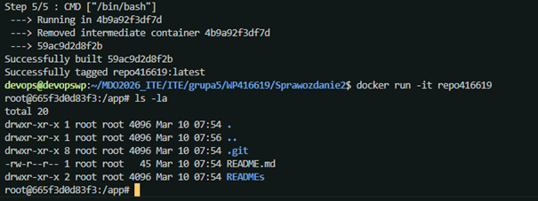

## 10. Czyszczenie lokalnych kontenerów i obrazów
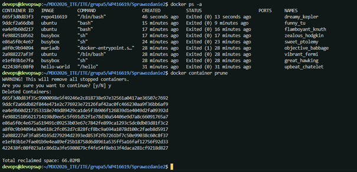

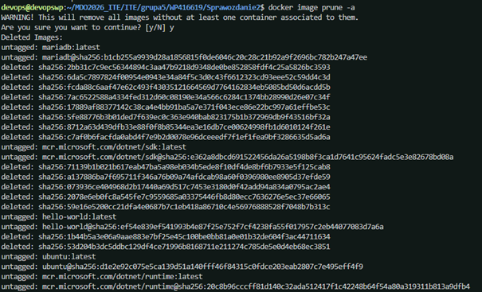