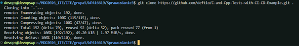
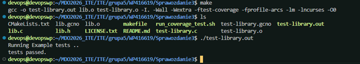
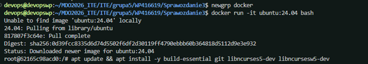
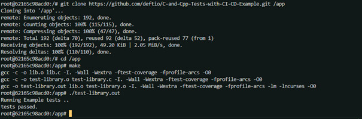
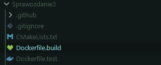
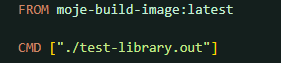
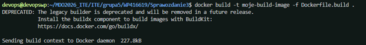
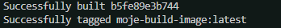
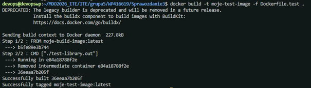
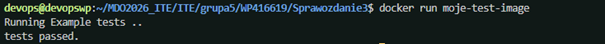

# Sprawozdanie 3 - Dockerfiles, kontener jako definicja etapu

**Student:** Wilhelm Pasterz

**Indeks:** 416619

**Kierunek:** ITE

**Grupa: 5** 

## 1. Klonowanie repozytorium https://github.com/deftio/C-and-Cpp-Tests-with-CI-CD-Example?

## 2. Make oraz puszczenie testów po doinstalowaniu wymaganych zależności

## 3. Uruchomienie kontenera z TTY

## 4. Ponowienie procesu na poziomie kontenera

Sklonowanie repozytorium, Uruchomienie buildu i przeprowadzenie testów

## 5. Utworzenie Dockerfile’i

***Dockerfile.build***

***Dockerfile.test***

## 6. Uruchomienie Dockerfile’i

## 7. Sprawdzenie czy wszystko działa

## 8. ... co pracuje w takim kontenerze?

W kontenerze pracuje jeden, konkretny proces testowy odizolowany dockerem. Kontener używa hosta żeby zarządzać procesorem i RAMem.