# Sprawozdanie 4 - Dodatkowa terminologia w konteneryzacji, instancja Jenkins

**Student:** Wilhelm Pasterz

**Indeks:** 416619

**Kierunek:** ITE

**Grupa: 5** 

## 1. Zachowywanie stanu między kontenerami

### Kreacja woluminow 

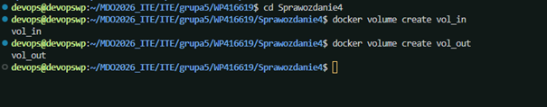

### Klonowanie repo na wolumin 

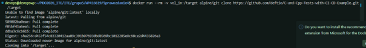

**Opis wykonania:**
Użyto komendy:
`docker run --rm -v vol_in:/target alpine/git clone <URL_REPO> .`
1. **Izolacja:** Wykorzystano gotowy obraz `alpine/git`, co wyeliminowało potrzebę instalacji Gita na hoście lub w docelowym obrazie budującym.
2. **Automatyzacja:** Dzięki fladze `--rm`, kontener po sklonowaniu kodu na wolumin został automatycznie usunięty, nie pozostawiając śmieci w systemie.
3. **Punkt montowania:** Wolumin `vol_in` zamontowano tymczasowo jako `/target`, gdzie Git bezpośrednio zapisał strukturę plików.

**Dlaczego ta metoda?**
* **Czystość środowiska:** Obraz budujący pozostaje lekki (brak `git` i jego zależności).
* **Bezpieczeństwo:** Nie manipulujemy bezpośrednio w katalogach systemowych Dockera.
* **Przenośność:** Rozwiązanie jest niezależne od plików na hoście – zadziała identycznie na każdym systemie z Dockerem.

### Budowanie projektu wewnątrz kontenera z wykorzystaniem woluminów

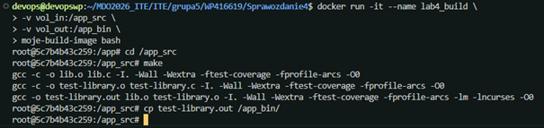

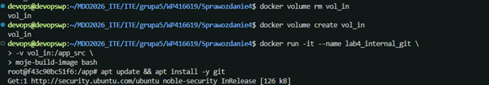

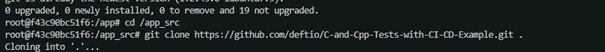

### Weryfikacja zawartości woluminu

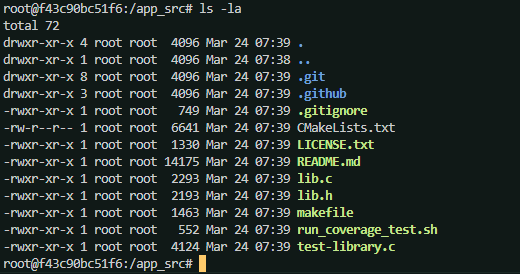

**Zamiast ręcznego klonowania na woluminy, można instrukcji RUN --mount w Dockerfile. Pozwala ona na tymczasowe zamontowanie zewnętrznego zasobu na etap budowania obrazu. Dzięki temu pliki źródłowe nie stają się częścią ostatecznych warstw obrazu, co zmniejsza jego rozmiar i zwiększa bezpieczeństwo.**

---

## 2. Eksponowanie portu i łączność między kontenerami

### Uruchomienie dwóch kontenerów

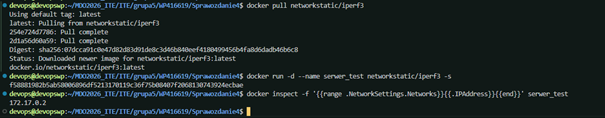

### Połączenie z drugiego kontenera

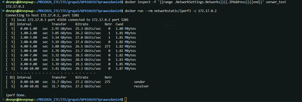

### Ponowienie kroku przy pomocy dedykowanej sieci mostkowej

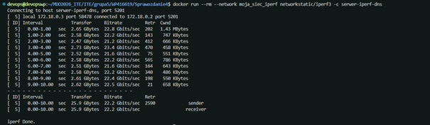

### Połączenie się spoza kontenera

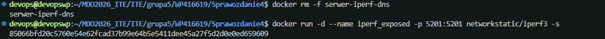

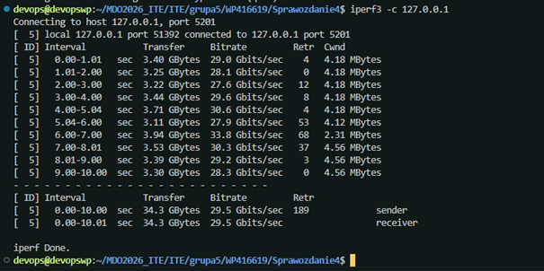

---

## 3. Usługi i CI/CD (SSHD & Jenkins)

### Uruchomienie kontener Ubuntu i zainstalowanie SSH:

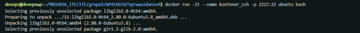

### Wewnątrz kontenera:

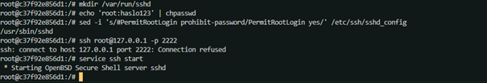

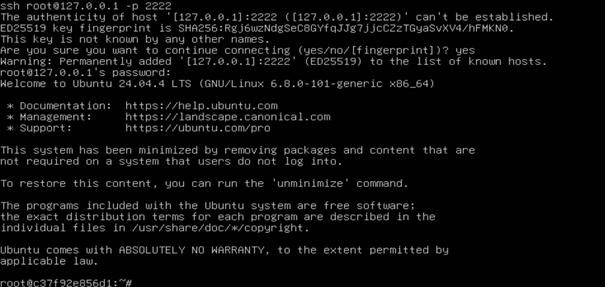

### Uruchomienie kontenera DIND

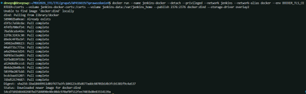

### Uruchomienie serwera Jenkins

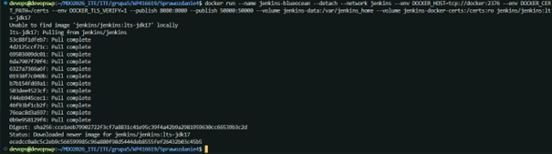

### Sprawdzenie działania

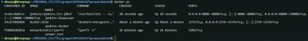

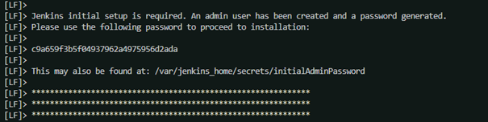

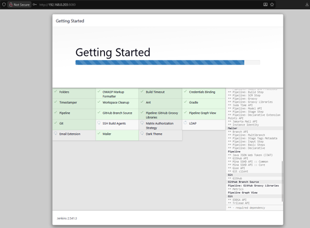

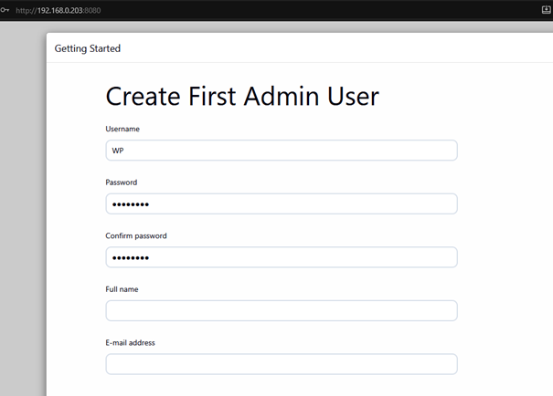

