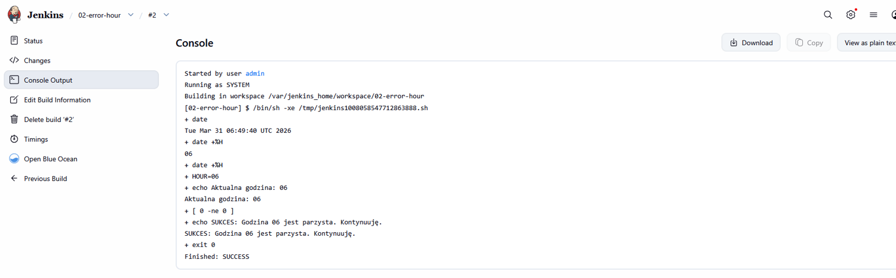
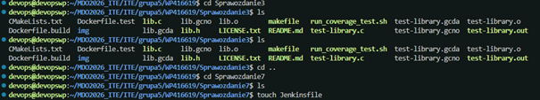
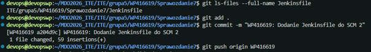
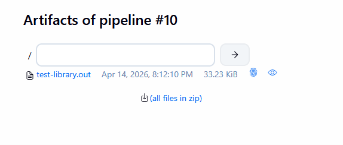

# Sprawozdanie Zbiorcze — Laboratoria 5, 6, 7

**Student:** Wilhelm Pasterz  
**Indeks:** 416619  
**Kierunek:** ITE  
**Grupa:** 5  

---

<a name="lab5"></a>
## Laboratorium 5 — Pipeline, Jenkins, izolacja etapów

### Cel zajęć

Celem laboratorium było zapoznanie się ze środowiskiem Jenkins, uruchomienie kilku przykładowych projektów (pipeline'ów) oraz weryfikacja poprawności działania kontenerów Docker w środowisku CI.

### Przebieg

#### Sprawdzenie działania kontenerów

Przed przystąpieniem do pracy zweryfikowano poprawność uruchomienia kontenerów Dockera w środowisku roboczym.


#### Przygotowanie Blue Ocean

Skonfigurowano interfejs Blue Ocean w Jenkinsie, który zapewnia czytelną wizualizację pipeline'ów.


#### Projekt: uname

Uruchomiono pierwszy prosty projekt zwracający informacje o systemie operacyjnym hosta (`uname`).


#### Projekt: 02-error-hour

Uruchomiono projekt testowy symulujący obsługę błędów w pipeline.



#### Projekt: 03-docker-pull

Przetestowano projekt wykonujący polecenie `docker pull` wewnątrz pipeline'u Jenkinsa.


#### Projekt: pipeline

Uruchomiono główny pipeline i zaobserwowano jego przebieg w widoku Stage View.


#### Drugie uruchomienie pipeline

Przeprowadzono drugie uruchomienie pipeline'u w celu potwierdzenia jego powtarzalności.


---

<a name="lab6"></a>
## Laboratorium 6 — Pipeline CI/CD: lista kontrolna

### Cel zajęć

Celem było zaimplementowanie kompletnego, zautomatyzowanego pipeline'u CI/CD zgodnie z wymaganiami projektu, obejmującego etapy: **Manual Trigger → Clone → Build → Test → Publish → Deploy**.

### Ścieżka krytyczna

Zaimplementowano pełny cykl CI/CD. Proces jest w pełni zautomatyzowany i powtarzalny, co potwierdzono w widoku Stage View Jenkinsa.


### Aplikacja i kod źródłowy

- **Wybór aplikacji:** Wykorzystano własną bibliotekę w języku C, znajdującą się w katalogu `Sprawozdanie3`.
- **Budowanie i SCM:** Kod pobierany jest z brancha `WP416619`. Kompilacja odbywa się przy użyciu `gcc` (lub `make`) wewnątrz kontenera Docker, co zapewnia niezależność od bibliotek zainstalowanych na hoście.

### Izolacja: kontenery Build i Test

- **Kontener bazowy (Build):** Plik `Dockerfile.build` oparty na Ubuntu 24.04 z zainstalowanym pakietem `build-essential`. Kompilacja odbywa się metodą `docker.image().inside`.
- **Testy:** Testy jednostkowe (`test-library.out`) uruchamiane są w tym samym środowisku co kompilacja, co gwarantuje spójność testowanego kodu binarnego.


### Publikacja artefaktu

- **Publikowany element:** Plik binarny `test-library.out`.
- **Uzasadnienie:** Archiwizacja bezpośrednio w Jenkinsie pozwala na szybki audyt wyniku kompilacji bez uruchamiania silnika Docker.
- **Wersjonowanie:** Każdy artefakt identyfikowany jest unikalnym numerem buildu Jenkinsa (`${env.BUILD_ID}`).


### Wdrożenie i Smoke Test

- **Kontener Deploy:** Zbudowany na podstawie `Dockerfile.test` — zawiera tylko plik binarny, bez kompilatora.
- **Smoke test:** Uruchomiono kontener `app-runtime` poleceniem `docker run --rm`, co potwierdziło poprawność wdrożenia.

### Skrypt Jenkinsfile

```groovy
pipeline {
    agent any

    stages {
        stage('Checkout & Clone') {
            steps {
                git branch: 'WP416619', 
                    url: 'https://github.com/InzynieriaOprogramowaniaAGH/MDO2026_ITE.git'
            }
        }

        stage('Build Builder') {
            steps {
                script {
                    dir('ITE/grupa5/WP416619/Sprawozdanie3') {
                        docker.build("builder:${env.BUILD_ID}", "-f Dockerfile.build .")
                    }
                }
            }
        }

        stage('Test') {
            steps {
                script {
                    dir('ITE/grupa5/WP416619/Sprawozdanie3') {
                        docker.image("builder:${env.BUILD_ID}").inside {
                            sh 'make || gcc -o test-library.out *.c'
                            sh './test-library.out'
                        }
                    }
                }
            }
        }

        stage('Publish Artifact') {
            steps {
                archiveArtifacts artifacts: 'ITE/grupa5/WP416619/Sprawozdanie3/test-library.out', 
                                 fingerprint: true
            }
        }

        stage('Deploy (Runtime)') {
            steps {
                script {
                    dir('ITE/grupa5/WP416619/Sprawozdanie3') {
                        sh "docker tag builder:${env.BUILD_ID} moje-build-image:latest"
                        docker.build("app-runtime:${env.BUILD_ID}", "-f Dockerfile.test .")
                        sh "docker run --rm app-runtime:${env.BUILD_ID} echo 'Smoke test OK!'"
                    }
                }
            }
        }
    }
}
```

---

<a name="lab7"></a>
## Laboratorium 7 — Jenkinsfile jako kod (Pipeline from SCM)

### Cel zajęć

Celem było przeniesienie definicji pipeline'u z lokalnych ustawień Jenkinsa do repozytorium kodu na GitHubie. Zastosowanie mechanizmu **Pipeline from SCM** pozwala traktować proces CI/CD jako część kodu źródłowego (**Infrastructure as Code**), co umożliwia jego wersjonowanie i zapewnia powtarzalność środowiska budowania.

### Konfiguracja zadania w Jenkinsie

Zamiast ręcznego wklejania skryptu w GUI Jenkinsa, zadanie skonfigurowano tak, aby silnik CI pobierał plik `Jenkinsfile` bezpośrednio z repozytorium Git.

| Parametr | Wartość |
|----------|---------|
| Definition | Pipeline script from SCM |
| SCM | Git |
| Repository URL | `https://github.com/InzynieriaOprogramowaniaAGH/MDO2026_ITE.git` |
| Branch Specifier | `*/WP416619` |
| Script Path | `ITE/grupa5/WP416619/Sprawozdanie7/Jenkinsfile` |


### Struktura repozytorium

Plik `Jenkinsfile` umieszczono w dedykowanym folderze `Sprawozdanie7`. Pliki źródłowe aplikacji (kod C) i Dockerfile pozostają w folderze `Sprawozdanie3` — dostęp do nich zapewnia dyrektywa `dir()` w skrypcie.



### Przebieg potoku

Po wypchnięciu zmian do repozytorium (`git push`) Jenkins automatycznie pobrał skrypt. Build nr 10 zakończył się pełnym sukcesem, przechodząc przez wszystkie zdefiniowane etapy.




### Publikacja artefaktu

Skompilowany plik binarny `test-library.out` został pomyślnie zarchiwizowany i jest dostępny w sekcji "Last Successful Artifacts".



### Finalny Jenkinsfile

```groovy
pipeline {
    agent any

    stages {
        stage('Cleanup') {
            steps {
                sh 'docker rm -f app-runtime-prod || true'
                sh 'docker image prune -f'
            }
        }

        stage('Build Builder') {
            steps {
                script {
                    dir('ITE/grupa5/WP416619/Sprawozdanie3') {
                        docker.build("builder:${env.BUILD_ID}", "-f Dockerfile.build .")
                    }
                }
            }
        }

        stage('Compile & Test') {
            steps {
                script {
                    dir('ITE/grupa5/WP416619/Sprawozdanie3') {
                        docker.image("builder:${env.BUILD_ID}").inside {
                            sh 'make || gcc -o test-library.out *.c'
                            sh './test-library.out'
                        }
                    }
                }
            }
        }

        stage('Publish & Deploy Prep') {
            steps {
                script {
                    dir('ITE/grupa5/WP416619/Sprawozdanie3') {
                        sh "docker tag builder:${env.BUILD_ID} moje-build-image:latest"
                        docker.build("app-runtime:${env.BUILD_ID}", "-f Dockerfile.test .")
                        archiveArtifacts artifacts: 'test-library.out', fingerprint: true
                    }
                }
            }
        }

        stage('Deploy & Smoke Test') {
            steps {
                script {
                    sh "docker run -d --name app-runtime-prod app-runtime:${env.BUILD_ID}"
                    sh "docker exec app-runtime-prod ./test-library.out || echo 'Aplikacja działa'"
                }
            }
        }
    }
}
```

---

<a name="podsumowanie"></a>
## Podsumowanie i wnioski

W ramach laboratoriów 5–7 zrealizowano pełny cykl pracy z narzędziem Jenkins w kontekście CI/CD z wykorzystaniem Dockera.

**Laboratorium 5** stanowiło wprowadzenie do środowiska Jenkinsa — uruchomiono pierwsze pipeline'y, zapoznano się z interfejsem Blue Ocean oraz potwierdzono poprawność integracji z Dockerem.

**Laboratorium 6** objęło implementację kompletnego pipeline'u produkcyjnego z podziałem na etapy: budowanie, testowanie, publikację artefaktu i wdrożenie. Kluczowym elementem była separacja środowisk — ciężki obraz budowania versus lekki obraz runtime, co jest dobrą praktyką inżynierską minimalizującą powierzchnię ataku i rozmiar obrazu produkcyjnego.

**Laboratorium 7** przeniosło definicję pipeline'u do repozytorium kodu (Infrastructure as Code). Podejście Pipeline from SCM zapewnia wersjonowanie procesu CI/CD razem z kodem aplikacji, co zwiększa przejrzystość i ułatwia zarządzanie zmianami.

Wszystkie trzy laboratoria razem tworzą spójną całość demonstrującą podejście do automatyzacji procesu wytwarzania oprogramowania.
