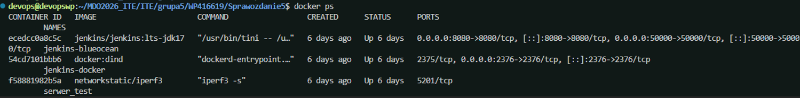
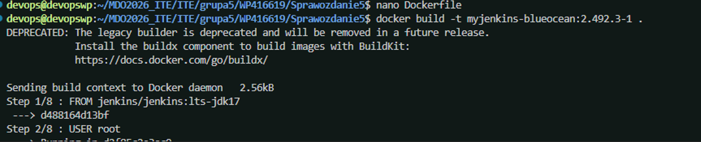
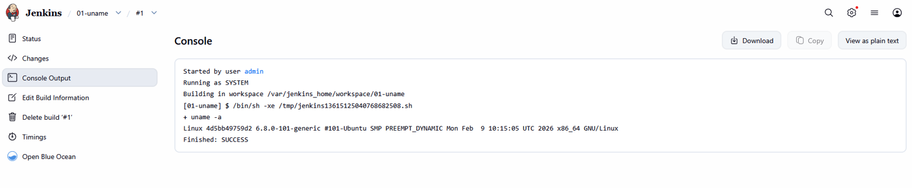
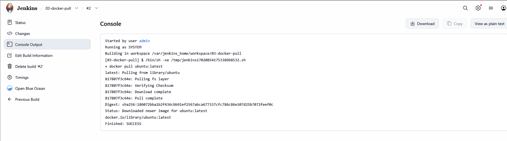
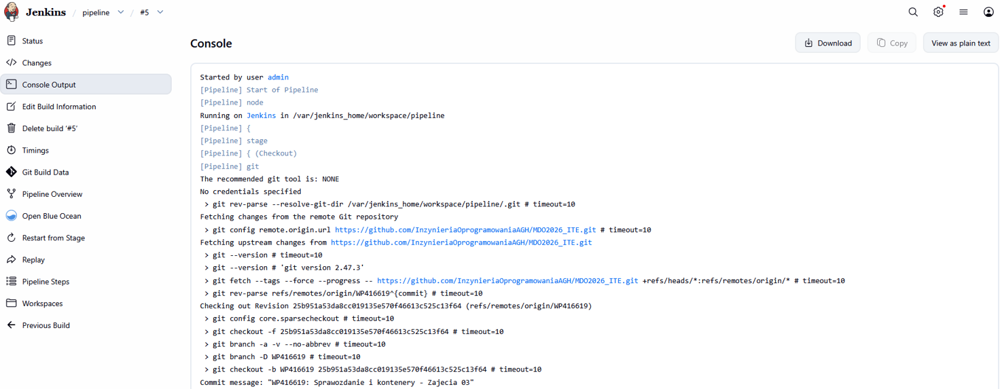
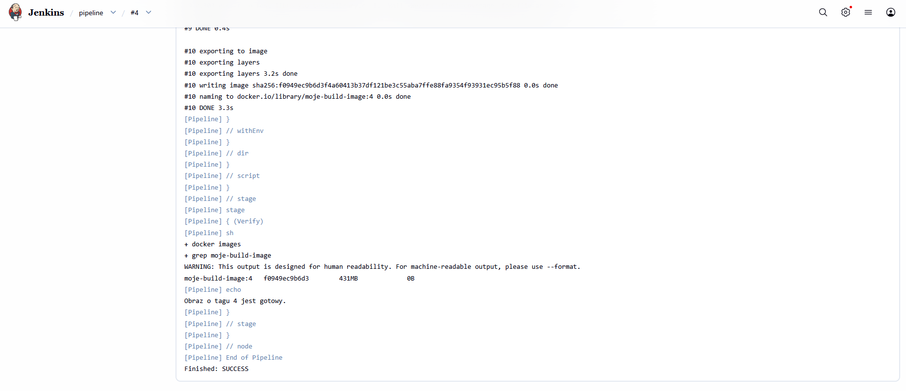
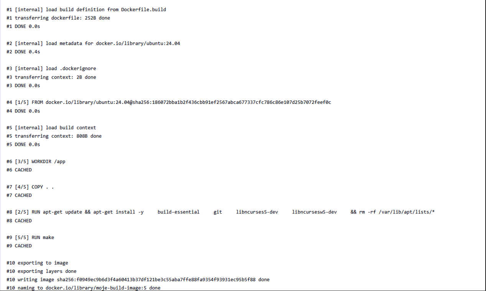
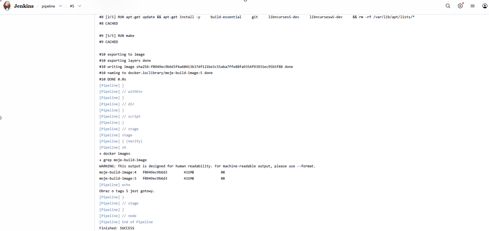

# Sprawozdanie 4 - Pipeline, Jenkins, izolacja etapów

**Student:** Wilhelm Pasterz

**Indeks:** 416619

**Kierunek:** ITE

**Grupa: 5** 

### Sprawdzenie działania kontenerów

### Przygotownie blueocean

### Projekt uname

### Projekt 02-error-hour

### Projekt 03-docker-pull

### Projekt pipeline

### Drugie uruchomienie pipeline

