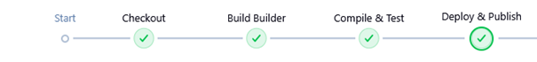
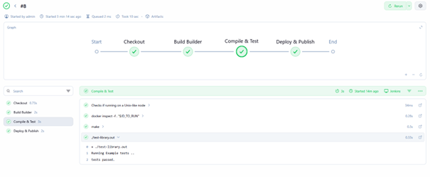

# Sprawozdanie 6 - Pipeline CI/CD, lista kontrolna

**Student:** Wilhelm Pasterz

**Indeks:** 416619

**Kierunek:** ITE

**Grupa: 5** 

## 1. Ścieżka krytyczna
Zaimplementowałem pełny cykl CI/CD zgodnie z wymaganiami (Manual Trigger -> Clone -> Build -> Test -> Publish -> Deploy). Proces jest w pełni zautomatyzowany i powtarzalny, co potwierdza widok etapów (Stage View) w moim projekcie.

## 2. Pełna lista kontrolna - Aplikacja i Kod
* *Wybór aplikacji:* Wykorzystałem własną bibliotekę/aplikację w języku C, znajdującą się w katalogu Sprawozdanie3.

* *Budowanie i SCM:* Kod jest pobierany z mojego brancha WP416619. Program buduje się przy użyciu gcc (lub make) wewnątrz kontenera, co zapewnia niezależność od bibliotek zainstalowanych na hoście.

## 3. Architektura i Diagram UML
Zaprojektowany proces opiera się na separacji środowisk.

* *Etap Build/Test:* Wykorzystuje ciężki obraz (Ubuntu + build-essential).

* *Etap Deploy:* Tworzy lekki obraz końcowy (Runtime).

* *Rozbieżność między UML a efektem:* W trakcie implementacji dodałem etap naprawczy (tagowanie obrazu), aby Dockerfile.test mógł poprawnie odnaleźć obraz bazowy w lokalnym rejestrze DinD.

## 4. Izolacja: Kontenery Build i Test
* *Kontener bazowy (Build):* Wykorzystałem plik `Dockerfile.build` (Ubuntu 24.04). Zainstalowane narzędzia to m.in. `build-essential`. Kompilacja odbywa się wewnątrz kontenera metodą `docker.image().inside`.

* *Testy:* Testy jednostkowe (`test-library.out`) są uruchamiane w tym samym środowisku, w którym nastąpiła kompilacja. Gwarantuje to, że testujemy dokładnie ten sam kod binarny w tym samym środowisku bibliotek systemowych.

## 5. Publikacja artefaktu (Publish)
* *Wybór elementu:* Publikuję plik binarny `test-library.out`.

* *Uzasadnienie:* Wybrałem archiwizację pliku binarnego bezpośrednio w Jenkinsie, ponieważ pozwala to na szybki audyt wyniku kompilacji bez konieczności uruchamiania silnika Docker.

* *Wersjonowanie:* Każdy artefakt jest unikalnie identyfikowany przez numer buildu Jenkinsa (${env.BUILD_ID}).

## 6. Wdrożenie i Smoke Test (Deploy)
* *Kontener Deploy:* Użyłem pliku `Dockerfile.test`, który tworzy finalny obraz runtime.

* *Uzasadnienie:* Kontener buildowy (z kompilatorem) jest zbyt duży i niebezpieczny dla produkcji. Obraz runtime jest odchudzony i zawiera tylko plik binarny.

* *Smoke test:* Wykonałem testowe uruchomienie kontenera `app-runtime` poleceniem `docker run --rm`, co potwierdziło poprawność wdrożenia.

## 7. Skrypt potoku (Jenkinsfile)
Zgodnie z wymaganiami, poniżej przedstawiam w pełni skopiowalną postać użytego obiektu Jenkinsfile.

pipeline {
    agent any

    stages {
        stage('Checkout & Clone') {
            steps {
                git branch: 'WP416619', 
                    url: 'https://github.com/InzynieriaOprogramowaniaAGH/MDO2026_ITE.git'
            }
        }

        stage('Build Builder') {
            steps {
                script {
                    dir('ITE/grupa5/WP416619/Sprawozdanie3') {
                        docker.build("builder:${env.BUILD_ID}", "-f Dockerfile.build .")
                    }
                }
            }
        }

        stage('Test') {
            steps {
                script {
                    dir('ITE/grupa5/WP416619/Sprawozdanie3') {
                        docker.image("builder:${env.BUILD_ID}").inside {
                            sh 'make || gcc -o test-library.out *.c'
                            sh './test-library.out'
                        }
                    }
                }
            }
        }

        stage('Publish Artifact') {
            steps {
                archiveArtifacts artifacts: 'ITE/grupa5/WP416619/Sprawozdanie3/test-library.out', 
                                 fingerprint: true
            }
        }

        stage('Deploy (Runtime)') {
            steps {
                script {
                    dir('ITE/grupa5/WP416619/Sprawozdanie3') {
                        sh "docker tag builder:${env.BUILD_ID} moje-build-image:latest"
                        
                        docker.build("app-runtime:${env.BUILD_ID}", "-f Dockerfile.test .")
                        
                        sh "docker run --rm app-runtime:${env.BUILD_ID} echo 'Smoke test OK!'"
                    }
                }
            }
        }
    }
}