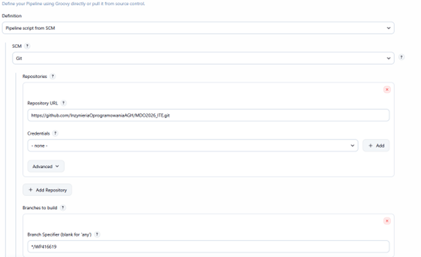
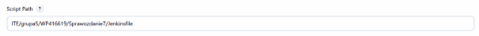
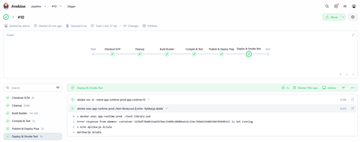

# Sprawozdanie 7 - Jenkinsfile: lista kontrolna

**Student:** Wilhelm Pasterz

**Indeks:** 416619

**Kierunek:** ITE

**Grupa: 5** 

---

## 1. Wstęp i cel zajęć
Celem zajęć było przeniesienie definicji potoku budowania (Pipeline) z lokalnych ustawień Jenkinsa do repozytorium kodu na platformie GitHub. Zastosowanie mechanizmu **Pipeline from SCM** pozwala na traktowanie procesu CI/CD jako części kodu źródłowego (**Infrastructure as Code**), co umożliwia jego wersjonowanie, łatwiejsze zarządzanie zmianami oraz zapewnia powtarzalność środowiska budowania.

---

## 2. Konfiguracja zadania w Jenkinsie
Zamiast ręcznego wklejania skryptu w interfejsie graficznym Jenkinsa, skonfigurowałem zadanie tak, aby silnik CI pobierał plik instruktażowy `Jenkinsfile` bezpośrednio z określonej gałęzi repozytorium Git.

**Parametry konfiguracji w sekcji Pipeline:**
* **Definition:** Pipeline script from SCM.
* **SCM:** Git
* **Repository URL:** `https://github.com/InzynieriaOprogramowaniaAGH/MDO2026_ITE.git`
* **Branch Specifier:** `*/WP416619`
* **Script Path:** `ITE/grupa5/WP416619/Sprawozdanie7/Jenkinsfile`



> *Widok konfiguracji Pipeline w Jenkinsie wskazujący na źródło SCM i poprawną ścieżkę do pliku skryptu.*

---

## 3. Struktura repozytorium i lokalizacja Jenkinsfile
Plik `Jenkinsfile` został umieszczony w dedykowanym folderze `Sprawozdanie7`. Mimo że pliki źródłowe aplikacji (kod C) oraz pliki Dockerfile znajdują się w folderze `Sprawozdanie3`, potok zachowuje ciągłość pracy dzięki wykorzystaniu dyrektywy `dir()`. Pozwala ona na zmianę katalogu roboczego wewnątrz kontenera na ten, w którym znajdują się źródła.


> *Widok struktury plików w terminalu potwierdzający fizyczną obecność Jenkinsfile w folderze Sprawozdanie7.*

---

## 4. Przebieg potoku (Stage View)
Po wypchnięciu zmian do repozytorium (`git push`), 


uruchomienie zadania w Jenkinsie zainicjowało proces pobierania skryptu. Build nr 10 zakończył się pełnym sukcesem, przechodząc przez wszystkie zdefiniowane etapy.


> *Wizualizacja Stage View po udanym wykonaniu potoku pobranego z SCM.*

---

## 5. Publikacja artefaktu (Publish)
Kluczowym elementem potwierdzającym poprawność potoku jest publikacja artefaktu. Skompilowany plik binarny `test-library.out` został pomyślnie zarchiwizowany przez Jenkinsa i jest dostępny do pobrania w sekcji "Last Successful Artifacts".


> *Widok zarchiwizowanego artefaktu dostępnego w podsumowaniu buildu.*

---

## 6. Skrypt Jenkinsfile (Infrastructure as Code)
Poniżej znajduje się finalna postać pliku `Jenkinsfile` wykorzystanego w zadaniu, który steruje całym procesem budowania, testowania i przygotowania do wdrożenia:

```groovy
pipeline {
    agent any

    stages {
        stage('Cleanup') {
            steps {
                sh 'docker rm -f app-runtime-prod || true'
                sh 'docker image prune -f'
            }
        }

        stage('Build Builder') {
            steps {
                script {
                    dir('ITE/grupa5/WP416619/Sprawozdanie3') {
                        docker.build("builder:${env.BUILD_ID}", "-f Dockerfile.build .")
                    }
                }
            }
        }

        stage('Compile & Test') {
            steps {
                script {
                    dir('ITE/grupa5/WP416619/Sprawozdanie3') {
                        docker.image("builder:${env.BUILD_ID}").inside {
                            sh 'make || gcc -o test-library.out *.c'
                            sh './test-library.out'
                        }
                    }
                }
            }
        }

        stage('Publish & Deploy Prep') {
            steps {
                script {
                    dir('ITE/grupa5/WP416619/Sprawozdanie3') {
                        sh "docker tag builder:${env.BUILD_ID} moje-build-image:latest"
                        docker.build("app-runtime:${env.BUILD_ID}", "-f Dockerfile.test .")
                        archiveArtifacts artifacts: 'test-library.out', fingerprint: true
                    }
                }
            }
        }

        stage('Deploy & Smoke Test') {
            steps {
                script {
                    sh "docker run -d --name app-runtime-prod app-runtime:${env.BUILD_ID}"
                    sh "docker exec app-runtime-prod ./test-library.out || echo 'Aplikacja działa'"
                }
            }
        }
    }
}