# Sprawozdanie 8 - Automatyzacja i zdalne wykonywanie poleceń za pomocą Ansible

**Student:** Wilhelm Pasterz

**Indeks:** 416619

**Kierunek:** ITE

**Grupa: 5** 

## 1. Instalacja i konfiguracja środowiska

### Konfiguracja maszyn wirtualnych

Przygotowano dwie maszyny wirtualne z tym samym systemem operacyjnym. Nowej maszynie nadano hostname `ansible-target`, utworzono użytkownika `ansible` oraz zainstalowano minimalny zestaw oprogramowania (w tym `tar` i serwer OpenSSH `sshd`). Wykonano migawkę maszyny.

Na głównej maszynie wirtualnej zainstalowano Ansible z repozytorium dystrybucji.

### Wymiana kluczy SSH

Przeprowadzono wymianę kluczy SSH między użytkownikiem głównej maszyny a użytkownikiem `ansible` na maszynie docelowej, tak aby logowanie `ssh ansible@ansible-target` nie wymagało podawania hasła.

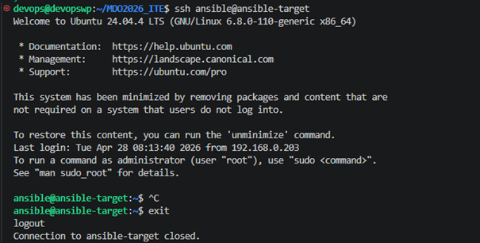

---

## 2. Inwentaryzacja systemów

### Konfiguracja nazw hostów i DNS

Ustalono przewidywalne nazwy komputerów za pomocą `hostnamectl`. Nazwy DNS skonfigurowano przy użyciu pliku `/etc/hosts`, co umożliwia odwoływanie się do maszyn po nazwie zamiast po adresie IP. Zweryfikowano łączność między maszynami.

### Plik inwentaryzacji

Stworzono plik `inventory.ini` zawierający sekcje `Orchestrators` oraz `Endpoints`, w których umieszczono nazwy odpowiednich maszyn wirtualnych.

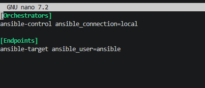

### Weryfikacja łączności – Ansible Ping

Wysłano żądanie `ping` do wszystkich maszyn z poziomu Ansible w celu weryfikacji poprawności konfiguracji inwentaryzacji

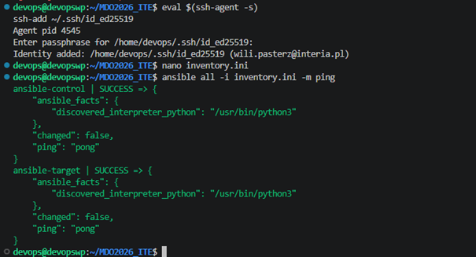

---

## 3. Zdalne wywoływanie procedur – Playbook

### Definicja playbooka (`tasks_08.yml`)

Przygotowano plik playbooka `tasks_08.yml` definiujący zadania do wykonania na zdalnych maszynach.

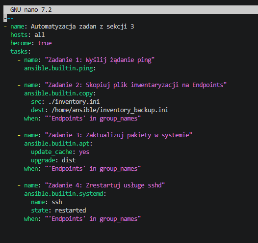

### Wykonanie playbooka

Playbook wykonano dwukrotnie. Z włączonym i wyłączonym SSH

**Uruchomienie 1:**

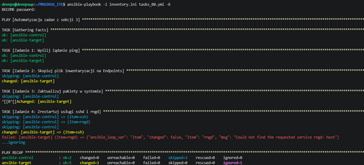

**Uruchomienie 2 po aktualizacji pakietów i wyłączeniu SSH:**

**Wyłączenie SSH**

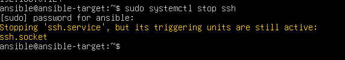

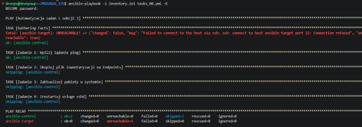


## 4. Zarządzanie stworzonym artefaktem

### Inicjalizacja roli – szkieletowanie

Użyto narzędzia `ansible-galaxy` do wygenerowania struktury roli:

```bash
ansible-galaxy role init deployment_role
```

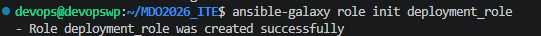

### Wypełnienie metadanych (`meta/main.yml`)

Uzupełniono plik `meta/main.yml` roli o poprawne metadane (autor, opis, platforma, zależności).

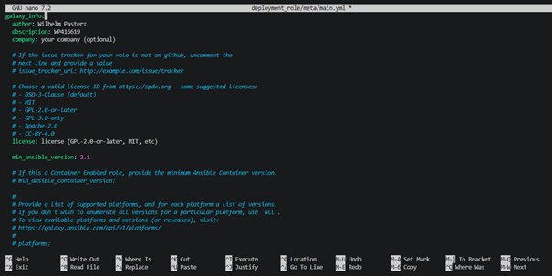

### Definicja zadań roli (`deployment_role/tasks/main.yml`)

W pliku `deployment_role/tasks/main.yml` zdefiniowano zadania odpowiedzialne za wdrożenie aplikacji: instalację Dockera, budowę/pobranie obrazu, uruchomienie kontenera oraz weryfikację łączności.

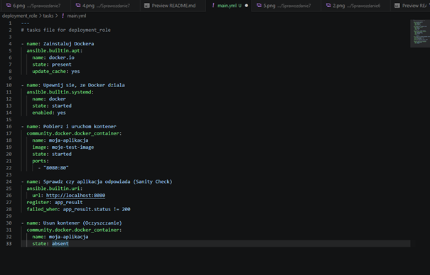

### Główny playbook (`final_playbook.yml`)

Stworzono finalny playbook odwołujący się do przygotowanej roli.

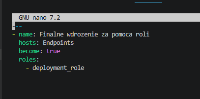

### Pełna definicja tasków roli

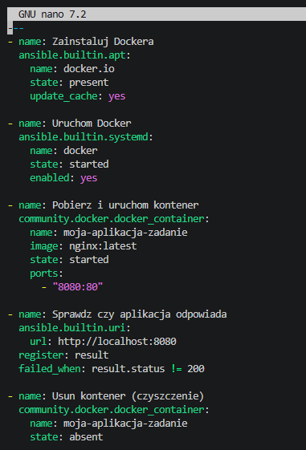

### Finalne uruchomienie

Przeprowadzono finalne uruchomienie playbooka obejmujące: sanity check maszyny docelowej, wdrożenie aplikacji w kontenerze Docker oraz oczyszczenie środowiska.

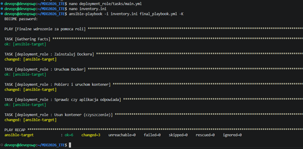

---

## Podsumowanie

W ramach zajęć skonfigurowano środowisko Ansible z maszyną-dyrygentem i maszyną docelową (`ansible-target`). Przeprowadzono pełen cykl: inwentaryzację hostów, zdalne wykonywanie poleceń za pomocą playbooków (ping, kopiowanie pliku, aktualizacja pakietów, restart usług), a także przetestowano zachowanie narzędzia w przypadku niedostępności hosta. Wdrożono artefakt aplikacji na maszynę docelową z użyciem Dockera instalowanego przez Ansible. Całość zadań obudowano w rolę Ansible wygenerowaną przez `ansible-galaxy` i opublikowano strukturę w repozytorium GitHub.