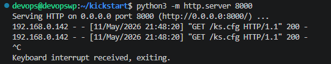
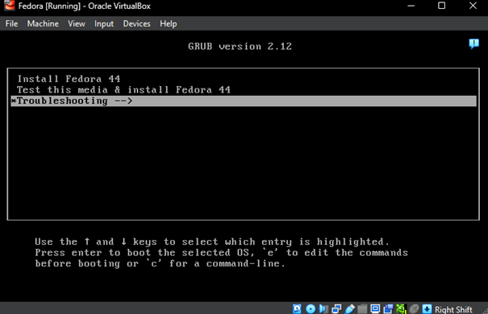
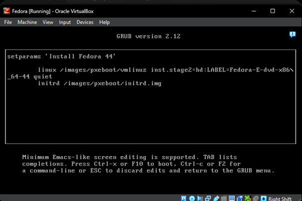
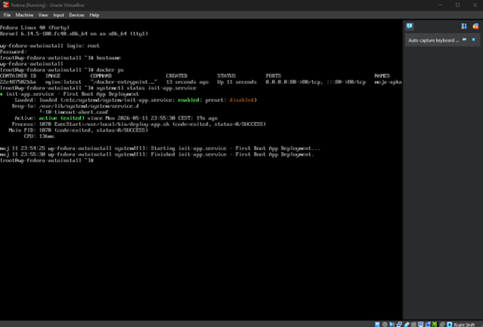
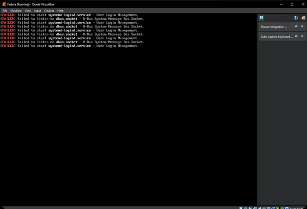

# Sprawozdanie 8 - Automatyzacja i zdalne wykonywanie poleceń za pomocą Ansible

**Student:** Wilhelm Pasterz

**Indeks:** 416619

**Kierunek:** ITE

**Grupa: 5** 

**Data: 11.05.2026**

---

## 1. Cel zadania
Celem projektu było przeprowadzenie w pełni nienadzorowanej instalacji (unattended installation) systemu Fedora Linux na maszynie wirtualnej przy użyciu pliku odpowiedzi **Kickstart**. Dodatkowym założeniem była automatyczna konfiguracja środowiska **Docker** oraz uruchomienie kontenera z aplikacją (Nginx) przy pierwszym uruchomieniu systemu.

---

## 2. Architektura rozwiązania
Do realizacji zadania wykorzystano model klient-serwer:
* **Serwer plików (Host):** Maszyna z uruchomionym serwerem HTTP (Python) na porcie `8000`, udostępniająca plik `ks.cfg`.
* **Klient (Maszyna wirtualna):** VirtualBox skonfigurowany w trybie **Bridged Adapter**, aby umożliwić bezpośrednią komunikację z serwerem plików.

## Kickstart: ks.cfg
```groovy
text
reboot
lang pl_PL.UTF-8
keyboard --vckeymap=pl
timezone Europe/Warsaw --utc

rootpw --plaintext fedora
user --name=student --groups=wheel --password=fedora --plaintext

network --bootproto=dhcp --device=link --activate
network --hostname=wp-fedora-autoinstall

zerombr
clearpart --all --initlabel
autopart --type=lvm

%packages
@core
docker
wget
systemd-container
%end

%post
systemctl enable docker

cat <<EOF > /usr/local/bin/deploy-app.sh
#!/bin/bash
sleep 15
/usr/bin/docker run -d -p 80:80 --name moja-apka nginx:latest
EOF

chmod +x /usr/local/bin/deploy-app.sh

cat <<EOF > /etc/systemd/system/init-app.service
[Unit]
Description=First Boot App Deployment
After=network-online.target docker.service
Wants=network-online.target

[Service]
Type=oneshot
ExecStart=/usr/local/bin/deploy-app.sh
RemainAfterExit=yes

[Install]
WantedBy=multi-user.target
EOF

systemctl enable init-app.service
%end
```
---

## 3. Konfiguracja pliku Kickstart (ks.cfg)
Przygotowany plik konfiguracyjny zawierał następujące kluczowe sekcje:
* **Automatyzacja:** Wyłączenie interakcji użytkownika (`text`, `reboot`).
* **Partycjonowanie:** Całkowite czyszczenie dysku i automatyczny podział partycji.
* **Pakiety:** Instalacja minimalnego systemu operacyjnego wraz z silnikiem Docker.
* **Sekcja %post:** Skrypt bashowy tworzący usługę `systemd` (`init-app.service`), która po starcie sieci pobiera obraz kontenera i uruchamia go w tle.

---
## 4. Przebieg pracy

Krok 1: Przygotowanie serwera plików

Prace rozpoczęto od przygotowania pliku ks.cfg w środowisku VS Code na głównej maszynie wirtualnej. Następnie uruchomiono serwer HTTP przy pomocy modułu Pythona, aby udostępnić konfigurację maszynie wirtualnej.



Krok 2: Konfiguracja maszyny wirtualnej i start instalacji

Utworzono maszynę wirtualną w VirtualBox (Fedora 40 Server (na zrzucie ekranu jest `Fedora 44`, która okazała się później nie działać)). W menu startowym GRUB, po naciśnięciu klawisza e, dopisano parametry wskazujące na sieciową lokalizację pliku Kickstart.





Po `quiet` wystąpi `inst.ks=http://192.168.0.203:8000/ks.cfg`, żeby wskazać lokalizację Kickstart.

Krok 3: Pobieranie konfiguracji przez instalator

Po zatwierdzeniu parametrów, instalator Anaconda nawiązał połączenie z serwerem. W terminalu VS Code zaobserwowano poprawne zapytanie GET, co potwierdziło komunikację między maszynami.


Krok 4: Automatyczny proces instalacji

System automatycznie przeszedł przez etapy partycjonowania, konfiguracji użytkownika oraz instalacji pakietów (Docker, wget).

Krok 5: Pierwsze uruchomienie i weryfikacja automatyzacji

Po zakończeniu instalacji i automatycznym restarcie, system uruchomił się z dysku twardego. Zalogowano się na konto root, aby sprawdzić czy skrypt %post poprawnie wdrożył aplikację.



---

## 5. Problem

### Próba z Fedora 44 (Everything)
Początkowo próbowano zainstalować wersję testową Fedora 44. Proces kończył się błędem `systemd-logind.service` oraz `Emergency Mode`. 


* **Diagnoza:** Niestabilność wersji rozwojowej na środowisku wirtualizacji VirtualBox.
* **Rozwiązanie:** Zmiana obrazu ISO na wersję `Fedora 40 Server` i ponowna instalacja. 

---

## 6. Wnioski
Zadanie zakończyło się sukcesem. Wykorzystanie technologii Kickstart pozwala na drastyczne skrócenie czasu wdrażania nowych serwerów. Kluczowym wnioskiem z projektu jest konieczność stosowania stabilnych wersji dystrybucji (LTS/Stable) w środowiskach automatyzacji, aby uniknąć błędów związanych z niekompatybilnością sterowników.