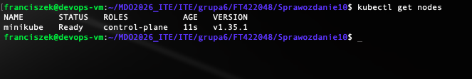
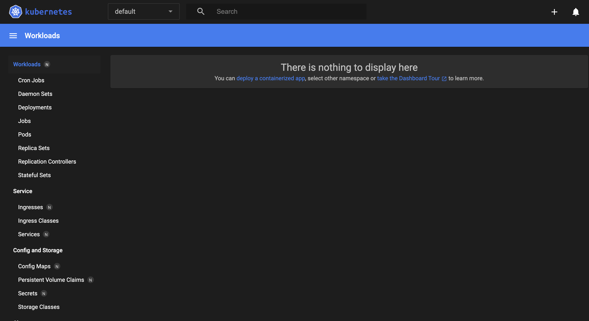
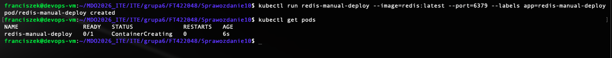
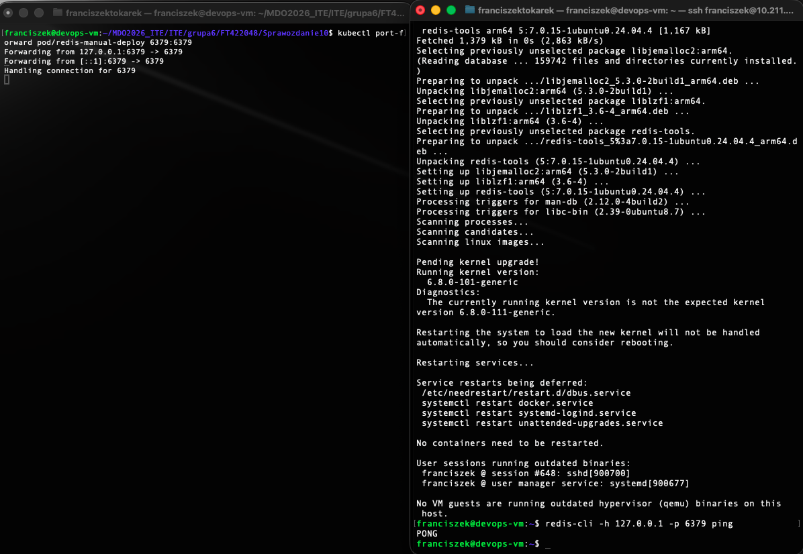
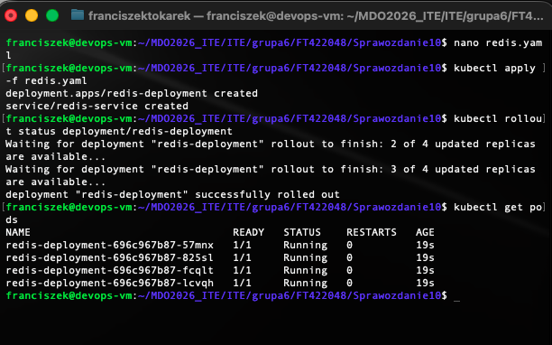
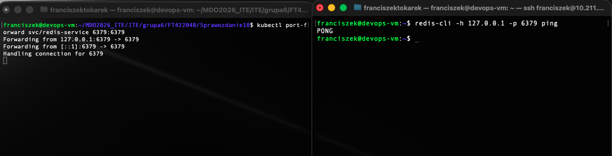

# Sprawozdanie 10 - Wdrażanie na zarządzalne kontenery: Kubernetes (1)

## Cel zadania
Instalacja i konfiguracja lokalnego klastra Kubernetes (Minikube) oraz wdrożenie na nim skonteneryzowanej aplikacji (Redis) w sposób manualny oraz z wykorzystaniem deklaratywnego pliku YAML.

## 1. Instalacja klastra i środowiska
Zainstalowano środowisko `minikube` oraz narzędzie `kubectl`. Z powodu ograniczeń środowiska wirtualnego Parallels na architekturze ARM, klaster uruchomiono ze sterownikiem `docker`, jawnie limitując zasoby (CPU: 2, RAM: 2048 MB) w celu zapobieżenia niestabilności systemu operacyjnego.

## 2. Wdrożenie manualne
Wykorzystano oficjalny obraz `redis:latest`. Aplikacja została wdrożona ręcznie (imperatywnie) za pomocą polecenia `kubectl run`. Następnie wyprowadzono port aplikacji do przestrzeni użytkownika, udowadniając poprawną komunikację z serwisem.

## 3. Infrastructure as Code (YAML) i Skalowanie
Wdrożenie manualne zostało usunięte i zastąpione wdrożeniem deklaratywnym poprzez plik `redis.yaml`. Zgodnie z dobrymi praktykami, plik jest pozbawiony komentarzy. Zdefiniowano w nim obiekt `Deployment` skalujący aplikację do 4 niezależnych replik oraz obiekt `Service` odpowiadający za eksponowanie funkcjonalności.

Wdrożenie zakończyło się pełnym sukcesem.
