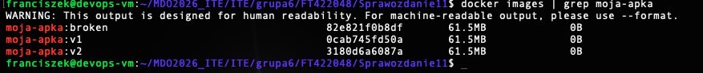
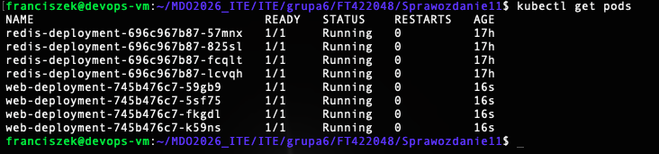
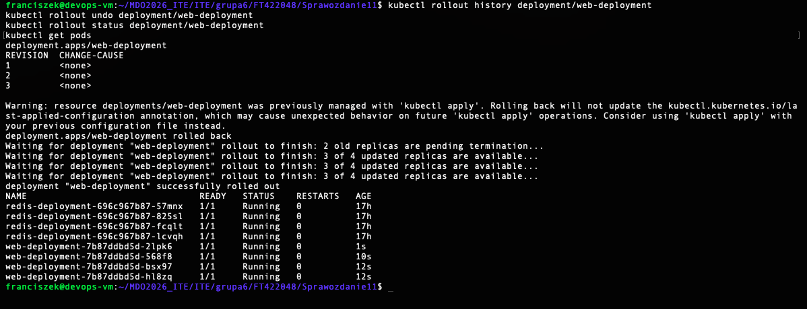
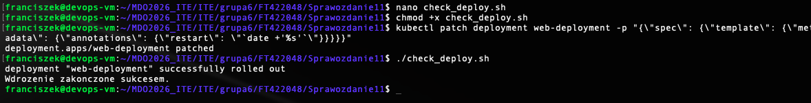
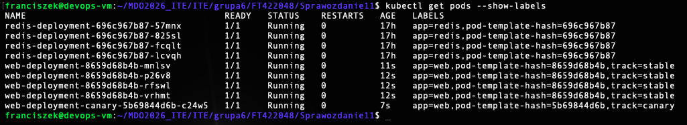

# Sprawozdanie 11 - Wdrażanie na zarządzalne kontenery: Kubernetes (2)

## Cel zadania
Zarządzanie cyklem życia aplikacji w klastrze Kubernetes. Wykorzystanie zaawansowanych strategii wdrożeń (Recreate, Rolling Update, Canary deployment), skalowanie w locie oraz obsługa awarii i wycofań (rollback).

## 1. Przygotowanie obrazów (Lokalny rejestr Minikube)
Zamiast publikować obrazy w zewnętrznym rejestrze, wykorzystano wbudowane środowisko Dockera wewnątrz Minikube. Zbudowano trzy wersje obrazu oparte na serwerze Nginx:
* `moja-apka:v1` (wersja stabilna)
* `moja-apka:v2` (nowa wersja)
* `moja-apka:broken` (wersja celowo uszkodzona).

## 2. Zmiany w deploymencie i Rollback
Przetestowano elastyczność klastra poprzez dynamiczne skalowanie liczby replik (w sekwencji 8 -> 1 -> 0 -> 4) z wykorzystaniem modyfikacji deklaratywnego pliku YAML.

Następnie zaktualizowano obraz do wersji wadliwej, co wywołało awarię produkcyjną (status `CrashLoopBackOff`). Sytuację zdiagnozowano za pomocą historii wdrożeń i przywrócono do stabilnego stanu komendą `kubectl rollout undo`.

## 3. Skrypt kontrolny
Napisano skrypt powłoki (Bash), wykorzystujący wbudowany mechanizm `kubectl rollout status` z parametrem `--timeout=60s`. Skrypt weryfikuje poprawność wdrożenia i w zależności od kodu wyjścia informuje o pełnym sukcesie lub przekroczeniu dozwolonego czasu.

## 4. Strategie wdrożenia i etykiety
Zaimplementowano pliki wdrożeń dla trzech głównych strategii:
* **Recreate:** Zabicie wszystkich starych replik przed podniesieniem nowych (powoduje chwilową niedostępność usługi).
* **Rolling Update:** Płynna wymiana instancji z parametrami `maxUnavailable: 2` i `maxSurge: 25%` (zachowanie ciągłości działania).
* **Canary Deployment:** Wdrożenie nowej wersji obok stabilnej dla ułamka ruchu. 

Do podziału i kierowania ruchem wykorzystano serwis oparty na nadrzędnej etykiecie `app: web`, podczas gdy poszczególne pody rozróżniano dedykowanymi podetykietami `track: stable` oraz `track: canary`.

