# Sprawozdanie 3 - Konteneryzacja i automatyzacja procesów wytwórczych

## 1. Wybór oprogramowania
Do realizacji zadania wybrano projekt **Redis**, napisany w języku C. Wybór uzasadniony jest przejrzystym procesem kompilacji (`make`) i rozbudowanym systemem testów, co pozwala na demonstrację powtarzalności środowiska w kontenerach.

## 2. Prace na maszynie lokalnej 
W pierwszym etapie sklonowano repozytorium i przeprowadzono kompilację bezpośrednio na maszynie wirtualnej.
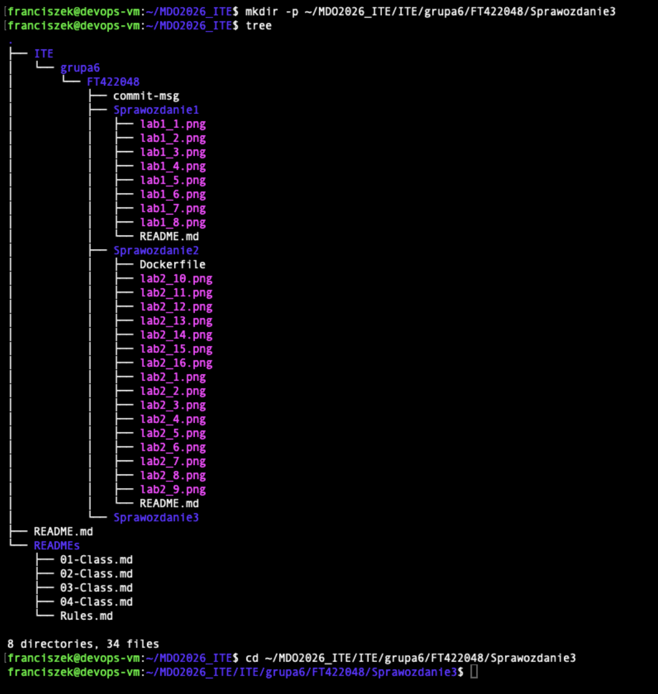
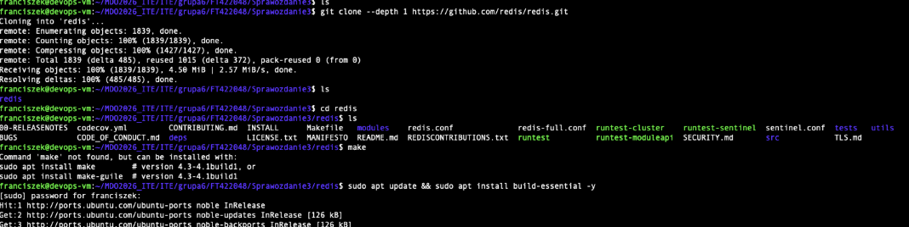

Podczas uruchomienia testów na hoście wystąpiły błędy, co potwierdza wpływ konfiguracji systemu gospodarza na stabilność testów.
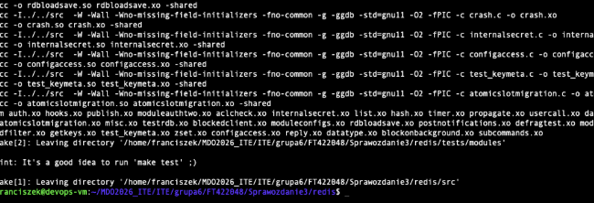

## 3. Budowanie interaktywne w kontenerze
Uruchomiono czysty kontener `ubuntu:latest`, w którym ręcznie zainstalowano zależności (`build-essential`, `tcl`, `git`). W izolowanym środowisku wszystkie testy zakończyły się sukcesem.
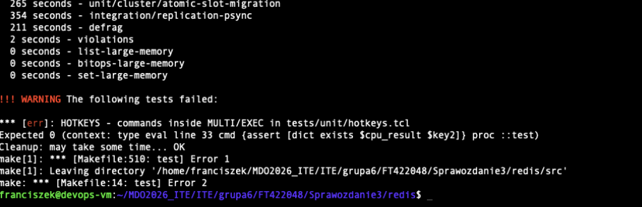
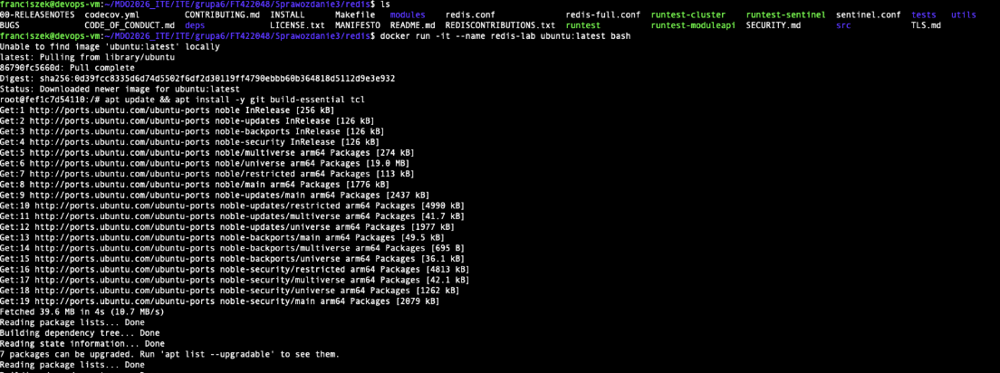

## 4. Automatyzacja przy użyciu Dockerfile
Przygotowano dwa pliki Dockerfile w celu separacji procesów:
- `Dockerfile.build`, który dpowiada za instalację narzędzi i kompilację kodu.
- `Dockerfile.test`, który wykorzystuje obraz builda do uruchomienia automatycznych testów.

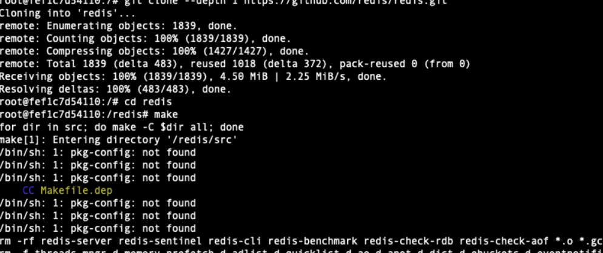
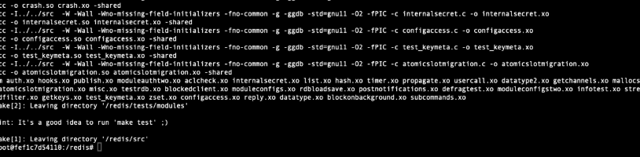
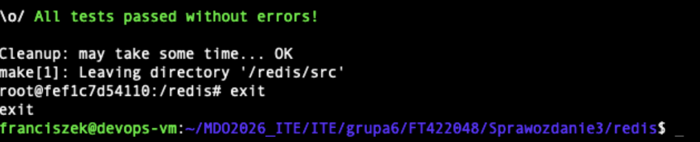

## 5. Docker Compose
Zaimplementowano plik `docker-compose.yml`, który automatyzuje budowanie i uruchamianie kontenera testowego jedną komendą.
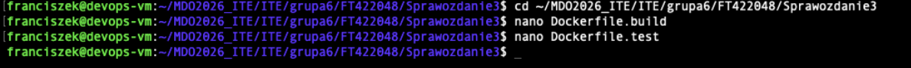
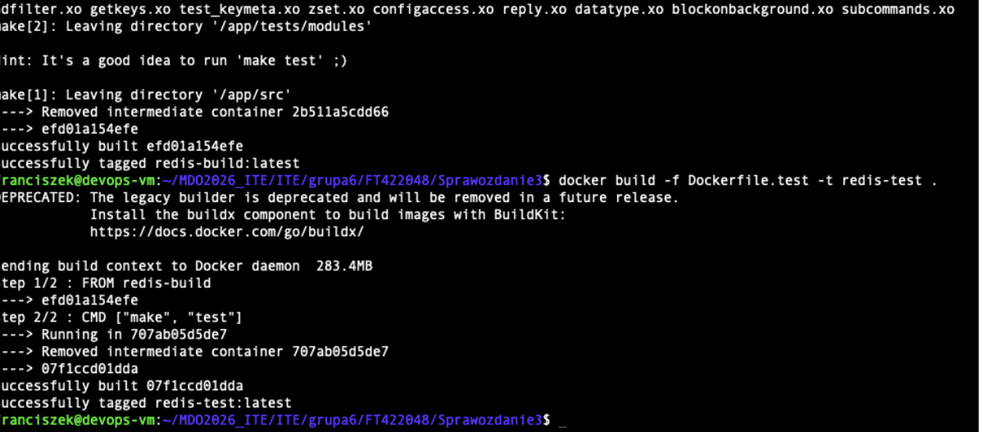
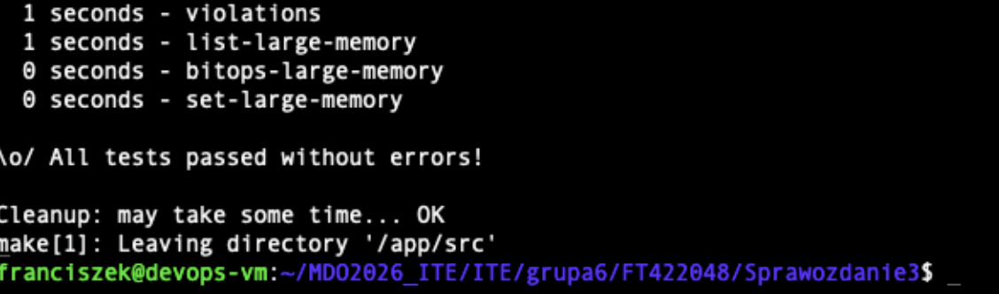

## 6. Analiza artefaktów i dyskusja
- Redis jest standardowo dystrybuowany jako obraz, alczkolwiek obecny obraz zawiera kod źródłowy i kompilatory, przez co jest zbyt duży do celów produkcyjnych.
- Aby umożliwić dystrybucję w systemach bez silnika kontenerowego, można wykorzystać kontener budujący do wygenerowania paczek instalacyjnych `.deb` lub `.rpm`, które byłyby finalnym artefaktem wyjściowym.

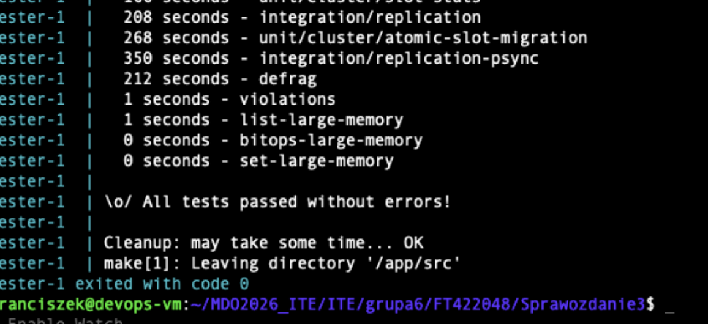
