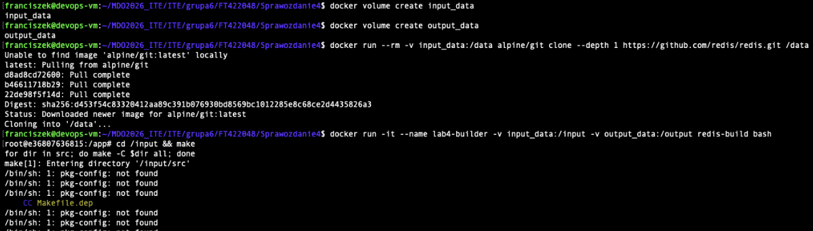
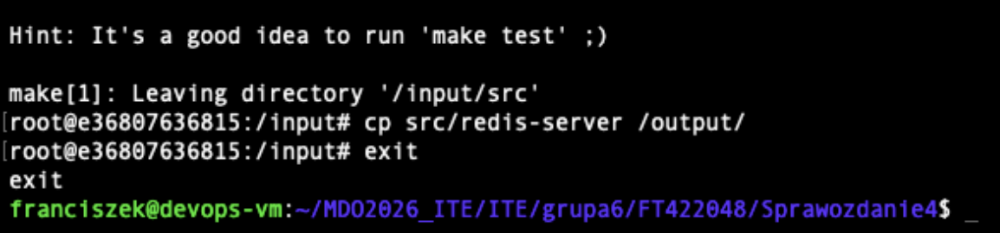
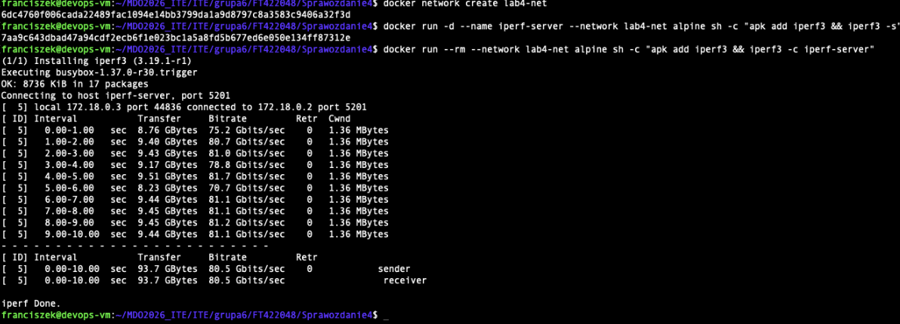
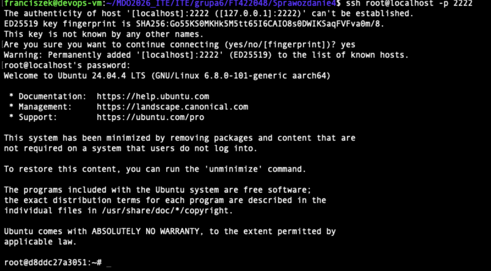
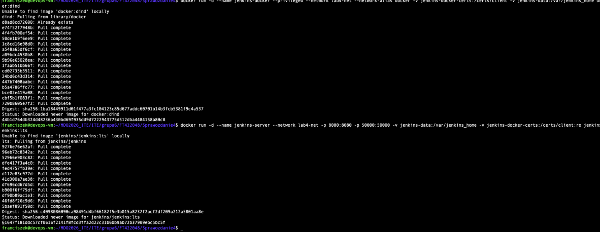
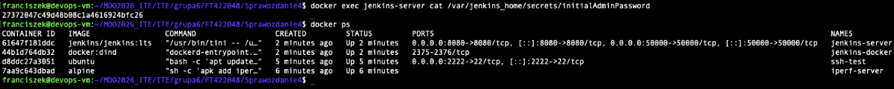
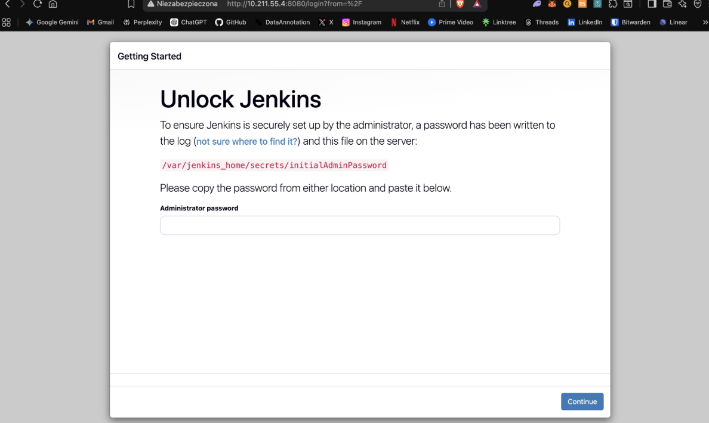

# Sprawozdanie 4 - Dodatkowa terminologia w konteneryzacji, instancja Jenkins
**Autor:** Franciszek Tokarek
**Indeks:** FT422048

## 1. Zachowywanie stanu między kontenerami (Woluminy)
Celem zadania było przeprowadzenie procesu budowania projektu bez użycia Gita wewnątrz kontenera budującego.
- Utworzono wolumin `input_data`, na który sklonowano repozytorium Redisa przy użyciu tymczasowego kontenera pomocniczego `alpine/git`. Ta metoda została wybrana, aby uniknąć ręcznego kopiowania plików do katalogów systemowych Dockera na hoście.
- Uruchomiono kontener `lab4-builder` (obraz `redis-build`), montując wolumin `input_data` jako źródło kodu i `output_data` jako miejsce zapisu artefaktów.
- Po zakończeniu budowania i usunięciu kontenera, plik binarny `redis-server` pozostał dostępny na woluminie wyjściowym.

## 2. Eksponowanie portów i łączność sieciowa (IPerf3)
Zbadano wydajność sieciową między kontenerami w dedykowanej sieci mostkowej `lab4-net`.
- Uruchomiono serwer `iperf3` w jednym kontenerze, a następnie połączono się z nim z drugiego kontenera, używając nazwy kontenera zamiast adresu IP (DNS Dockera).
- Uzyskano przepustowość na poziomie **80.5 Gbits/sec**, co jest wynikiem komunikacji wewnątrz pamięci RAM hosta.

## 3. Usługi w kontenerze (SSHD)
Skonfigurowano usługę SSH wewnątrz kontenera Ubuntu 24.04, eksponując port 22 na port 2222 hosta.
- **Zalety:** Możliwość zdalnego zarządzania i integracji ze starszymi narzędziami automatyzacji
- **Wady:** Większy rozmiar obrazu, dodatkowe wektory ataku, naruszenie izolacji (wiele procesów w jednym kontenerze)

## 4. Instalacja serwera Jenkins (DIND)
Uruchomiono instancję Jenkinsa w modelu Docker-in-Docker, co pozwala serwerowi CI na samodzielne budowanie obrazów kontenerowych.
- Wykorzystano sieć `lab4-net` do komunikacji między serwerem Jenkins a pomocnikiem DIND.
- Odczytano wygenerowane hasło administratora (`initialAdminPassword`) i pomyślnie zainicjalizowano panel webowy.

