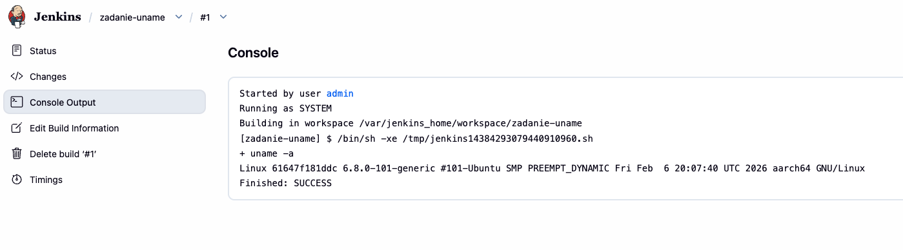
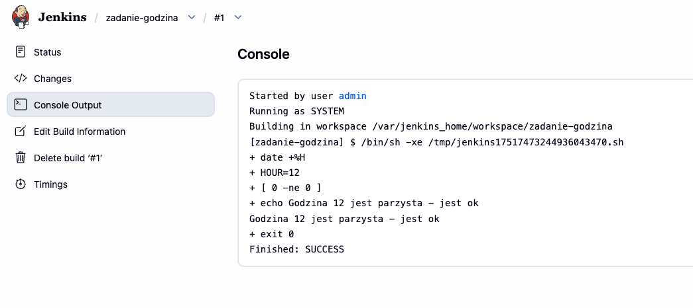
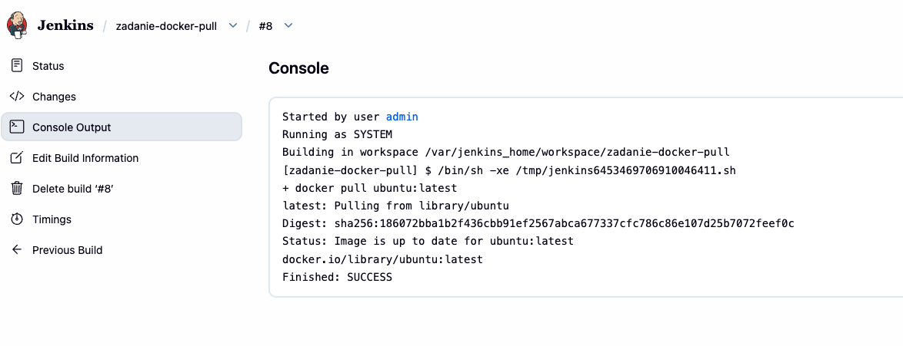
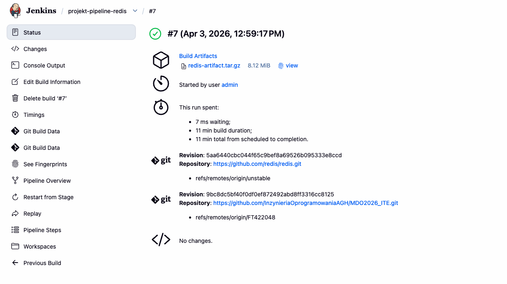
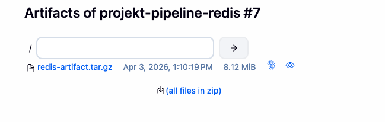
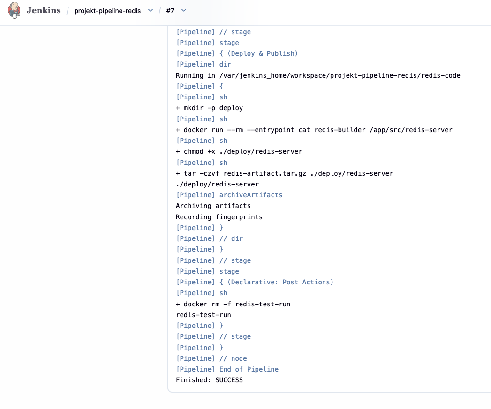

# Sprawozdanie 5 - Franciszek Tokarek 422048

## 1. Konfiguracja i Dashboard
Uruchomiono instancję Jenkinsa i przeprowadzono wstępną konfigurację adresu URL.




## 2. Zadania Freestyle
Zrealizowano testowe projekty sprawdzające środowisko (uname, skrypt godzinowy oraz docker pull).



## 3. Główny Pipeline (Redis)
Zaimplementowano potok CI/CD wykorzystujący Dockerfile z poprzednich zajęć. Pipeline automatyzuje pobieranie źródeł, budowanie obrazu (make), testy oraz publikację artefaktu.



## 4. Artefakty i Wynik
Skompilowany serwer Redis został spakowany do archiwum i udostępniony jako artefakt buildu. Proces zakończył się statusem SUCCESS.




---

## Pytania i Dyskusja

* **Obrazy slim/alpine:** Są znacznie mniejsze, co przyspiesza ich przesyłanie przez sieć i budowanie potoków. Zmniejszają też powierzchnię ataku, co podnosi bezpieczeństwo.
* **Automatyzacja testów:** Gwarantuje powtarzalność i natychmiastowe wykrycie błędów przy każdej zmianie kodu, eliminując czynnik ludzki.

### Diagram potoku
```mermaid
graph LR
    A[Checkout] --> B[Build Redis]
    B --> C[Run Tests]
    C --> D[Archive Artifact]
    D --> E[SUCCESS]
