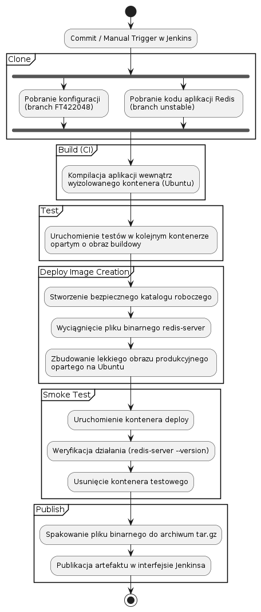
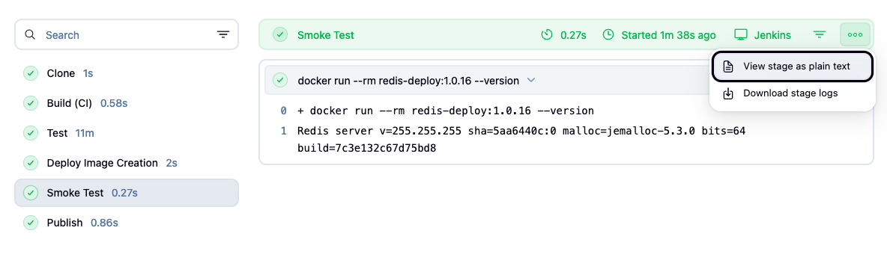
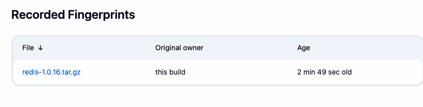
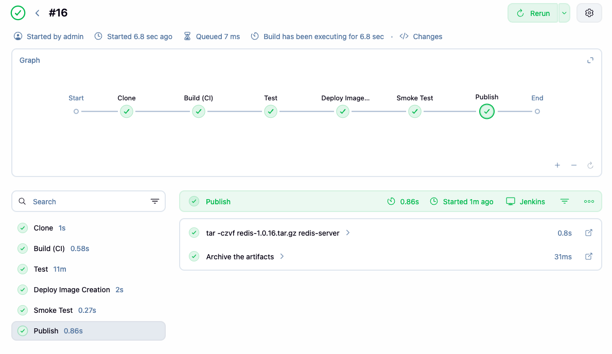

# Sprawozdanie 6: Pipeline CI/CD – Projekt Redis (FT422048)

## 1. Pełna lista kontrolna (Weryfikacja)

* **[x] Aplikacja została wybrana:** Redis (licencja BSD-3-Clause).
* **[x] Stworzono diagram UML:**
    
* **[x] Wybrano kontener bazowy:** Ubuntu:latest (zarówno build, jak i deploy).
* **[x] Build i testy wykonane wewnątrz kontenera:** Tak, przy użyciu dedykowanych obrazów.
* **[x] Zdefiniowano kontener typu 'deploy':** Tak, oddzielony od kontenera buildowego.
* **[x] Uzasadniono wybór kontenera deploy:** Kontener buildowy zawiera zbędne narzędzia kompilacyjne (GCC), co niepotrzebnie zwiększa rozmiar obrazu.
* **[x] Weryfikacja (smoke test):** Sprawdzono poprawność działania binarki w docelowym obrazie.
    
* **[x] Publikacja artefaktu:** Archiwum tar.gz opublikowane w Jenkinsie.
    
* **[x] Proces wersjonowania:** Semantic Versioning 1.0.${BUILD_NUMBER}.
* **[x] Pełna ścieżka krytyczna (Stage View):**
    
* **[x] Pliki źródłowe (Dockerfile i Jenkinsfile):** Dostępne w repozytorium.

## 2. Kody źródłowe (Czyste)

### Dockerfile.deploy
```dockerfile
FROM ubuntu:latest
WORKDIR /app
COPY redis-server /app/redis-server
RUN chmod +x /app/redis-server
EXPOSE 6379
ENTRYPOINT ["./redis-server"]
```

### Jenkinsfile
```groovy
pipeline {
    agent any
    environment {
        APP_VERSION = "1.0.${env.BUILD_NUMBER}"
    }
    stages {
        stage('Clone') {
            steps {
                dir('redis-code') {
                    git branch: 'unstable', url: 'https://github.com/redis/redis.git'
                }
                dir('my-config') {
                    git branch: 'FT422048', url: 'https://github.com/InzynieriaOprogramowaniaAGH/MDO2026_ITE.git'
                }
            }
        }
        stage('Build (CI)') {
            steps {
                sh 'cp my-config/ITE/grupa6/FT422048/Sprawozdanie3/Dockerfile.build redis-code/'
                dir('redis-code') {
                    sh "docker build -t redis-builder:${APP_VERSION} -f Dockerfile.build ."
                }
            }
        }
        stage('Test') {
            steps {
                sh 'cp my-config/ITE/grupa6/FT422048/Sprawozdanie3/Dockerfile.test redis-code/'
                dir('redis-code') {
                    sh "docker build -t redis-tester:${APP_VERSION} -f Dockerfile.test ."
                    sh 'docker rm -f redis-test-run || true'
                    sh "docker run --name redis-test-run redis-tester:${APP_VERSION}"
                }
            }
        }
        stage('Deploy Image Creation') {
            steps {
                sh 'mkdir -p my-deploy-folder'
                sh 'cp my-config/ITE/grupa6/FT422048/Sprawozdanie6/Dockerfile.deploy my-deploy-folder/'
                dir('my-deploy-folder') {
                    sh "docker run --rm --entrypoint cat redis-builder:${APP_VERSION} /app/src/redis-server > redis-server"
                    sh "docker build -t redis-deploy:${APP_VERSION} -f Dockerfile.deploy ."
                }
            }
        }
        stage('Smoke Test') {
            steps {
                sh "docker run --rm redis-deploy:${APP_VERSION} --version"
            }
        }
        stage('Publish') {
            steps {
                dir('my-deploy-folder') {
                    sh "tar -czvf redis-${APP_VERSION}.tar.gz redis-server"
                    archiveArtifacts artifacts: "redis-${APP_VERSION}.tar.gz", fingerprint: true
                }
            }
        }
    }
}
```
