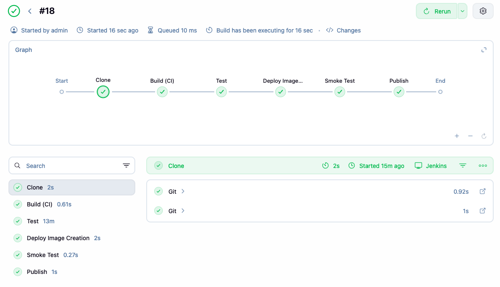

# Sprawozdanie 7: CI/CD z Jenkins jako kod (FT422048)

## Kroki Jenkinsfile
Weryfikacja ścieżki krytycznej zdefiniowanej w repozytorium:

- [X] Przepis dostarczany z SCM, a nie wklejony w Jenkinsa lub sprawozdanie (co załatwia nam `clone`):
Zamiast wklejać kod ręcznie, Jenkins ma ustawioną opcję "Pipeline script from SCM". Cały potok ciągnie bezpośrednio z pliku `Jenkinsfile` w repozytorium.

- [X] Posprzątaliśmy i wiemy, że odbyło się to skutecznie - mamy pewność, że pracujemy na najnowszym (a nie *cache'owanym* kodzie):
Dodaliśmy etap `Cleanup` z instrukcją `deleteDir()` na samym starcie. Dzięki temu przed każdym buildem mamy pewność, że obszar roboczy jest w 100% czysty i Jenkins nie ciągnie starych śmieci.

- [X] Etap `Build` dysponuje repozytorium i plikami `Dockerfile`:
W etapie `Clone` zaciągamy zarówno kod źródłowy Redisa, jak i nasze repozytorium z konfiguracją. Etap `Build (CI)` przerzuca sobie `Dockerfile.build` do odpowiedniego folderu i ma wszystko, co potrzebne.

- [X] Etap `Build` tworzy obraz buildowy, np. `BLDR`:
Krok `Build (CI)` buduje nam obraz i odpowiednio go taguje jako `redis-builder:${APP_VERSION}`.

- [X] Etap `Build` (krok w tym etapie) lub oddzielny etap (o innej nazwie), przygotowuje artefakt - **jeżeli docelowy kontener ma być odmienny**, tj. nie wywodzimy `Deploy` z obrazu `BLDR`:
Nie wrzucamy na produkcję obrazu buildowego, bo jest za ciężki. W etapie `Deploy Image Creation` odpalamy na chwilę zbudowany kontener i komendą `cat` wyciągamy z niego samą skompilowaną binarkę `redis-server` do lokalnego folderu.

- [X] Etap `Test` przeprowadza testy:
Żeby mieć pewność, że testujemy aktualny kod, użyliśmy `sed` do podmiany obrazu bazowego w pliku `Dockerfile.test` w locie. Następnie budowany jest kontener testowy i odpalane są w nim paczki testów Redisa.

- [X] Etap `Deploy` przygotowuje **obraz lub artefakt** pod wdrożenie:
Budujemy nowiutki, lekki obraz produkcyjny `redis-deploy:${APP_VERSION}`. Bazuje on na czystym Ubuntu i dorzucamy do niego tylko wypakowaną wcześniej binarkę.

- [X] Etap `Deploy` przeprowadza wdrożenie (start kontenera docelowego lub uruchomienie aplikacji na przeznaczonym do tego celu kontenerze sandboxowym):
W etapie `Smoke Test` po prostu uruchamiamy nasz nowy obraz deploy z flagą `--version`, żeby upewnić się, że kontener wstaje i biblioteki się poprawnie zlinkowały.

- [X] Etap `Publish` wysyła obraz docelowy do Rejestru i/lub dodaje artefakt do historii builda:
Pakujemy naszą czystą binarkę do archiwum `redis-${APP_VERSION}.tar.gz` i wypychamy jako zarchiwizowany artefakt prosto do interfejsu Jenkinsa.

- [X] Ponowne uruchomienie naszego *pipeline'u* powinno zapewniać, że pracujemy na najnowszym (a nie *cache'owanym*) kodzie:
Połączenie czyszczenia dysku (`deleteDir()`) i nadpisywania wersji obrazu dla testów sprawia, że potok jest w 100% powtarzalny i za każdym razem pracuje na świeżych plikach.


## "Definition of done"
Proces jest skuteczny, gdy "na końcu rurociągu" powstaje możliwy do wdrożenia artefakt (*deployable*).

* **Czy opublikowany obraz może być pobrany z Rejestru i uruchomiony w Dockerze bez modyfikacji?**
Tak, ten obraz odpali się bez problemu na każdej maszynie z Dockerem. Zbudowaliśmy go na bazie `ubuntu:latest`, więc ma w sobie wszystkie biblioteki systemowe, na których polega Redis. Nie trzeba kombinować ze specyficznymi ustawieniami – wystarczy zmapować port (np. `-p 6379:6379`). Potwierdza to zresztą nasz Smoke Test – skoro aplikacja odpowiada w kontenerze na `--version`, to znaczy, że środowisko ma wszystko, czego potrzebuje.

* **Czy dołączony do jenkinsowego przejścia artefakt, gdy pobrany, ma szansę zadziałać od razu na maszynie o oczekiwanej konfiguracji docelowej?**
Tak, pobrana z Jenkinsa paczka `.tar.gz` zadziała od razu, pod jednym warunkiem: maszyna docelowa musi mieć zgodne środowisko (architekturę i rodzaj biblioteki standardowej C). Ponieważ kompilowaliśmy to na Ubuntu (które używa `glibc`), uruchomienie tej binarki bezpośrednio na maszynie z Alpine Linux (który używa `musl`) zakończy się błędem braku bibliotek. Jeśli maszyna to typowy, popularny Linux, binarka po prostu ruszy.

## Zaktualizowany Jenkinsfile

```groovy
pipeline {
    agent any
    environment {
        APP_VERSION = "1.0.${env.BUILD_NUMBER}"
    }
    stages {
        stage('Cleanup') {
            steps {
                deleteDir()
            }
        }
        stage('Clone') {
            steps {
                dir('redis-code') {
                    git branch: 'unstable', url: 'https://github.com/redis/redis.git'
                }
                dir('my-config') {
                    git branch: 'FT422048', url: 'https://github.com/InzynieriaOprogramowaniaAGH/MDO2026_ITE.git'
                }
            }
        }
        stage('Build (CI)') {
            steps {
                sh 'cp my-config/ITE/grupa6/FT422048/Sprawozdanie3/Dockerfile.build redis-code/'
                dir('redis-code') {
                    sh "docker build -t redis-builder:${APP_VERSION} -f Dockerfile.build ."
                }
            }
        }
        stage('Test') {
            steps {
                sh 'cp my-config/ITE/grupa6/FT422048/Sprawozdanie3/Dockerfile.test redis-code/'
                dir('redis-code') {
                    sh "sed -i 's|^FROM.*|FROM redis-builder:${APP_VERSION}|' Dockerfile.test"
                    sh "docker build -t redis-tester:${APP_VERSION} -f Dockerfile.test ."
                    sh 'docker rm -f redis-test-run || true'
                    sh "docker run --name redis-test-run redis-tester:${APP_VERSION}"
                }
            }
        }
        stage('Deploy Image Creation') {
            steps {
                sh 'mkdir -p my-deploy-folder'
                sh 'cp my-config/ITE/grupa6/FT422048/Sprawozdanie6/Dockerfile.deploy my-deploy-folder/'
                dir('my-deploy-folder') {
                    sh "docker run --rm --entrypoint cat redis-builder:${APP_VERSION} /app/src/redis-server > redis-server"
                    sh "docker build -t redis-deploy:${APP_VERSION} -f Dockerfile.deploy ."
                }
            }
        }
        stage('Smoke Test') {
            steps {
                sh "docker run --rm redis-deploy:${APP_VERSION} --version"
            }
        }
        stage('Publish') {
            steps {
                dir('my-deploy-folder') {
                    sh "tar -czvf redis-${APP_VERSION}.tar.gz redis-server"
                    archiveArtifacts artifacts: "redis-${APP_VERSION}.tar.gz", fingerprint: true
                }
            }
        }
    }
}
```
