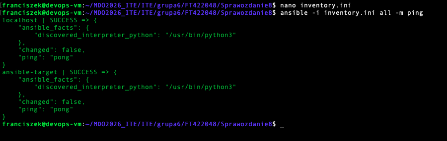
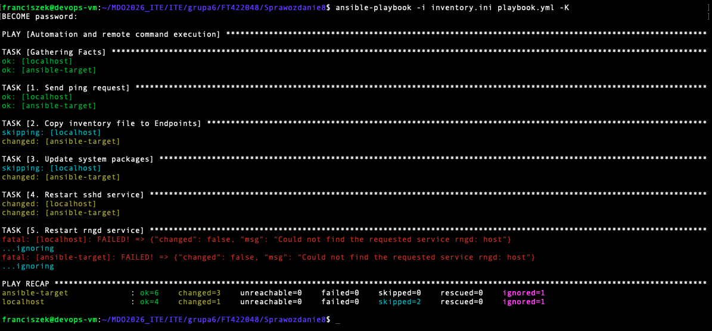
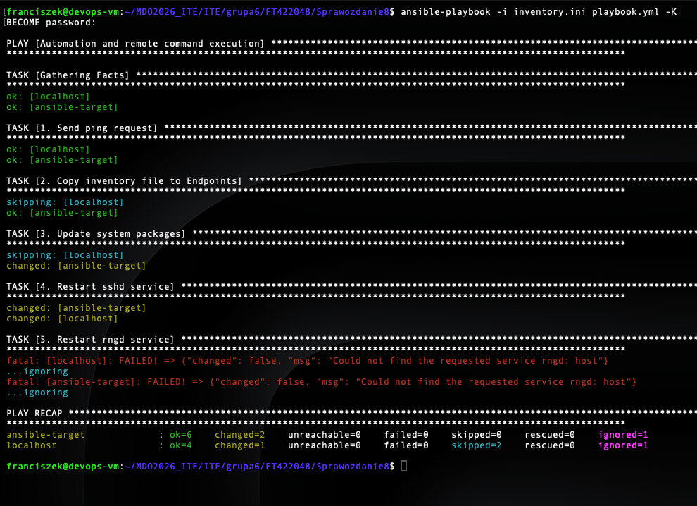
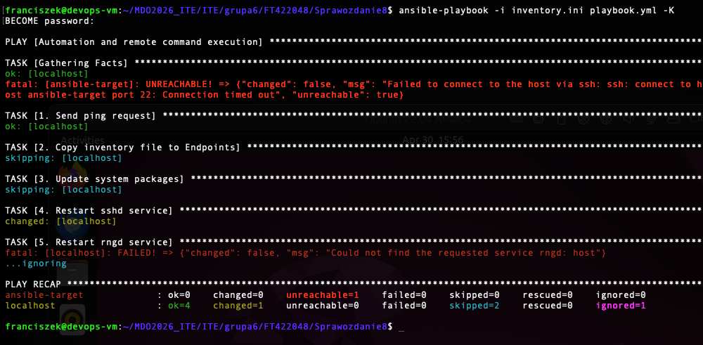
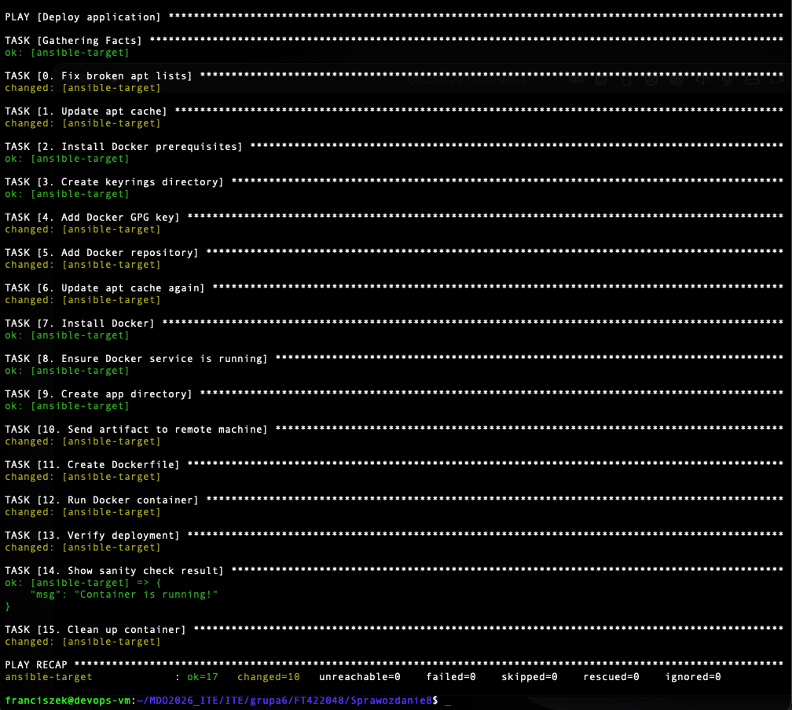

# Sprawozdanie 8 - Automatyzacja konfiguracji (Ansible)

## 1. Inwentaryzacja i test połączenia
W pierwszej części laboratorium skonfigurowano plik inwentaryzacji `inventory.ini`, definiując w nim grupę maszyn docelowych (Endpoints) oraz localhost (Orchestrators). Aby upewnić się, że komunikacja SSH działa poprawnie, wykorzystano wbudowany moduł `ping` z odpowiednio zdefiniowanym użytkownikiem (`ansible_user`). Test połączenia zakończył się pełnym sukcesem.

## 2. Zdalne wywoływanie procedur
Następnym krokiem było utworzenie pierwszego playbooka (`playbook.yml`), który zautomatyzował podstawowe zadania administracyjne. Skrypt z powodzeniem wykonał aktualizację pakietów systemowych (`apt update & upgrade`), skopiował plik inwentaryzacji na maszynę docelową oraz zrestartował usługi. Celowo dodano obsługę błędów (`ignore_errors: yes`) dla usługi `rngd`, której domyślnie brakuje na czystym systemie Ubuntu, co pozwoliło playbookowi zakończyć działanie bez przerywania procesu.

## 3. Idempotentność
Aby zademonstrować kluczową cechę narzędzia Ansible, jaką jest idempotentność, playbook został uruchomiony ponownie bez wprowadzania zmian w kodzie. Ansible rozpoznał, że pożądany stan systemu został już osiągnięty. Zadania zakończyły się statusem `OK` (na zielono), bez ponownego, niepotrzebnego modyfikowania plików czy pakietów (brak statusu `changed`).

## 4. Symulacja awarii
W ramach testowania zachowania Ansible w sytuacjach krytycznych, przeprowadzono symulację awarii poprzez odłączenie interfejsu sieciowego dla maszyny docelowej. Próba wykonania playbooka w takich warunkach zakończyła się przewidywanym błędem przekroczenia czasu połączenia po SSH, a maszyna otrzymała status `UNREACHABLE!`.

## 5. Wdrożenie aplikacji przy użyciu Roli
W finałowym etapie zajęć przekształcono kod w profesjonalną strukturę roli Ansible o nazwie `redis_deploy` (przy pomocy polecenia `ansible-galaxy role init`). Główny plik `deploy.yml` wywołuje rolę, wewnątrz której skrypt automatycznie naprawia listy pakietów `apt`, instaluje środowisko Docker, przesyła lokalny artefakt udający serwer Redis na maszynę docelową, a następnie buduje i pomyślnie uruchamia aplikację w kontenerze.

