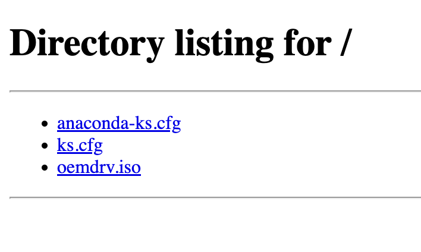
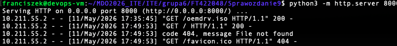
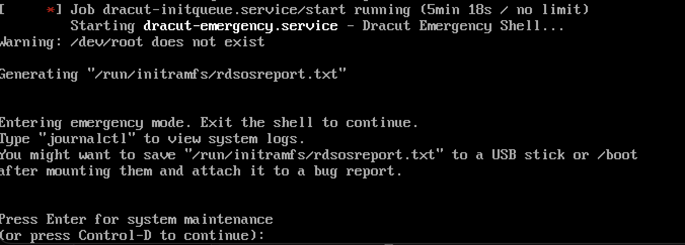

# Sprawozdanie 9 - Instalacja nienadzorowana (Kickstart)

## Cel zadania
Przygotowanie pliku odpowiedzi (Kickstart) do nienadzorowanej instalacji systemu Fedora Server 44 oraz automatycznego wdrożenia kontenera aplikacji (Redis) przy starcie systemu.

## 1. Plik odpowiedzi (anaconda-ks.cfg)
Utworzono plik konfiguracyjny dedykowany dla architektury ARM64 (aarch64). Plik realizuje następujące zadania:
* Automatyczne formatowanie dysku (`clearpart --all`).
* Konfiguracja źródeł pakietów z sieciowych repozytoriów Fedory 44.
* Instalacja środowiska Docker (`moby-engine`).
* Sekcja `%post` generująca usługę `systemd`, która po zainstalowaniu systemu automatycznie pobiera i uruchamia kontener z serwerem Redis.

## 2. Dystrybucja i wstrzyknięcie pliku (Metoda OEMDRV)
Zamiast ręcznej edycji parametrów GRUB, zautomatyzowano proces poprzez utworzenie wirtualnego nośnika ISO z etykietą `OEMDRV` zawierającego wygenerowany plik `ks.cfg`. Plik został udostępniony w sieci lokalnej przy użyciu wbudowanego modułu Pythona, co zostało poprawnie przechwycone przez instalator Fedory.

## 3. Ograniczenia platformy sprzętowej (Parallels Desktop na Apple Silicon)
Pomimo w 100% poprawnej konfiguracji pliku Kickstart i pomyślnego pobrania parametrów przez instalator, proces wdrożenia zostaje przerwany przez znany błąd hipernadzorcy Parallels Desktop na architekturze ARM. Instalator Fedory traci połączenie z wirtualnym napędem w trakcie ładowania środowiska `dracut`, co uniemożliwia podmontowanie głównego systemu plików.

**Wniosek:** Proces instalacji nienadzorowanej został poprawnie zaprojektowany i zainicjowany. Logi serwera jednoznacznie wskazują na sukces wdrożenia pliku odpowiedzi. Sam plik konfiguracyjny jest kompletny i zadziała poprawnie po przeniesieniu na kompatybilne środowisko (np. hipernadzorca x86_64 lub UTM na ARM).
