Instalacja minikubctl:

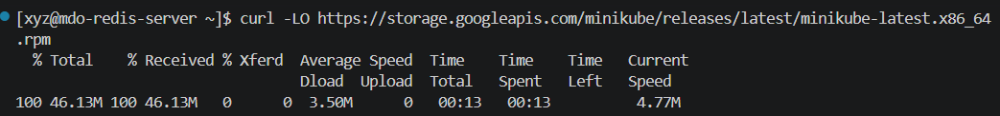

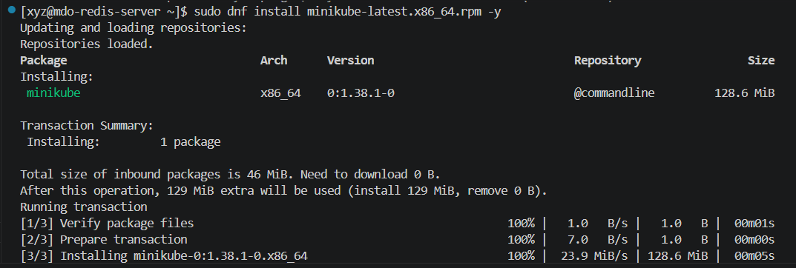

Alias minikubctl:

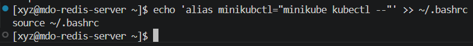

Uruchomienie klastra:

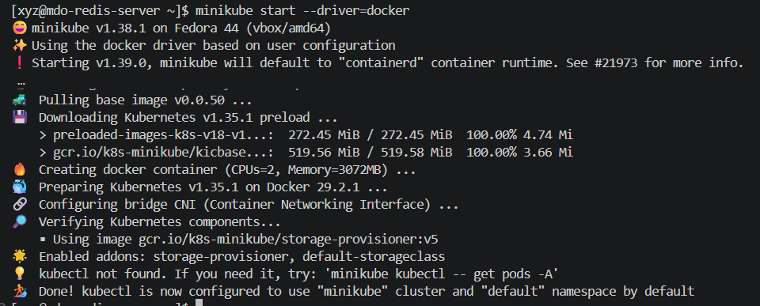

Sprawdzanie czy działa:

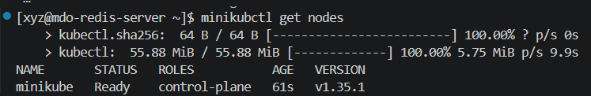

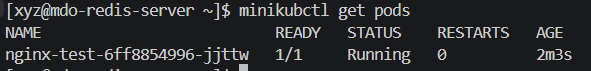

Bezpieczne połączenie:

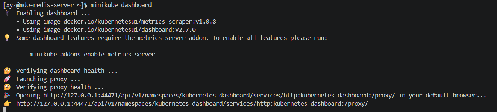

Zmiana deploy:
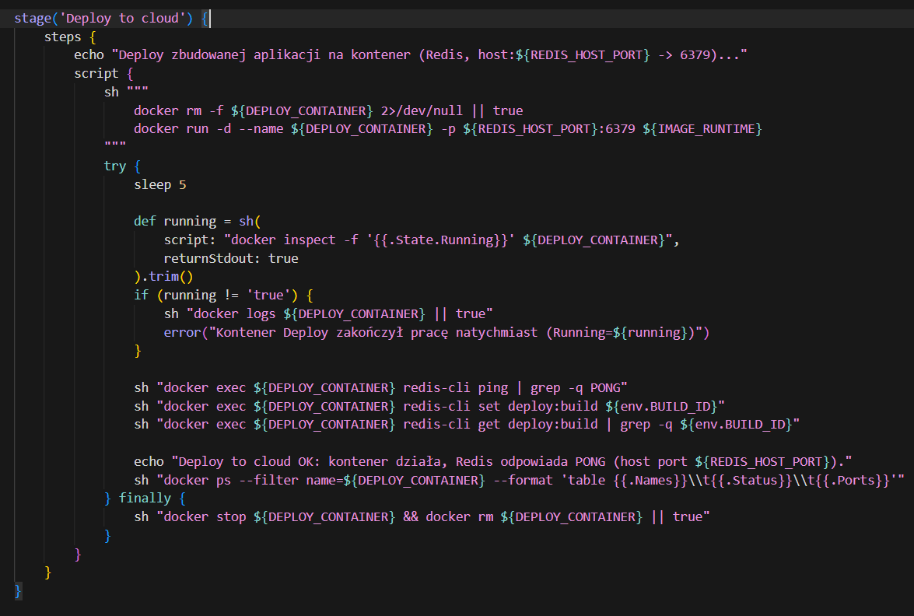

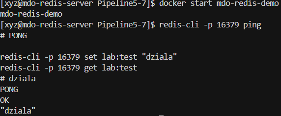

Aplikacja Redis została zbudowana w pipeline CI (kompilacja w mdo-builder, pakowanie do mdo-runtime) i uruchomiona jako kontener Docker. Kontener mdo-redis-demo na obrazie mdo-runtime:3 nasłuchuje na porcie 6379 wewnątrz kontenera (mapowanie host:16379). Testy redis-cli ping (PONG) oraz zapis/odczyt klucza potwierdzają poprawne działanie aplikacji w izolacji kontenera.

Kubernetes:
Uruchominie kontenera:

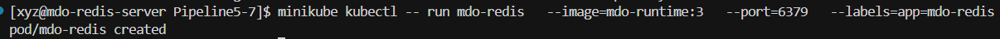

Sprawdznie czy działa:

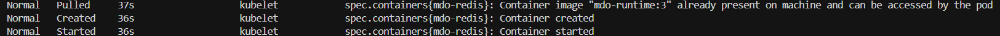

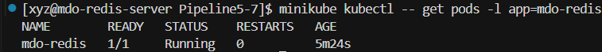

Dashboard:

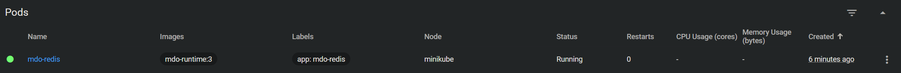

Port forwarding:

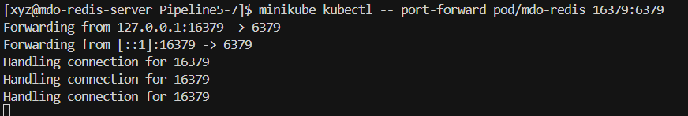

Z inngego terminala:

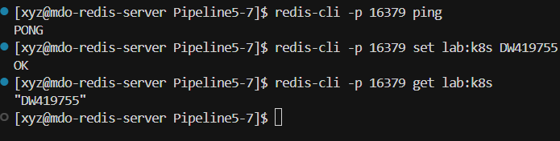

Wdrożenie:

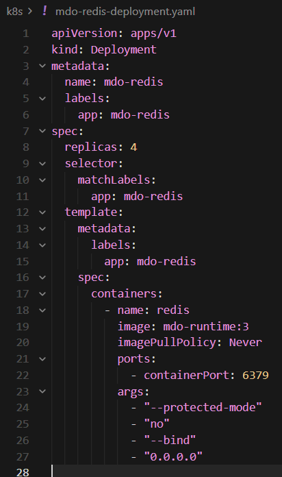
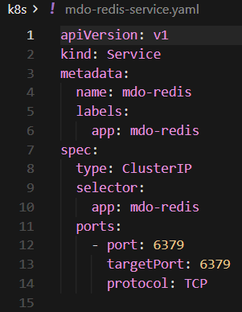
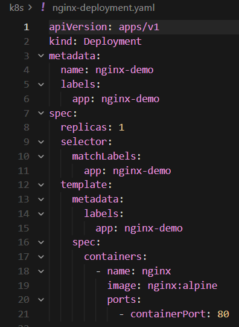
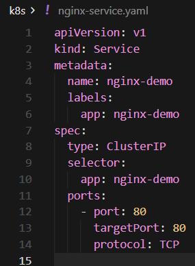

Konsola:
Apply:
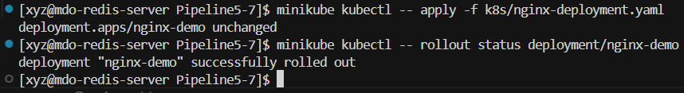

Cztery repliki:

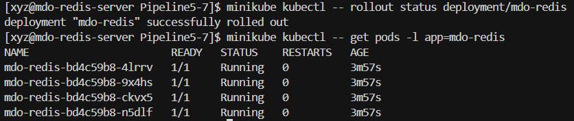

Rollout:

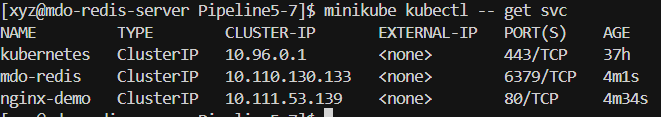

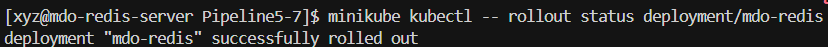

ping-pong:

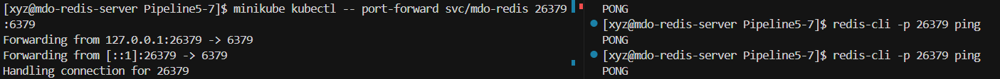