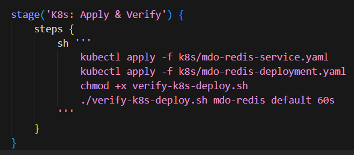

Rejestrowanie nowej wersji obrazu:

Tagowanie obrazu:

 

Sprawdzanie czy działa:

 

Tworzenie obrazu z błędem:

 

 

Tagowanie i sprawdzanie działania:

 

Pushowanie obrazu na Dockerhub: 

 

Zmiany w pliku .yaml:
zwiększenie replik do 8:

 

 

Zmniejszenie replik do 1:

 

Zmniejsznie replik do 0:

 

Zwiększenie replik do 4:

 

Wprowadzenie nowego obrazu:

 

Wprowadzenie nowego obrazu z błędem:

 

Badanie obrazu z błędem:

 
 

Rollout oraz zastosowanie starszej wersji obrazu:

 

Sprawdzanie histori rolloutów:

Cofnięcie rolloutu:

 

Historia wdrożenia i problemy:
W trakcie testów każda modyfikacja pliku YAML i ponowne kubectl apply generowała nową rewizję w kubectl rollout history. Skalowanie replik było rejestrowane jako kolejne rewizje Deploymentu: przy replicas 0 Service tracił endpointy i usługa była niedostępna, lecz rollout formalnie się kończył. Po przywróceniu co najmniej 4 replik pody wracały do stanu Running. Zmiana obrazu na nowszą wersję oraz powrót do starszej przebiegały zgodnie ze strategią, natomiast wdrożenie obrazu wadliwego powodowało CrashLoopBackOff oraz zatrzymanie rolloutu.

Skrypt do sprawdzania czy wdrożenie się powiodło w 60 sekund:

 

Uruchomienie skryptu:

 

Skrpyt ujęty w pipeline:

Wersej wdrożeń:
canary:

 

 

 

 

 

Rolling:

 

 

Recreate:

 

 

Sprawdzanie stanów wdrożenia:

Różnice między wersjami wdrożeń:
Rolling Update: aktualizacja odbywa się stopniowo poprzez wymianę kolejnych replik, przy czym część instancji poprzedniej wersji pozostaje dostępna w trakcie wdrożenia, co minimalizuje przestoje usługi.

Recreate: przed uruchomieniem nowej wersji wszystkie repliki poprzedniej wersji są usuwane, a następnie tworzone są instancje nowej wersji; strategia ta powoduje krótkotrwałą niedostępność usługi, ale eliminuje równoległe działanie obu wersji w ramach jednego obiektu Deployment.

Canary: nowa wersja jest wdrażana równolegle ze stabilną w osobnych obiektach Deployment, a na instancje testowe kierowany jest ograniczony ruch produkcyjny, co umożliwia weryfikację poprawności wdrożenia przed pełnym przełączeniem całego obciążenia na nową wersję.

