Przygotowanie:
Uruchomienie środowiska zagnieżdżonego (Docker-in-Docker):

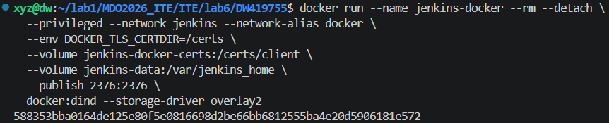  
Przygotowanie obrazu Blue Ocean:

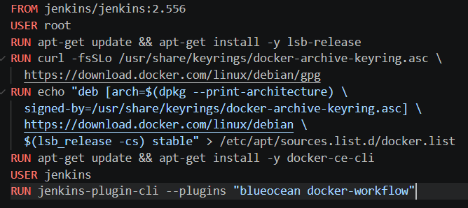  
Budowanie obrazu:

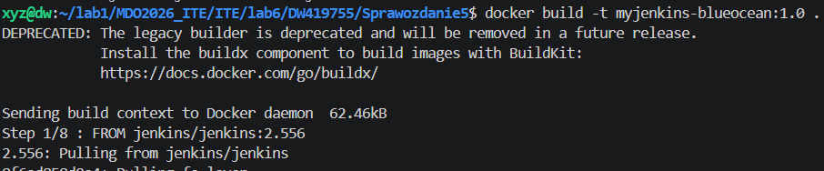  

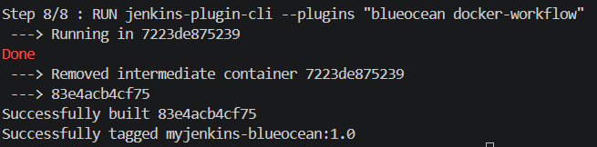  

Uruchomienie kontenera Blue Ocean:

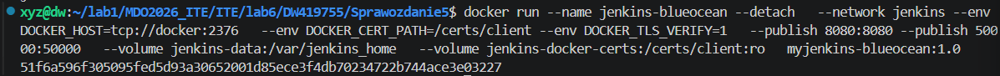  
Strona startowa Jankins:

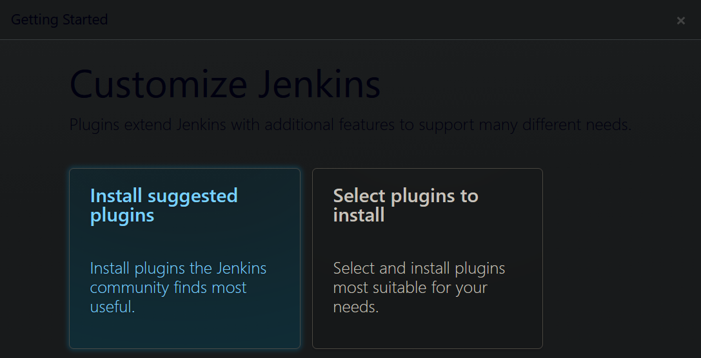

Gotowy setup:

  

Zabezpiecznia Jenkinsa:
max-size (10m): Jeden plik logu nie przekroczy 10 megabajtów.
max-file (3): Docker będzie trzymał maksymalnie 3 archiwalne pliki logów.

  

Zadanie wstępne: uruchomienie:
Uname

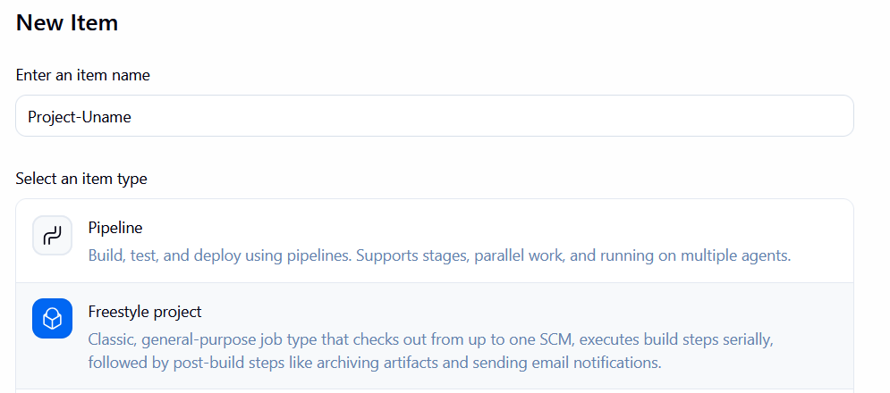
Wyświetlanie uname:

Execute shell dla godziny nieprarzystej:

Działa:

Pobieranie obrazu kontenera ubuntu:

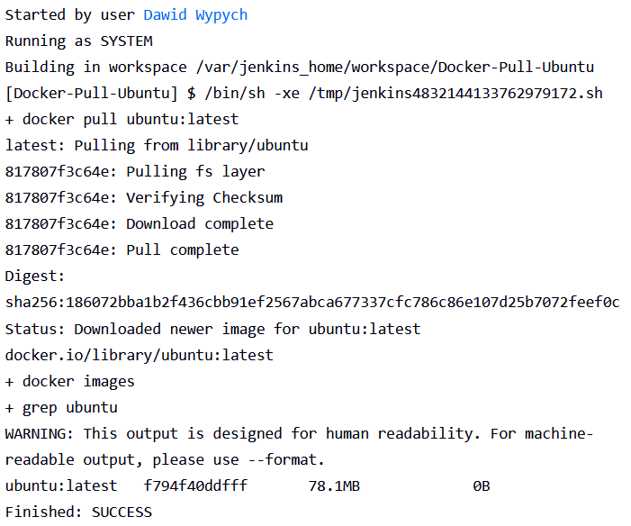

Obiekt typu pipeline
Towrzenie pipeline:

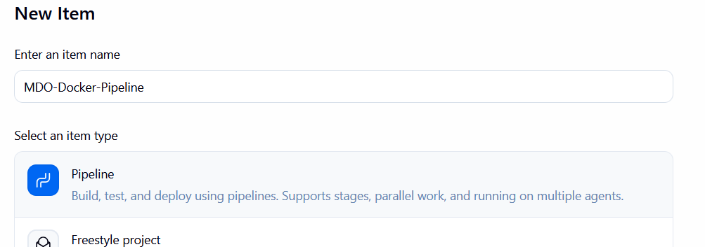

Wykonany pipeline:

Wykonany drugi pipeline:

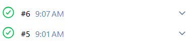

Drugi pipeline wykonał się dużo szybciej, ponieważ obraz ubuntu został już pobrany podczas pierwszego pipeline'a.

# Zajęcia 06
---

## Pipeline: lista kontrolna
Scharakteryzuj plan na *pipeline* i przedstaw postęp prac. Czy mamy pomysł na każdy krok poniżej?

### Ścieżka krytyczna
Podstawowy zbiór czynności do wykonania w ramach zadania z pipelinem CI/CD. Ścieżką krytyczną jest:
- [X] commit (lub tzw. *manual trigger* @ Jenkins)
- [X] clone
- [X] build
- [X] test
- [X] deploy
- [X] publish

Jenkinsfile z krokami:

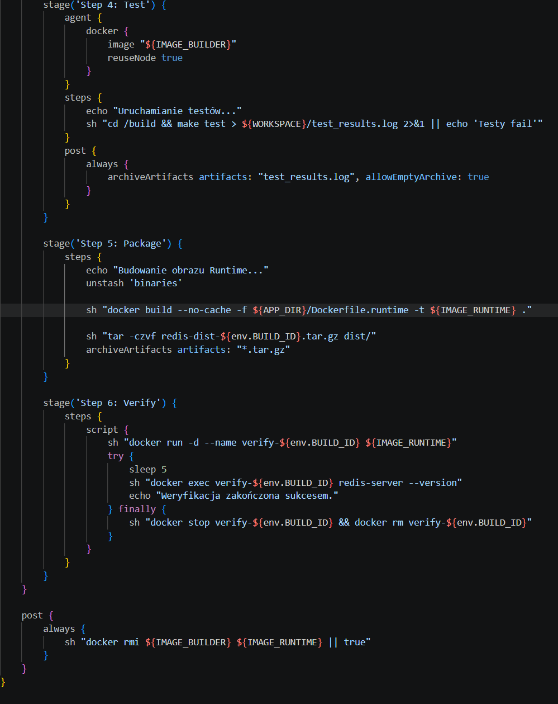

Poniższe czynności wykraczają ponad tę ścieżkę, ale zrealizowanie ich pozwala stworzyć pełny, udokumentowany, jednoznaczny i łatwy do utrzymania pipeline z niskim progiem wejścia dla nowych *maintainerów*.

### Pełna lista kontrolna
Zweryfikuj dotychczasową postać sprawozdania oraz planowane czynności względem ścieżki krytycznej oraz poniższej listy. Realizacja punktu wymaga opisania czynności,
wykazania skuteczności (np. zrzut ekranu), podania poleceń i uzasadnienia decyzji dot. implementacji.

- [X] Aplikacja została wybrana - Redis
- [X] Licencja potwierdza możliwość swobodnego obrotu kodem na potrzeby zadania
- [X] Wybrany program buduje się

- [X] Przechodzą dołączone do niego testy

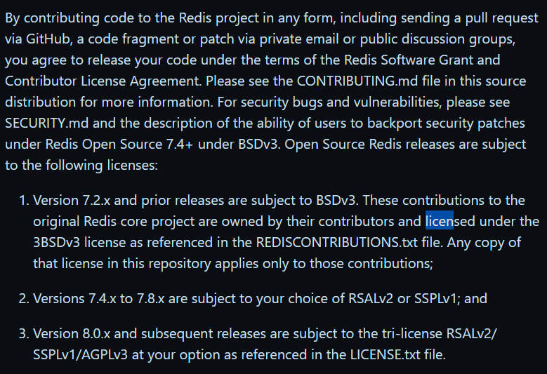

- [X] Zdecydowano, czy jest potrzebny fork własnej kopii repozytorium
- [X] Stworzono diagram UML zawierający planowany pomysł na proces CI/CD:

- [X] Wybrano kontener bazowy lub stworzono odpowiedni kontener wstepny (runtime dependencies):

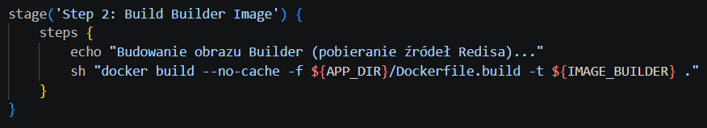

- [X] *Build* został wykonany wewnątrz kontenera:

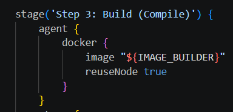

- [X] Testy zostały wykonane wewnątrz kontenera (kolejnego):

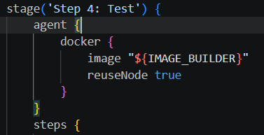

- [X] Kontener testowy jest oparty o kontener build: obraz o nazwie Image_Builder
- [X] Logi z procesu są odkładane jako numerowany artefakt, niekoniecznie jawnie

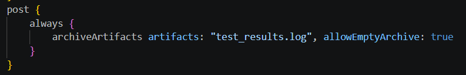

- [X] Zdefiniowano kontener typu 'deploy' pełniący rolę kontenera, w którym zostanie uruchomiona aplikacja (niekoniecznie docelowo - może być tylko integracyjnie)

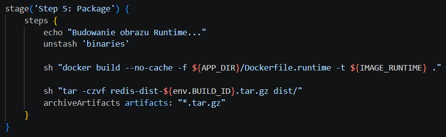

- [X] Uzasadniono czy kontener buildowy nadaje się do tej roli/opisano proces stworzenia nowego, specjalnie do tego przeznaczenia: Kontener buildowy zawiera zbędne w środowisku produkcyjnym narzędzia kompilacyjne oraz zależności testowe, co niepotrzebnie zwiększa rozmiar obrazu i rozszerza płaszczyznę potencjalnego ataku. Z tego powodu proces kończy się stworzeniem dedykowanego obrazu runtime, który obejmuje wyłącznie niezbędne binaria i biblioteki, co gwarantuje wyższy poziom bezpieczeństwa oraz znacznie szybsze wdrażanie aplikacji dzięki mniejszej wadze kontenera.
- [X] Wersjonowany kontener 'deploy' ze zbudowaną aplikacją jest wdrażany na instancję Dockera
- [X] Następuje weryfikacja, że aplikacja pracuje poprawnie (*smoke test*) poprzez uruchomienie kontenera 'deploy'

- [X] Zdefiniowano, jaki element ma być publikowany jako artefakt: Docker i tar.gz
- [X] Uzasadniono wybór: kontener z programem, plik binarny, flatpak, archiwum tar.gz, pakiet RPM/DEB:
Równoległe generowanie obrazu Docker oraz archiwum .tar.gz zapewnia pełną elastyczność w doborze docelowej infrastruktury wdrożeniowej. Obraz kontenerowy jest optymalny dla nowoczesnych środowisk orkiestracji, natomiast paczka tar.gz umożliwia tradycyjną instalację bezpośrednio w systemie operacyjnym, co czyni artefakt uniwersalnym i niezależnym od dostępności silnika Docker na maszynie docelowej.
- [X] Opisano proces wersjonowania artefaktu (można użyć *semantic versioning*)
Wersjonowanie artefaktów oparto na unikalnej zmiennej BUILD_ID generowanej przez serwer Jenkins, co pozwala na bezbłędne powiązanie każdej paczki z konkretnym przebiegiem potoku i rewizją kodu źródłowego. Takie podejście zapewnia pełną trasowalność procesu CI/CD, umożliwiając szybką weryfikację pochodzenia binariów i stanowi solidną podstawę do późniejszego przejścia na pełny standard Semantic Versioning przy wydaniach stabilnych.
- [X] Dostępność artefaktu: publikacja do Rejestru online, artefakt załączony jako rezultat builda w Jenkinsie: jako archive artefacts
- [X] Przedstawiono sposób na zidentyfikowanie pochodzenia artefaktu: ${env.BUILD_ID}

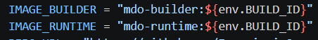

- [X] Pliki Dockerfile i Jenkinsfile dostępne w sprawozdaniu w kopiowalnej postaci oraz obok sprawozdania, jako osobne pliki
- [X] Zweryfikowano potencjalną rozbieżność między zaplanowanym UML a otrzymanym efektem:
W trakcie implementacji zdecydowano się na optymalizację procesu względem pierwotnego planu UML. Zamiast instalować zależności bezpośrednio w pipeline, zostały one przeniesione do Dockerfile, co zapewnia powtarzalność środowiska. Zmieniono również metodę healthchecku z redis-cli ping na weryfikację wersji, aby uprościć pierwszy etap wdrożenia

# DevOps 7: CI/CD z Jenkins i Docker

### Kroki Jenkinsfile
Zweryfikuj, czy definicja pipeline'u obecna w repozytorium pokrywa ścieżkę krytyczną:

- [X] Przepis dostarczany z SCM, a nie wklejony w Jenkinsa lub sprawozdanie (co załatwia nam `clone` ):
Pipeline jest zdefiniowany jako kod, a Stage 1 wykonuje checkout z Git.

- [X] Posprzątaliśmy i wiemy, że odbyło się to skutecznie - mamy pewność, że pracujemy na najnowszym (a nie *cache'owanym* kodzie):
Użycie deleteDir() na samym początku gwarantuje czysty workspace

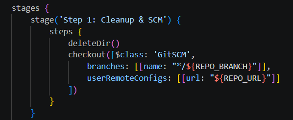

- [X] Etap `Build` dysponuje repozytorium i plikami `Dockerfile`:
Repozytorium jest klonowane w kroku 1, a w kroku 2 jest odwołanie do ${APP_DIR}/Dockerfile.build.
- [X] Etap `Build` tworzy obraz buildowy, np. `BLDR`:
Stage 2 buduje obraz przypisany do zmiennej IMAGE_BUILDER.

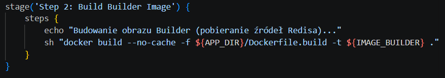

- [X] Etap `Build` (krok w tym etapie) lub oddzielny etap (o innej nazwie), przygotowuje artefakt - **jeżeli docelowy kontener ma być odmienny**, tj. nie wywodzimy `Deploy` z obrazu `BLDR`:
Stage 3 kompiluje kod wewnątrz kontenera builder i wyciąga binarki do folderu dist/ za pomocą stash.

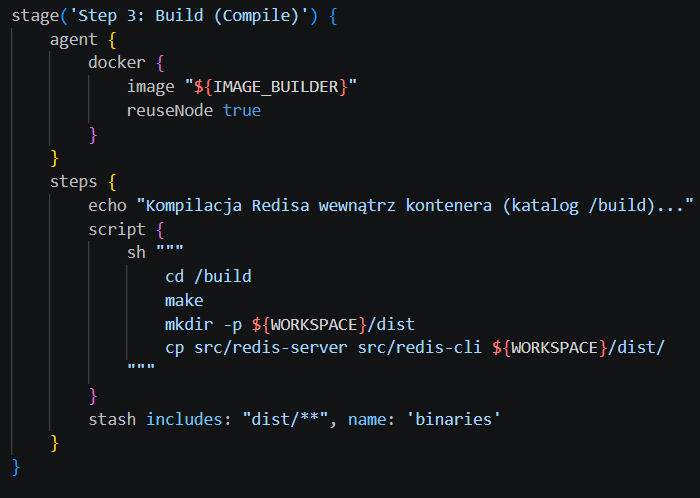

- [X] Etap `Test` przeprowadza testy:
Stage 4 uruchamia testy jednostkowe Redisa (test-server) w środowisku buildera:

- [X] Etap `Deploy` przygotowuje **obraz lub artefakt** pod wdrożenie. W przypadku aplikacji pracującej jako kontener, powinien to być obraz z odpowiednim entrypointem. W przypadku buildu tworzącego artefakt niekoniecznie pracujący jako kontener (np. interaktywna aplikacja desktopowa), należy przesłać i uruchomić artefakt w środowisku docelowym.:
Stage 5 buduje IMAGE_RUNTIME na podstawie osobnego pliku Dockerfile.runtime.

- [X] Etap `Deploy` przeprowadza wdrożenie (start kontenera docelowego lub uruchomienie aplikacji na przeznaczonym do tego celu kontenerze sandboxowym):
Stage 6 (Verify) uruchamia kontener, sprawdza wersję i sprząta po sobie – klasyczny smoke test.

- [X] Etap `Publish` wysyła obraz docelowy do Rejestru i/lub dodaje artefakt do historii builda:
Wykonywane jest polecenie archiveArtifacts dla paczki .tar.gz
- [X] Ponowne uruchomienie naszego *pipeline'u* powinno zapewniać, że pracujemy na najnowszym (a nie *cache'owanym*) kodzie. Innymi słowy, *pipeline* musi zadziałać więcej niż jeden raz 😎
deleteDir() + docker build --no-cache gwarantują, że każdy build jest świeży

### *"Definition of done"*
Proces jest skuteczny, gdy "na końcu rurociągu" powstaje możliwy do wdrożenia artefakt (*deployable*).
* Czy opublikowany obraz może być pobrany z Rejestru i uruchomiony w Dockerze **bez modyfikacji** (acz potencjalnie z szeregiem wymaganych parametrów, jak obraz DIND)? Nie chcemy posyłać w świat czegoś, co działa tylko u nas!:  
Ten obraz zadziała na dowolnej maszynie, ponieważ Dockerfile.runtime zawiera nie tylko binarkę Redisa, ale też wszystkie niezbędne biblioteki systemowe, na których Redis polega. Jeśli Redis wewnątrz obrazu nasłuchuje na standardowym porcie, użytkownik końcowy musi jedynie wykonać docker run -p 6379:6379 nazwa_obrazu. Nie wymaga to specyficznych ustawień typu DinD. Stage 6 (Verify) udowadnia, że obraz jest kompletny. Komenda redis-server --version wykonuje się wewnątrz świeżo uruchomionego kontenera, co oznacza, że binarka znalazła wszystkie swoje zależności wewnątrz tego obrazu.
* Czy dołączony do jenkinsowego przejścia artefakt, gdy pobrany, ma szansę zadziałać **od razu** na maszynie o oczekiwanej konfiguracji docelowej?:  
Pobrany artefakt zadziała od razu, ale pod jednym  warunkiem: zgodności środowiska wykonawczego (Runtime) ze środowiskiem budowania (Builder). Jeśli builder to np. Ubuntu (korzystające z glibc), a ktoś spróbuje uruchomić te binarki bezpośrednio na maszynie z Alpine Linux (korzystającym z musl), Redis wyrzuci błąd: file not found lub segmentation fault.

Obraz jest w pełni deployable, ponieważ zawiera wszystkie niezbędne komponenty do uruchomienia Redisa. 